# 🚀 vLLM Local Server: Gemma 4 26B (Multimodal & Reasoning)


Servidor de Inferencia de Modelos de Lenguaje (LLM) de alto rendimiento basado en **vLLM**, configurado para desplegar el modelo **NVIDIA Gemma 4 26B-A4B-NVFP4** con soporte **Multimodal (Visión/OCR)**, **Razonamiento** y **Llamadas a Herramientas (*Tool Choice*)**, totalmente integrado con clientes como **Open-WebUI**.

> 📘 **¿Buscás la guía rápida para usuarios y operadores de Open-WebUI?**  
> Consultá el nuevo [**Manual de Integración y Guía de Uso: vLLM Suite + Open-WebUI (`MANUAL_OPENWEBUI.md`)**](MANUAL_OPENWEBUI.md) con catálogo de herramientas listas para usar (RAG LanceDB, Generador PDF A4, Búsqueda Web y Clima).

---

## 🛠️ Especificaciones del Entorno

* **Sistema Operativo:** Ubuntu Linux
* **GPU:** NVIDIA GeForce RTX 3090 (24 GB VRAM, Compute Capability 8.6 - Ampere)
* **Memoria RAM:** 64 GB DDR4/DDR5
* **Entorno Python:** Virtualenv (`venv`) con Python 3.13
* **Motor de Inferencia:** vLLM v0.26.0 (Engine V1)

---

## 💾 Arquitectura de Coexistencia de VRAM (RTX 3090 / 24 GB)

Para permitir que los 4 servicios de Inteligencia Artificial corran en caliente en la misma tarjeta sin colisionar por memoria, se definió la siguiente distribución de la VRAM y de puertos de red:

| Servicio | Puerto Público (Gateway) | Puerto Interno (Backend) | Consumo de VRAM Fijo | Rol en el Ecosistema |
| :--- | :---: | :---: | :--- | :--- |
| **Gemma 4-E4B-it** | `8000` | `18000` (127.0.0.1) | **~13.2 GB** | Chat LLM y Visión (128K tokens context) |
| **Whisper-large-v3-turbo** | `8001` | `18001` (127.0.0.1) | **~2.9 GB** | Reconocimiento de Voz (ASR / Transcripción) |
| **F5-TTS (Texto a Voz)** | `8002` | `18002` (127.0.0.1) | **~1.9 GB** | Inferencia de Audio (Clonación multilingüe) |
| **PyAnnote 3.1 (Diarizador)** | `8003` | `18003` (127.0.0.1) | **~0.4 GB** | Segmentación e Identificación de Hablantes |
| **Dashboard Web GUI** | `8004` | *(Directo)* | **0 GB (VRAM)** | Monitoreo del sistema, edición de .env y test |
| **Gnome / Sistema Linux** | - | - | **~1.1 GB** | Entorno gráfico y aplicaciones de usuario |

* **VRAM Total Usada (Modo Estándar):** **`~19.5 GB`**
* **VRAM Total Libre:** **`~4.5 GB`** (Margen de seguridad perfecto para evitar caídas por *Out Of Memory*).

> **🛡️ Nota de Red y Seguridad:** Por motivos de seguridad, los motores de IA reales (backends) enlazan exclusivamente en localhost (`127.0.0.1`) en los puertos del rango `18000`. Todo tráfico externo pasa obligatoriamente por el **vLLM Gateway Proxy** en los puertos públicos estándar (`8000`-`8003`), el cual realiza la validación de credenciales.

---

## 🎛️ Guía Estratégica: Escenarios de Uso y Orquestación de VRAM (24 GB)

En un entorno de hardware local con **24 GB de VRAM (NVIDIA RTX 3090 / RTX 4090)**, la coexistencia de múltiples modelos de frontera (LLMs de 26B/30B, motores de voz, diarización, visión y RAG de alta fidelidad) exige **reconocer los límites físicos de la memoria y elegir conscientemente el perfil operativo más adecuado según la tarea en curso**.

Gracias a la arquitectura desacoplada de la suite, los **Fallbacks automáticos en CPU** y el **motor de embeddings de uso dual (CUDA o RAM)**, es posible alternar entre escenarios con un solo clic desde el Dashboard (`:8004`) sin comprometer la estabilidad ni la disponibilidad general.

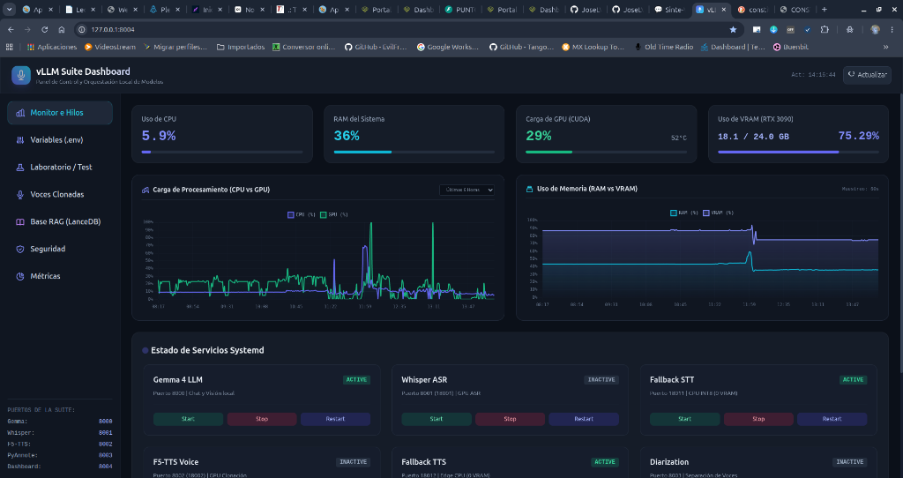

---

### 1. 📚 Perfil A: "RAG Intensivo y Consulta Documental" *(Escenario Actual Recomendado)*

* **Objetivo:** Velocidad de respuesta instantánea en búsquedas vectoriales híbridas (Dense 1024D + BM25) en LanceDB, con latencia imperceptible respecto a una consulta directa sin RAG.
* **Distribución de VRAM (~18.1 GB - 21.0 GB):**
  - **Gemma 4-E4B-it (vLLM en `:18000`):** `~13.2 GB` (`gpu_memory_utilization=0.55`).
  - **Qwen3-Embedding (CUDA en `:18005`):** `~3.5 GB - 4.5 GB` (`EMBEDDINGS_DEVICE=cuda`, `EMBEDDINGS_CPU_THREADS=0`). *Imprescindible en GPU para absorber los picos de reindexado masivo sin demoras.*
  - **Docling OCR (GPU en `:5020`):** `~800 MB`.
  - **Sistema / Gnome:** `~1.1 GB`.
* **Estado de Servicios de Audio:**
  - `Whisper GPU` (`:8001`), `F5-TTS GPU` (`:8002`) y `PyAnnote Diarization` (`:8003`): **`INACTIVE`**.
  - `Fallback STT` (`:18011`) y `Fallback TTS` (`:18012`): **`ACTIVE (CPU / 0 VRAM)`**.
* **Sincronización Automática:** El temporizador Systemd (`vllm-rag-sync.timer`) procesa las actualizaciones diferenciales a las 00:00 y 12:00 en CUDA a máxima velocidad.

---

### 2. 💻 Perfil B: "Asistente de Código / Modelo Grande" *(GLM-4.7-Flash 30B MoE 128K / Qwen3-Coder 30B)*

* **Objetivo:** Máxima capacidad de razonamiento lógico, refactorización, debugging agéntico y análisis de repositorios completos con ventana de contexto de **128.000 tokens (128K)** en `bfloat16`.
* **Distribución de VRAM (~22.0 GB / 24.0 GB - 91.76% | ~2.0 GB libres de colchón):**
  - **LLM Principal 30B MoE (`QuantTrio/GLM-4.7-Flash-AWQ`):** `~16.96 GB` (`gpu_memory_utilization=0.72 - 0.80`, `swap_space=10`, `kv_cache_dtype=bfloat16`).
  - **Docling OCR (GPU en `:5020`):** `~800 MB - 884 MB` *(¡Mantenido ACTIVO en GPU para extracción y escaneo de documentos!)*.
  - **CUDAGraphs / Activaciones:** `~0.46 GB`.
  - **Sistema / Gnome:** `~1.1 GB`.
* **Distribución de RAM del Sistema (47.8% utilizado | >33 GB libres de 64 GB):**
  - **Capas derivadas a RAM (UVA Offload):** `10.0 GB`.
  - **Qwen3-Embedding en RAM (`:18005`):** `~1.2 GB` (`EMBEDDINGS_DEVICE=cpu`, `EMBEDDINGS_CPU_THREADS=8`).
  - **Fallbacks de Audio en CPU (`:18011` y `:18012`):** `ACTIVE (0 VRAM)`.
  - **PyAnnote Diarization (`:8003`):** **`INACTIVE`** *(Único servicio satélite totalmente apagado)*.
* **Comportamiento en Producción:**
  - Ingesta probada de **+43.4K tokens de input continuo** en DeepSeek Harness sin degradación.
  - Velocidad de generación estable de **~5.2 a 9.0 tokens/s**.
  - Parsers oficiales integrados en `app.py`: `--tool-call-parser glm47` y `--reasoning-parser deepseek_r1`.
  - Botón de activación de 1 clic disponible en el Dashboard (pestaña **Variables**).

---

### 3. 🎨 Perfil C: "Multimodalidad y Generación de Imágenes" *(Gemma 4 + FLUX.2 Klein 4B)*

* **Objetivo:** Diálogo multimodal con análisis visual + generación y edición de imágenes mediante modelos de difusión (*vLLM-Omni* en `:18004`).
* **Distribución de VRAM (~21.5 GB - 22.8 GB):**
  - **Gemma 4-E4B-it (LLM/Visión en `:18000`):** `~12.5 GB - 13.0 GB`.
  - **FLUX.2 Klein 4B / SDXL Diffusion (GPU en `:18004`):** `~7.5 GB - 8.5 GB`.
  - **Sistema / Gnome / Escritorio:** `~1.3 GB`.
* **Ajustes Críticos de Apagado para Proteger la VRAM:**
  - **Docling OCR (`:5020`):** **`INACTIVE`** $\rightarrow$ *Apagar obligatoriamente para liberar los **~884 MB** de VRAM de los modelos de visión de documentos.*
  - **Qwen3-Embedding (`:18005`):** Operando en RAM/CPU (`EMBEDDINGS_DEVICE=cpu`) o RAG desactivado $\rightarrow$ Libera **~1.5 GB**.
  - **Audio GPU (`Whisper`, `F5-TTS`, `Diarization`):** **`INACTIVE`** $\rightarrow$ Delegado 100% a los Fallbacks de CPU (`:18011` y `:18012`) con **0 VRAM**.
  - **Margen de Seguridad:** `~1.5 GB - 2.5 GB libres` para búferes de activación y KV Cache sin riesgo de OOM.

---

### 4. 🎙️ Perfil D: "Laboratorio de Voz, Clonación y Diarización Completa" *(Audio Lab)*

* **Objetivo:** Clonación de voz multilingüe de alta fidelidad, transcripción de reuniones largas con identificación exacta de locutores y LLM conversacional.
* **Distribución de VRAM (~21.0 GB - 23.0 GB):**
  - **Whisper-large-v3-turbo (GPU `:8001`):** `~2.9 GB`.
  - **F5-TTS Voice Cloning (GPU `:8002`):** `~2.2 GB`.
  - **PyAnnote 3.1 Diarization (GPU `:8003`):** `~0.8 GB`.
  - **Gemma 4-E4B-it (LLM `:8000`):** `~13.2 GB`.
  - **Sistema / Gnome:** `~1.1 GB`.
* **Ajustes de la Suite:**
  - `Docling OCR`: **`INACTIVE`** o en demanda.
  - `Qwen3-Embedding`: Operando en CPU (`EMBEDDINGS_DEVICE=cpu`).
  - Sincronización RAG delegada a CPU para proteger la VRAM de audio.

---

## 🧬 Adaptación Multi-Modelo Inteligente y Dimensionamiento Dinámico de VRAM

Uno de los saltos cualitativos más importantes de esta suite es la **abstracción e interoperabilidad multi-modelo universal**. Anteriormente, cambiar el modelo en `.env` requería reescribir manualmente comandos de terminal para adaptar flags de llamadas a herramientas (*tool calling*), parsers de razonamiento (*reasoning/thinking*), adaptadores LoRA y límites de memoria gráfica.

Ahora, el iniciador [`app.py`](app.py) analiza dinámicamente el nombre y la arquitectura del modelo seleccionado al arrancar, aplicando la configuración nativa óptima para cada familia sin intervención manual.

---

### 1. 🎯 Matriz Universal de Parsers y Familias de Modelos

Cada familia de IA utiliza formatos sintácticos distintos para invocar herramientas (etiquetas XML, JSON schemas, bloques de control) y estructurar el flujo de pensamiento (*reasoning tokens*). La suite mapea automáticamente:

| Familia de Modelo | Identificador en Nombre | Parser de Herramientas (`--tool-call-parser`) | Parser de Razonamiento (`--reasoning-parser`) | Modos y Adaptadores Especiales |
| :--- | :--- | :--- | :--- | :--- |
| **Google Gemma 4** | `gemma` (ej: `Gemma-4-E4B-it`, `Gemma-4-26B`) | `gemma4` | `gemma4` | Auto Tool Choice + Soporte LoRA adaptativo |
| **Zhipu GLM 4.7 MoE** | `glm` (ej: `QuantTrio/GLM-4.7-Flash-AWQ`) | `glm47` | `deepseek_r1` *(para `<think>`)* | MoE 30B + 128K Contexto + Agentic Coding |
| **Alibaba Qwen 2.5 / 3** | `qwen` (ej: `Qwen3-14B`, `Qwen2.5-Coder`) | `hermes` *(ChatML nativo)* | - | Auto Tool Choice universal en Open-WebUI |
| **DeepSeek V3 / R1 / Distill** | `deepseek` (ej: `Qwen3-14B-DeepSeek-v3.2`, `R1-Distill`) | `hermes` | `deepseek_r1` *(si contiene `r1` o `reasoner`)* | Parser de pensamiento `<think>...</think>` |
| **Mistral / Mixtral** | `mistral` (ej: `Mistral-Small-24B`, `Nemo`) | `mistral` | - | Formato nativo de funciones Mistral |
| **Meta Llama 3 / 3.1 / 3.3** | `llama` (ej: `Llama-3.1-8B-Instruct`) | `llama3_json` | - | Esquema JSON estricto de Llama 3 |
| **Genéricos / Fine-tunes** | Cualquier otro modelo compatible | `hermes` *(Fallback estándar)* | - | Compatibilidad completa con Function Calling |

---

### 2. ⚡ Aceleración de Atención: Selección Condicional `FlashInfer` vs `FlashAttention`

Para maximizar los tokens por segundo y reducir al mínimo el **Tiempo al Primer Token (*Time To First Token / TTFT*)** en la GPU **NVIDIA GeForce RTX 3090**, la suite implementa una política de resolución inteligente del backend de atención en [`app.py`](app.py):

#### A. Lógica de Decisión Condicional en `app.py`:
* **Modo Seguro para LoRA (`FLASH_ATTN`):** Si detecta que hay adaptadores LoRA activos (`gemma-4-reasoning`), utiliza automáticamente **FlashAttention-2** para garantizar estabilidad matemática absoluta en las matrices de bajo rango.
* **Modo Acelerado para Modelos Base (`FLASHINFER`):** Si es un modelo base compatible con *Grouped-Query Attention* (GQA) sin LoRA (`gemma`, `glm`, `qwen`, `llama`, `mistral`, `deepseek`), activa **FlashInfer** para acelerar la decodificación y el *Chunked Prefill*.
* **Control Manual en `.env`:** Permite forzar el comportamiento mediante la variable `ATTENTION_BACKEND` (`auto`, `flashinfer`, `flash_attn`).

#### B. ¿Por qué se siente tan rápido el primer token (*TTFT*) con FlashAttention?
* **Cálculo en la SRAM del Chip:** A diferencia de los métodos de atención tradicionales que escriben matrices gigantescas de atención en la memoria VRAM global y las vuelven a leer, FlashAttention divide el prompt en bloques (*tiling*) y calcula la atención **directamente en la memoria ultrarrápida del núcleo de la GPU (SRAM / Shared Memory)**.
* **Prefill Instantáneo:** Permite procesar prompts largos con resultados de búsqueda web o RAG (1.000 a 3.000 tokens) a más de **`1.589 tokens/s`**, entregando la primera palabra en pantalla en menos de **400 ms** y sosteniendo velocidades de decodificación de **+80 tokens/s**.

---

### 3. 🧮 Dimensionamiento Físico de VRAM: Memoria de Pesos vs KV Cache

Un error frecuente al probar modelos más grandes (como pasar de 8B a 14B o 32B) es el desbordamiento de memoria del **KV Cache** (*Key-Value Cache*):

$$\text{VRAM Total Requerida} = \text{Pesos del Modelo} + \text{Runtime CUDA / Búferes} + \text{KV Cache Contexto}$$

* **Pesos del Modelo:** Dependen de la cantidad de parámetros y la cuantización (`bitsandbytes`, `FP8`, `AWQ`, `NVFP4`).
* **KV Cache:** Es la memoria dinámica reservada para recordar la conversación. Crece linealmente con el largo de la ventana de contexto (`MAX_MODEL_LEN`) y la cantidad de capas y cabezales de atención de la red.

#### ⚠️ ¿Por qué falla si `GPU_MEMORY_UTILIZATION` es muy bajo en un modelo grande?
Si un modelo 14B pesa ~10 GB en VRAM y se fija `GPU_MEMORY_UTILIZATION=0.52` (12.5 GB asignados a vLLM), solo quedan **1.47 GB** libres para el KV Cache. Si se solicitan **16.384 tokens (`MAX_MODEL_LEN=16384`)**, el modelo exige **2.50 GB** de KV Cache para una petición completa $\rightarrow$ `1.47 GB < 2.50 GB` $\rightarrow$ vLLM aborta por falta de memoria.

---

### 📊 Presets Recomendados para NVIDIA RTX 3090 (24 GB)

Ajusta estas variables en tu archivo [`.env`](.env) según el tamaño del modelo que desees utilizar:

| Categoría de Modelo | Modelos de Ejemplo | Cuantización Sugerida | `GPU_MEMORY_UTILIZATION` | `MAX_MODEL_LEN` | VRAM Libre para la Suite |
| :--- | :--- | :--- | :--- | :--- | :--- |
| **Modelos ~8B (Ligeros / Rápidos)** | `google/gemma-4-E4B-it`<br>`Qwen/Qwen2.5-7B-Instruct`<br>`meta-llama/Llama-3.1-8B-Instruct` | `FP8` / `bitsandbytes` | **`0.52`** (~12.5 GB) | **`16384`** (16K tokens) | **~11.5 GB libres** *(Ideal para RAG + Audio + Imágenes simultáneos)* |
| **Modelos ~14B (Intermedios / Razonamiento)** | `TeichAI/Qwen3-14B-DeepSeek-v3.2`<br>`Qwen/Qwen2.5-14B-Instruct` | `bitsandbytes` | **`0.58` - `0.62`** (~14.2 GB) | **`16384`** (16K tokens)<br>*(o `8192` con `0.52`)* | **~9.5 - 10.0 GB libres** *(Estabilidad total con RAG y Diffusion)* |
| **Modelos ~26B / 32B (Grandes / Programación)** | `nvidia/Gemma-4-26B-A4B-NVFP4`<br>`Qwen/Qwen2.5-Coder-32B-Instruct-GPTQ` | `NVFP4` / `AWQ` / `bitsandbytes` | **`0.70` - `0.78`** (~17.5 GB) | **`8192`** (8K tokens) | **~6.5 GB libres** *(Recomendado: Embeddings en RAM / Fallbacks CPU)* |

---

### 📋 Cuadro Comparativo de Perfiles Operativos (24 GB VRAM)

| Perfil de Uso | LLM Principal | Embeddings (Qwen3) | Docling OCR GPU | RAG Sync Timer | Audio GPU (Whisper/F5/Diar) | Audio Fallback CPU | VRAM Ocupada |
| :--- | :---: | :---: | :---: | :---: | :---: | :---: | :---: |
| **A: RAG Intensivo** | Gemma 4 (55%) | **CUDA (GPU)** | **Activo (~884MB)** | **Activo (GPU)** | Inactivo | **Activo** | **~18.1 GB** |
| **B: Asistente Código** | 30B / 26B (90%) | **RAM (CPU)** | Inactivo | *Pausado* | Inactivo | Opcional | **~22.5 GB** |
| **C: Imagen / Diffusion**| Gemma 4 (50%) + FLUX | **RAM (CPU)** | **Inactivo (Apagado)** | *Pausado* | Inactivo | **Activo** | **~21.8 GB** |
| **D: Audio Lab Completo**| Gemma 4 (50%) | **RAM (CPU)** | Inactivo | Activo (CPU) | **Activo (GPU)** | Standby | **~20.5 GB** |

> **💡 Conclusión Operativa:** *"Con 24 GB de VRAM no es necesario resignar capacidades, sino elegir conscientemente el modo de trabajo más conveniente para cada momento y orquestar los microservicios en consecuencia."*

---

## 🌟 Características Principales

1. **Ecosistema Completo de Microservicios Locales**: Coexistencia de 9 microservicios especializados en segundo plano: **Gemma 4** (`:8000`), **Whisper GPU** (`:8001`), **F5-TTS GPU** (`:8002`), **PyAnnote Diarization** (`:8003`), **Qwen3 Embeddings en RAM** (`:8005`), **Docling OCR** (`:5020`), **Fallbacks CPU con 0 VRAM** (`:18011` y `:18012`) y **Dashboard Web** (`:8004`).
2. **Alta Disponibilidad con Failover Transparente**: El API Gateway (`:8000`-`:8005`) conmuta automáticamente las peticiones de transcripción y voz hacia los microservicios en CPU si la GPU se apaga o entra en mantenimiento, asegurando que el asistente nunca quede "sordo" ni "mudo".
3. **Gestión Coordinada de VRAM y RAM**: Asignación estricta de memoria (Gemma 4 al 50%, Whisper al 10%, F5-TTS al 10%, Docling a ~800MB y PyAnnote a ~400MB en GPU; Qwen3-Embedding a ~1.2 GB en RAM del sistema), manteniendo la suite completa cargada en caliente sin colisiones.
4. **Dashboard Web Interactivo**: Monitoreo de recursos en tiempo real (CPU, RAM, VRAM), controlador gráfico de todos los servicios systemd y pruebas interactivas de las APIs.
5. **Instalación como Servicios del Sistema (`systemd`)**: Autoinstaladores integrados con autorreinicio (`install_service.sh`, `install_whisper_service.sh`, `install_tts_service.sh`, `install_fallback_stt_service.sh`, `install_fallback_tts_service.sh`, `install_diarization_service.sh`, `install_embeddings_service.sh`, `install_docling_service.sh` y `install_dashboard_service.sh`).
6. **Despliegue Multimodal de Audio, Visión y Embeddings**: Soporte nativo para procesar imágenes, documentos estructurados, búsqueda vectorial y voz directamente.
7. **Exposición Swagger UI y Scalar (`/docs`)**: Documentación interactiva completa autogenerada en el puerto de cada servicio de forma nativa.

---

## 🚀 Guía de Instalación y Despliegue

### 1. Clonar el repositorio y crear el entorno virtual

```bash
git clone <URL_DEL_REPOSITORIO>
cd vllm
python -m venv venv
source venv/bin/activate
```

### 2. Instalar dependencias del sistema y Python

#### A. Paquetes del Sistema (Linux / Ubuntu)

Instala las herramientas del sistema necesarias (`ffmpeg` para decodificación y conversión de audio, `libportaudio2` para captura de micrófono en tiempo real, el compilador CUDA `nvcc` para vLLM, y asegúrate de tener el servidor **MongoDB** instalado y en ejecución):

```bash
sudo apt update && sudo apt install -y nvidia-cuda-toolkit libportaudio2 ffmpeg
```

> **Nota:** El paquete `nvidia-cuda-toolkit` provee el compilador `nvcc`, requerido por el backend FlashInfer de vLLM para la compilación en tiempo de ejecución (JIT).

#### B. Paquetes de Python

Puedes instalar todas las dependencias del ecosistema directamente con el archivo `requirements.txt`:

```bash
pip install -r requirements.txt
```

O instalarlas explícitamente mediante `pip`:

```bash
pip install vllm torch fastapi uvicorn httpx flask psutil requests pydantic python-dotenv pymongo faster-whisper pyannote.audio sounddevice numpy scipy soundfile pydub f5-tts edge-tts huggingface_hub docling-serve
```

| Categoría | Librerías | Propósito |
| :--- | :--- | :--- |
| **Inferencia LLM** | `vllm`, `torch` | Servidor OpenAI API para Gemma 4 y aceleración CUDA. |
| **Gateway & Dashboard** | `fastapi`, `uvicorn`, `httpx`, `flask`, `psutil` | Proxy inverso, seguridad/autenticación, telemetría y GUI. |
| **Transcripción (STT)** | `faster-whisper`, `sounddevice`, `numpy`, `scipy` | Whisper GPU + Fallback CPU INT8 + Captura de micrófono. |
| **Voz (TTS) & Diarización** | `f5-tts`, `edge-tts`, `pyannote.audio`, `soundfile`, `pydub` | F5-TTS con clonación, Fallback Edge CPU y separación de interlocutores. |
| **Documentos & OCR** | `docling-serve` | Extracción de layouts, tablas y OCR para Teccam PDF y RAG. |
| **Base de Datos & Config** | `pymongo`, `python-dotenv`, `pydantic` | Persistencia en MongoDB y validación de variables de entorno. |

### 3. Configurar las variables de entorno (`.env`)

Copia la plantilla `.env.example` para crear tu propio `.env`:

```bash
cp .env.example .env
```

Edita tu archivo `.env` configurando tu token de Hugging Face y clave API:

```env
HF_TOKEN=tu_token_huggingface_aqui
API_KEY=tu_clave_api_aqui

HOST=0.0.0.0
PORT=8000
MODEL="google/gemma-4-E4B-it"

GPU_MEMORY_UTILIZATION=0.51
MAX_MODEL_LEN=131072
MAX_NUM_SEQS=64
KV_CACHE_DTYPE=bfloat16
SWAP_SPACE=0
QUANTIZATION=bitsandbytes
MAX_NUM_BATCHED_TOKENS=4096
```

---

## ⚙️ Modos de Ejecución

### Opción A: Ejecución Manual

```bash
python app.py
```

### Opción B: Instalación como Servicio Systemd (Recomendado)

Ejecuta el script instalador para registrar e iniciar el servidor como un servicio del sistema Linux:

```bash
./install_service.sh
```

#### Comandos de administración de systemd

* **Ver estado:** `sudo systemctl status vllm`
* **Ver logs en tiempo real:** `sudo journalctl -u vllm -f`
* **Detener servicio:** `sudo systemctl stop vllm`
* **Reiniciar servicio:** `sudo systemctl restart vllm`

---

## 🎙️ Servidor de Transcripción Persistente: vLLM-Whisper

Para evitar tiempos de carga en frío de Whisper, el proyecto incluye un servidor de transcripción permanente e independiente corriendo en vLLM bajo el puerto **`8001`**.

El servidor levanta el modelo `openai/whisper-large-v3-turbo` reservando únicamente el **10% de la VRAM** (~2.8 GB), permitiendo que coexista con el LLM principal.

### 1. Instalación del servicio systemd

```bash
./install_whisper_service.sh
```

### 2. Comandos de administración

* **Ver logs en tiempo real:** `sudo journalctl -u vllm-whisper -f`
* **Ver estado:** `sudo systemctl status vllm-whisper`
* **Detener servicio:** `sudo systemctl stop vllm-whisper`
* **Reiniciar servicio:** `sudo systemctl restart vllm-whisper`

### 3. Probar transcripción vía API (`POST /v1/audio/transcriptions`)

Ejecuta el cliente de prueba para mandar un archivo local:

```bash
python test_whisper_api.py
```

### 4. Integración con Open-WebUI (Voz a Texto / STT)

Para habilitar la transcripción por voz local en la interfaz de Open-WebUI, ve a **Ajustes de Administrador > Audio** y configura la sección **Voz a Texto (STT)** con los siguientes valores:

* **Motor Voz a Texto (STT):** `OpenAI`
* **URL Base API:** `http://localhost:8001/v1` *(Si corres Open-WebUI en Docker, usa `http://host.docker.internal:8001/v1`)*
* **Clave API:** `tu_clave_api_aqui` *(o la clave configurada en tu `.env`)*
* **Request Format:** `Multipart Upload`
* **Modelo STT:** `openai/whisper-large-v3-turbo`

---

## 🗣️ Servidor de Texto a Voz: vLLM-TTS

Para tener generación de voz con clonación zero-shot en caliente y sin retrasos de carga, el proyecto incluye un servidor de Texto a Voz (TTS) multilingüe basado en FastAPI y F5-TTS que corre en el puerto **`8002`**.

El servidor administra dinámicamente múltiples acentos intercambiando el modelo activo en la GPU en milisegundos y manteniendo los inactivos en la RAM del sistema, consumiendo apenas **~1.2 GB de VRAM fija**. Expone la API compatible con OpenAI `/v1/audio/speech`.

### 1. Instalación del servicio systemd

```bash
./install_tts_service.sh
```

### 2. Comandos de administración

* **Ver logs en tiempo real:** `sudo journalctl -u vllm-tts -f`
* **Ver estado:** `sudo systemctl status vllm-tts`
* **Detener servicio:** `sudo systemctl stop vllm-tts`
* **Reiniciar servicio:** `sudo systemctl restart vllm-tts`

### 3. Documentación interactiva (Swagger UI)

Accede desde tu navegador para probar y documentar los endpoints:
`http://localhost:8002/docs`

> **🔒 Autenticación en Swagger:** Haz clic en el botón **"Authorize"** en la parte superior derecha e introduce tu API key (`tu_clave_api_aqui`) para desbloquear las pruebas.

### 4. Integración con Open-WebUI (Texto a Voz / TTS)

Para escuchar las respuestas con tu voz clonada y el acento correcto según el idioma en Open-WebUI, ve a **Ajustes de Administrador > Audio** y configura la sección **Texto a Voz (TTS)** con los siguientes valores:

* **Motor Texto a Voz (TTS):** `OpenAI`
* **URL Base API:** `http://localhost:8002/v1` *(Si corres Open-WebUI en Docker, usa `http://host.docker.internal:8002/v1`)*
* **Clave API:** `tu_clave_api_aqui`
* **Modelo TTS:** `tts-1`
* **Voz TTS / Mapeo de Acentos:**
  Selecciona o escribe el identificador de voz correspondiente al acento nativo deseado:
  
  | Identificador de Voz (API / WebUI) | Idioma / Acento Nativo | Modelo Asociado |
  | :--- | :--- | :--- |
  | `jose`, `jose-es` o **`alloy`** | 🇪🇸 **Español** | `jpgallegoar/F5-Spanish` |
  | `jose-en` o **`echo`** | 🇺🇸 **Inglés** | `SWivid/F5-TTS` (Base Oficial) |
  | `jose-fr` o **`fable`** | 🇫🇷 **Francés** | `RASPIAUDIO/F5-French` |
  | `jose-de` o **`onyx`** | 🇩🇪 **Alemán** | `aihpi/F5-TTS-German` |
  | `jose-ru` o **`nova`** | 🇷🇺 **Ruso** | `hotstone228/F5-TTS-Russian` |
  | `jose-ja` o **`shimmer`** | 🇯🇵 **Japonés** | `Jmica/F5TTS` |
  | `jose-pt` | 🇧🇷 **Portugués (Brasil)** | `firstpixel/F5-TTS-pt-br` |

*(Nota: Todas las opciones clonan tu timbre de voz nativo en base a `mi_voz_24k_mono.wav`, pero con la pronunciación del acento seleccionado).*

---

## 🛡️ Microservicios de Respaldo (Fallback CPU - 0 MB VRAM) y Failover Automático

Para garantizar **alta disponibilidad 24/7** y evitar que el asistente quede "sordo" o "mudo" si se apagan los motores principales de GPU (por ejemplo, para liberar memoria VRAM en tareas de generación de imágenes o mantenimiento), el sistema incluye dos microservicios en CPU en modo *Hot-Standby* permanente:

### 1. Fallback STT (`vllm-fallback-stt` - Puerto `18011`)
- **Motor:** `faster-whisper` (`base` / `small`) con cuantización `INT8` en CPU multinúcleo.
- **Consumo:** **0 MB de VRAM**, ~300 MB de RAM.
- **Instalación:** `./install_fallback_stt_service.sh`
- **Comandos:**
  * Ver estado: `sudo systemctl status vllm-fallback-stt`
  * Ver logs: `sudo journalctl -u vllm-fallback-stt -f`

### 2. Fallback TTS (`vllm-fallback-tts` - Puerto `18012`)
- **Motor:** `edge-tts` streaming ultrarrápido con voces neuronales humanas en español (`es-AR-TomasNeural`, `es-ES-AlvaroNeural`) e idiomas extranjeros.
- **Consumo:** **0 MB de VRAM**, ~150 MB de RAM.
- **Instalación:** `./install_fallback_tts_service.sh`
- **Comandos:**
  * Ver estado: `sudo systemctl status vllm-fallback-tts`
  * Ver logs: `sudo journalctl -u vllm-fallback-tts -f`

### 3. Mecanismo de Conmutación Transparente en el Gateway
El **vLLM Gateway Proxy** (`app_gateway.py`) monitorea la salud de los backends principales en los puertos `18001` (Whisper GPU) y `18002` (F5-TTS GPU):
* **Comportamiento Normal:** Redirige a GPU con máxima fidelidad y clonación de voz.
* **Failover en Caliente:** Si el motor de GPU no responde (servicio apagado, caída de red o error 502/503), el Gateway **redirige la petición al instante al microservicio de CPU correspondiente** sin que los clientes externos (Open-WebUI, Live Subtitles, scripts) perciban interrupción alguna.

---

## 👥 Servidor de Diarización de Voz: vLLM-Diarization

Para identificar "quién habla en cada momento" (separación de voces) en grabaciones de múltiples personas, el proyecto incluye un servidor de diarización basado en FastAPI y **PyAnnote 3.1** que corre en el puerto **`8003`**.

El servidor se ejecuta en la **GPU (CUDA)** para obtener la máxima velocidad de procesamiento, permaneciendo precargado con un consumo extremadamente ligero de apenas **~300 MB a 500 MB** de VRAM.

### 1. Requisito previo (Aceptar términos de uso en Hugging Face)

Los modelos de PyAnnote son de acceso restringido (*gated*). Antes de iniciar el servicio, debes ingresar con tu usuario a Hugging Face y aceptar las condiciones haciendo clic en:

1. [pyannote/speaker-diarization-3.1](https://huggingface.co/pyannote/speaker-diarization-3.1)
2. [pyannote/segmentation-3.0](https://huggingface.co/pyannote/segmentation-3.0)
3. [pyannote/speaker-diarization-community-1](https://huggingface.co/pyannote/speaker-diarization-community-1)

*(El token configurado en `HF_TOKEN` en tu `.env` se usará automáticamente para descargar los pesos).*

### 2. Instalación del servicio systemd

```bash
./install_diarization_service.sh
```

### 3. Comandos de administración

* **Ver logs en tiempo real:** `sudo journalctl -u vllm-diarization -f`
* **Ver estado:** `sudo systemctl status vllm-diarization`
* **Detener servicio:** `sudo systemctl stop vllm-diarization`
* **Reiniciar servicio:** `sudo systemctl restart vllm-diarization`

### 4. Probar Diarización mediante Swagger UI

Accede al panel interactivo y haz clic en **"Authorize"** con tu API key:
`http://localhost:8003/docs`

### 5. Ejemplo de prueba vía `curl`

```bash
curl -X POST http://localhost:8003/v1/audio/diarize \
  -H "Authorization: Bearer tu_clave_api_aqui" \
  -F "file=@mi_voz_24k_mono.wav"
```

---

## 🧠 Servidor de Embeddings Semánticos y RAG: vLLM-Embeddings

Para alimentar el sistema RAG (*Retrieval-Augmented Generation*), la búsqueda vectorial en LanceDB y el análisis semántico de documentos de Teccam PDF, el proyecto incluye un microservicio de embeddings de última generación basado en **`Qwen/Qwen3-Embedding-0.6B`** corriendo en el puerto **`8005`** (backend interno `18005`).

### 1. Ventajas de Arquitectura y Rendimiento
* **Aceleración GPU CUDA Ultrarrápida (~1.1 GB VRAM):** Utiliza precisión `bfloat16` y Tensor Cores de la GPU RTX 3090, procesando fragmentos en **~2-3 ms por chunk** (más de 30x más rápido que CPU), ideal para ingesta masiva de documentos en Open-WebUI.
* **Procesamiento por Mini-Lotes (*Batching*):** Soporta solicitudes concurrentes y lotes de cientos de fragmentos manteniendo el consumo de memoria GPU constante y predecible.
* **Precarga en Caliente (Hot-Standby):** El modelo (~595 millones de parámetros) permanece cargado permanentemente en memoria (*Zero Cold-Start*).
* **Modo Fallback / CPU Configurable:** Permite alternar a cálculo en CPU (`EMBEDDINGS_DEVICE=cpu`) si se desea liberar VRAM para tareas multimodales pesadas.
* **API Compatible con OpenAI:** Expone el endpoint estándar `POST /v1/embeddings` (compatible con LangChain, LlamaIndex, Open-WebUI, Teccam PDF y LanceDB).
* **Vectores de 1024 Dimensiones:** Normalización L2 unitaria y soporte para textos largos (hasta 8.192 tokens de contexto).

### 2. Instalación del servicio systemd

```bash
./install_embeddings_service.sh
```

### 3. Comandos de administración

* **Ver logs en tiempo real:** `sudo journalctl -u vllm-embeddings -f`
* **Ver estado:** `sudo systemctl status vllm-embeddings`
* **Detener servicio:** `sudo systemctl stop vllm-embeddings`
* **Reiniciar servicio:** `sudo systemctl restart vllm-embeddings`

### 4. Documentación interactiva (Swagger UI)

Accede desde tu navegador para probar y documentar los endpoints:
`http://localhost:8005/docs` (o directo al backend en `http://localhost:18005/docs`).

### 5. Ejemplo de prueba vía `curl`

```bash
curl -X POST http://localhost:8005/v1/embeddings \
  -H "Authorization: Bearer tu_clave_api_aqui" \
  -H "Content-Type: application/json" \
  -d '{"input": "Prueba de generación de embedding vectorial con Qwen3 en GPU CUDA"}'
```

### 6. Integración con Open-WebUI (RAG y Documentos en Español)

Para que Open-WebUI utilice este motor de embeddings de alta resolución al procesar documentos (PDFs, textos, webs) en lugar del modelo básico por defecto o de enviar los documentos a la nube de OpenAI:

1. Ve a **Panel de Administración > Ajustes > Documentos** (*Admin Panel > Settings > Documents*).
2. En la sección **Motor de Embeddings (*Embedding Engine*)**, selecciona: **`OpenAI`**.
3. Configura los siguientes campos:
   * **URL Base de la API:** `http://localhost:8005/v1` *(o `http://host.docker.internal:8005/v1` si corres Open-WebUI dentro de Docker)*.
   * **Clave de la API (*API Key*):** Tu clave configurada en el archivo `.env` (`tu_clave_api_aqui`).
   * **Modelo de Embedding (*Embedding Model*):** `Qwen/Qwen3-Embedding-0.6B`.
   * **Batch Size:** `32` o `64`.
4. Haz clic en **Guardar**.

#### 📊 Comparativa de Rendimiento RAG: Por Defecto vs Qwen3-Embedding

| Criterio | Motor por Defecto en Open-WebUI (`all-MiniLM-L6-v2`) | Nuestro Servidor (`Qwen3-Embedding-0.6B`) |
| :--- | :--- | :--- |
| **Dimensión Vectorial** | 384 dimensiones (baja densidad semántica) | **1024 dimensiones (alta fidelidad semántica)** |
| **Calidad en Español y Multilingüe** | Pobre / Regular (entrenado casi exclusivamente en inglés) | **Estado del Arte (SOTA nativo multilingüe)** |
| **Comprensión de Textos Técnicos y Legales** | Tiende a perder matices y cláusulas críticas | **Preserva relaciones complejas, tablas y jerarquías** |
| **Contexto de Entrada Soportado** | 256 - 512 tokens | **Hasta 8.192 tokens de contexto** |
| **Privacidad y Costos** | Local (pero débil) o Nube OpenAI (\$ de pago) | **100% Local, Privado, Gratuito y 0 VRAM** |
| **Sinergia del Ecosistema** | Fragmentado solo dentro de Open-WebUI | **Espacio vectorial unificado para Teccam PDF, LanceDB y WebUI** |

> **💡 Impacto en la Práctica:** Al subir el mismo documento PDF en Open-WebUI, la búsqueda semántica con Qwen3 recupera los fragmentos exactos y relevantes del texto en español con mucha mayor precisión, reduciendo drásticamente las alucinaciones del LLM al responder preguntas sobre documentos.

### 7. Opciones de Configuración y Alternancia de Hardware (`.env`)

El microservicio permite alternar libremente entre aceleración por GPU CUDA (máxima velocidad) y cálculo en memoria RAM (0 MB de VRAM) editando las variables en el archivo `.env`:

```ini
# ==============================================================================
# Modo 1: GPU CUDA (Predeterminado - Máxima Velocidad ~3ms/chunk | ~1.1 GB VRAM)
# ==============================================================================
EMBEDDINGS_MODEL=Qwen/Qwen3-Embedding-0.6B
EMBEDDINGS_DEVICE=cuda
EMBEDDINGS_CPU_THREADS=6
EMBEDDINGS_BATCH_SIZE=64
EMBEDDINGS_BACKEND_PORT=18005

# ==============================================================================
# Modo 2: RAM / CPU (Ahorro Total de VRAM | ~1.2 GB RAM - 0 MB VRAM)
# ==============================================================================
# EMBEDDINGS_MODEL=Qwen/Qwen3-Embedding-0.6B
# EMBEDDINGS_DEVICE=cpu
# EMBEDDINGS_CPU_THREADS=6
# EMBEDDINGS_BATCH_SIZE=16
# EMBEDDINGS_BACKEND_PORT=18005
```

#### 📌 Guía de Parámetros:

* **`EMBEDDINGS_DEVICE` (`cuda` | `cpu`):**
  * `cuda`: Activa la inferencia acelerada en la GPU con precisión `bfloat16` y Tensor Cores. Ideal para ingesta rápida de documentos en Open-WebUI.
  * `cpu`: Deriva todo el cómputo a la memoria RAM del sistema con precisión `float32` y **0 MB de consumo en la VRAM de la GPU**.
* **`EMBEDDINGS_BATCH_SIZE`:**
  * En `cuda`: Se recomienda **`64`** para aprovechar el paralelismo masivo de la GPU.
  * En `cpu`: Se recomienda **`16`** o **`32`** para evitar saturación del bus de memoria RAM.
* **`EMBEDDINGS_CPU_THREADS`:**
  * Número de hilos paralelos para PyTorch en CPU (asignar el número de núcleos físicos, ej: `6` para Ryzen 5).
  * ⚠️ **IMPORTANTE:** Nunca configurar en `0` (en PyTorch causaría un `RuntimeError`). Cuando se usa `cuda`, esta variable no afecta la velocidad de inferencia de la GPU pero mantiene la tokenización optimizada.
* **`EMBEDDINGS_BACKEND_PORT`:** Puerto interno (`18005`) donde escucha el microservicio FastAPI.

---

## 🖥️ Dashboard Web de Administración: vLLM-Dashboard

Para gestionar la suite de manera más simple y visual sin recurrir a la terminal, el proyecto incluye un Dashboard Web responsive desarrollado con Flask y Tailwind CSS que corre en el puerto **`8004`**.

### 1. Características del Dashboard

* **Visualización de Recursos:** Gráficos en tiempo real de uso de CPU, RAM, temperatura de la GPU y porcentaje/cantidad de VRAM ocupada.
* **Controladores Systemd:** Botones para **Iniciar (Start)**, **Detener (Stop)** y **Reiniciar (Restart)** cada servicio local mediante llamadas seguras a `systemctl` con privilegios `sudo` pre-otorgados.
* **Editor de Configuración (.env):** Formulario visual para modificar variables críticas (como el checkpoint del modelo, puertos, y porcentajes de VRAM) y guardarlas de forma segura respetando tus comentarios y estructura original.
* **Laboratorio de Pruebas (Playground):** Interfaces interactivas para probar directamente el chat de Gemma, transcribir archivos de audio con Whisper, generar habla clonada con F5-TTS y visualizar diarizaciones de interlocutores.

### 2. Soporte Offline

El Dashboard incluye una copia local de la biblioteca Tailwind CSS en `static/js/tailwind.js`, permitiendo que toda la interfaz sea 100% funcional incluso si la máquina local no tiene conexión a Internet.

### 3. Instalación del servicio systemd

```bash
./install_dashboard_service.sh
```

### 4. Comandos de administración

* **Ver logs en tiempo real:** `sudo journalctl -u vllm-dashboard -f`
* **Ver estado:** `sudo systemctl status vllm-dashboard`
* **Detener servicio:** `sudo systemctl stop vllm-dashboard`
* **Reiniciar servicio:** `sudo systemctl restart vllm-dashboard`

### 5. Vista de la Interfaz (Capturas)

| **Monitor e Hilos** (Recursos en Tiempo Real) | **Variables (.env)** (Configuración Visual) |
| :---: | :---: |
|  |  |

| **Laboratorio / Test** (Playground de APIs) | **Voces Clonadas** (Gestor de Audio) |
| :---: | :---: |
|  |  |

| **Seguridad** (Claves API & Firewalls) | **Métricas** (Estadísticas y Reportes de Consumo) |
| :---: | :---: |
|  |  |

---

## 📚 Base de Conocimiento RAG Desacoplada: LanceDB + Teccam PDF (`:5022`)

Para brindar respuestas precisas y fundamentadas a **Gemma 4**, Open-WebUI o cualquier cliente de la suite sin alucinaciones, el sistema implementa un **RAG híbrido desacoplado** que conecta la biblioteca documental de **[Teccam PDF](https://github.com/JoseLVillaronga/teccam_pdf)** (`http://192.168.1.33:5022`), nuestro motor de **Qwen3-Embedding** (`:18005`) y la base de datos vectorial embebida en disco **LanceDB**.

### 1. ¿Cómo Funciona la Arquitectura?

```mermaid
flowchart TD
    subgraph SYNC ["1. Sincronización Diferencial Asíncrona (Segundo Plano)"]
        TPDF["Teccam PDF API (:5022)<br>/api/v1/rag/documentos"] --> Sync["app_rag_sync.py<br>(Temporizador 2x al día o manual)"]
        Sync --> Chunker["Chunking Jerárquico Markdown<br>(Títulos H1/H2/H3 + Tablas intactas)"]
        Chunker --> Embed["Qwen3-Embedding (:18005)<br>Vectores 1024D"]
        Embed --> LDB["LanceDB Local en Disco<br>data/lancedb/teccam_kb<br>(Vectorial + FTS BM25)"]
    end

    subgraph QUERY ["2. Consulta en Tiempo Real (~25ms)"]
        User["Usuario / LLM / Open-WebUI"] --> Gate["Gateway Proxy (:8000)<br>/v1/rag/search"]
        Gate --> Search["Búsqueda Híbrida en LanceDB<br>(Similitud Coseno + Palabras Clave)"]
        Search --> Context["Fragmentos Enriquecidos con Citas<br>y Metadatos Estructurados"]
        Context --> Gemma["Gemma 4 LLM<br>Respuesta Precisa y Verificable"]
    end
```

### 2. Ventajas del RAG Jerárquico v2.1 frente al RAG tradicional

* **Cero Retraso en Tiempo de Chat:** La vectorización de documentos pesados ocurre en segundo plano de forma asíncrona. Durante una consulta, sólo se vectoriza la pregunta del usuario (**~15-20 ms en CPU**), logrando una recuperación total en **menos de 30 milisegundos**.
* **GPS Documental (`get_document_structure` / `/v1/rag/structure`):** Para obras masivas (ej. Código Civil con ~850.000 tokens y 2.754 chunks), genera previamente un árbol estructurado de capítulos, rangos de chunks y tokens estimados, permitiendo al LLM y al usuario saber qué secciones existen antes de leer.
* **Particionado Inteligente con Tolerancia Dinámica ($\pm 5\% - 8\%$):** Reemplaza el corte ciego de tokens por una búsqueda de límites naturales de capítulos/secciones en una ventana de tolerancia, garantizando que nunca se partan artículos o párrafos por la mitad.
* **Extracción Quirúrgica por Sección (`seccion="..."`):** Permite recuperar directamente un capítulo o libro específico (ej. `seccion="Nuevos derechos"` o `seccion="Capítulo IV"`) con latencias de ~50 ms y fidelidad 100%.
* **Indexación Híbrida (Vectorial 1024D + BM25):** Permite encontrar tanto conceptos semánticos abstractos como términos técnicos, números de artículo o leyes específicas con exactitud matemática.
* **Sincronización Diferencial Automática:** Compara las marcas de tiempo e IDs de Teccam PDF para sincronizar únicamente documentos nuevos o editados, purgando automáticamente los obsoletos.
* **Visor Interactivo en el Dashboard Web (`:8004`):** Cada documento cuenta con un botón violeta **"GPS"** que despliega un modal con el mapa de capítulos, métricas de tokens y la sintaxis de llamada para el LLM.

### 3. Instalación del Temporizador Systemd

```bash
./install_rag_sync_service.sh
```

* **Ver temporizadores activos:** `sudo systemctl list-timers | grep vllm-rag-sync`
* **Ejecutar sincronización manual por terminal:** `/home/jose/vllm/venv/bin/python app_rag_sync.py`
* **Ver historial de ejecuciones:** Disponible en el Dashboard (`:8004`) o vía MongoDB en `vllm.rag_sync_logs`.

### 4. Modelos Virtuales con RAG Integrado: `local/gemma-4-rag` y `cloud-rag` (Cero Configuración)

El API Gateway expone automáticamente los modelos virtuales **`local/gemma-4-rag`** y **`cloud-rag`** (también como `local/cloud-rag`) en el endpoint `/v1/models`.

#### A. ¿Por qué RAG Server-Side a nivel de Gateway en lugar de *Tool Calling*?
* **100% Determinista:** No depende de que el LLM decida estocásticamente si invoca o no una herramienta externa según la redacción del mensaje.
* **1 Sola Pasada (<80 ms de búsqueda):** El Gateway intercepta la consulta, busca en LanceDB e inyecta el contexto en el *System Prompt* de inmediato, devolviendo la respuesta final en streaming sin la doble latencia del *Function Calling*.
* **Compatibilidad Universal:** Funciona sin configurar plugins ni scripts en Open-WebUI, LibreChat, Cursor, terminales, curl o clientes OpenAI.

---

#### B. Modelo Local: `local/gemma-4-rag`
Utiliza el motor local vLLM (Gemma 4) con inferencia acelerada en GPU.

```bash
curl -X POST http://localhost:8000/v1/chat/completions \
  -H "Authorization: Bearer TU_CLAVE_API_VLLM" \
  -H "Content-Type: application/json" \
  -d '{
    "model": "local/gemma-4-rag",
    "messages": [
      {"role": "user", "content": "¿Qué dice el procedimiento de Teccam sobre el tiempo máximo en los puestos?"}
    ],
    "temperature": 0.1
  }'
```

---

#### C. Modelo en la Nube: `cloud-rag`
Aplica la misma técnica de búsqueda e inyección sobre LanceDB, pero enviando la consulta enriquecida al **modelo de proveedor en la nube que elijas en el Dashboard** (OpenRouter, Claude 3.5 Sonnet, GPT-4o, DeepSeek, etc.):

1. **Configuración en el Dashboard:** En la pestaña **Base RAG (LanceDB)**, dentro del bloque *"Modelo Cloud para RAG (Alias: `cloud-rag`)"*, selecciona el proveedor y el modelo destino y haz clic en **Guardar Modelo Cloud RAG**.
2. **Uso directo:** En Open-WebUI o en tu cliente, selecciona el modelo **`cloud-rag`**.
3. **Sufijo Dinámico `-rag`:** También puedes invocar cualquier modelo cloud activo agregándole `-rag` (ejemplo: `openrouter/anthropic/claude-3.5-sonnet-rag`) para activar la inyección de LanceDB sobre la marcha.

```bash
curl -X POST http://localhost:8000/v1/chat/completions \
  -H "Authorization: Bearer TU_CLAVE_API_VLLM" \
  -H "Content-Type: application/json" \
  -d '{
    "model": "cloud-rag",
    "messages": [
      {"role": "user", "content": "Háblame del alcance del procedimiento de soporte en Teccam"}
    ],
    "temperature": 0.2
  }'
```

---

#### Capturas de Verificación en Open-WebUI:

* **Listado de Modelos con `cloud-rag` y `local/gemma-4-rag`:**
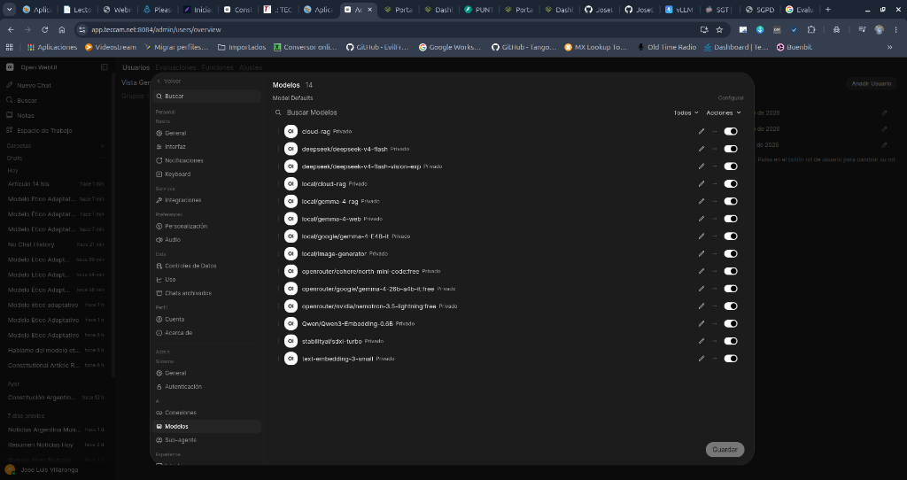

* **Respuesta RAG con `cloud-rag` (Inferencia Cloud + LanceDB):**
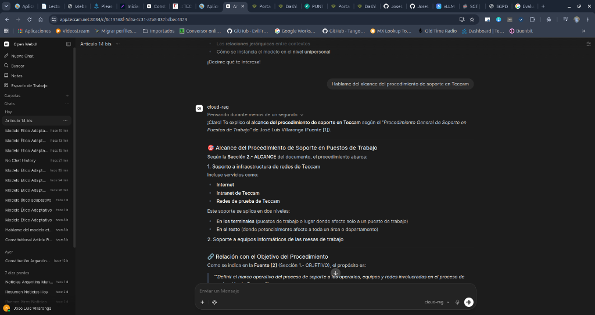

* **Consulta Jurídica con `local/gemma-4-rag` (Constitución Nacional Argentina):**
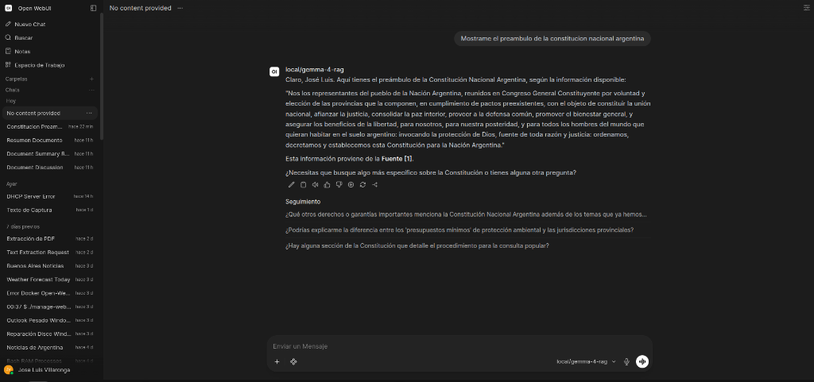

* **Consulta de Manual Interno con `local/gemma-4-rag` (Procedimiento General de Soporte en Puestos Teccam):**
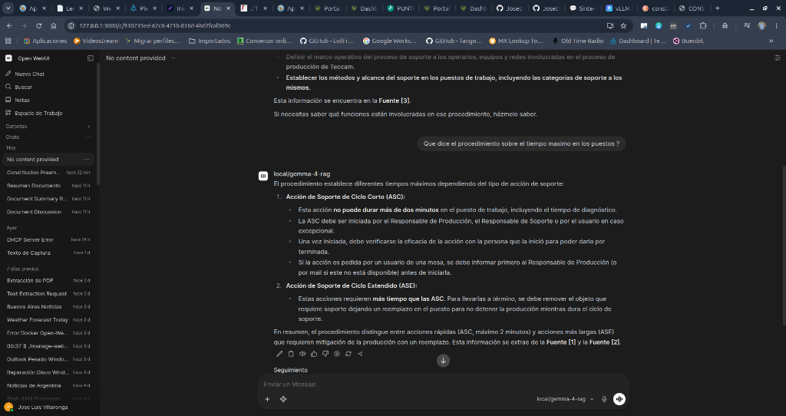

### 5. Integración como Herramienta Nativa en Open-WebUI (*Function Calling / Tool Calling*)

Permite que tanto los modelos locales (Gemma 4) como los modelos de proveedores en la nube (DeepSeek, Claude, GPT, etc.) consulten autónomamente la base de conocimiento vectorial en LanceDB cuando la conversación lo requiera.

#### A. Pasos de Instalación en Open-WebUI:
1. Ve a **Workspace (Espacio de Trabajo) ➔ Herramientas (Tools)** y haz clic en el botón **`+` (Crear Herramienta)**.
2. Copia y pega el código Python de la herramienta presentado a continuación (también disponible en [`tools/openwebui_rag_tool.py`](tools/openwebui_rag_tool.py)).
3. Haz clic en **Guardar**.
4. Haz clic en el ícono de engranaje ⚙️ de la herramienta (**Valves / Válvulas**) y define:
   * **`GATEWAY_URL`**: `http://192.168.1.47:8000` (utiliza la IP del host si Open-WebUI corre dentro de Docker).
   * **`API_KEY`**: Tu clave API maestra o una clave secundaria creada en el Dashboard con permiso de acceso.
   * **`DEFAULT_TOP_K`**: `4` (número de fragmentos de contexto a recuperar).
5. Ve a **Workspace ➔ Modelos**, edita el modelo deseado (ej: `google/gemma-4-E4B-it`, `deepseek/deepseek-v4...`, etc.) y activa el interruptor de la herramienta **`Búsqueda y Lectura RAG Teccam (LanceDB)`**.

#### B. Código de la Herramienta (*Custom Tool v2.0.0*):

```python
"""
title: Búsqueda y Lectura RAG Teccam (LanceDB)
author: Jose Luis Villaronga
author_url: https://github.com/JoseLVillaronga/tech-vllm
git_url: https://github.com/JoseLVillaronga/tech-vllm
description: Consulta y lee documentos de la base de conocimiento documental de Teccam en LanceDB con vectores 1024D (Qwen3), BM25, GPS Documental y extracción por secciones.
required_open_webui_version: 0.3.0
requirements: requests, pydantic
version: 2.0.0
license: MIT
"""

import os
import requests
from typing import Optional, List, Union
from pydantic import BaseModel, Field


class Tools:
    class Valves(BaseModel):
        GATEWAY_URL: str = Field(
            default="http://127.0.0.1:8000",
            description="URL base del Gateway de la suite vLLM (ej: http://127.0.0.1:8000 o https://tech-support.com.ar:19000)."
        )
        API_KEY: str = Field(
            default="TU_CLAVE_API_VLLM_AQUI",
            description="Clave API autorizada para consultar el servicio RAG."
        )
        DEFAULT_TOP_K: int = Field(
            default=4,
            description="Cantidad máxima de fragmentos relevantes a recuperar por búsqueda puntual."
        )

    def __init__(self):
        self.valves = self.Valves()

    def buscar_en_base_de_conocimiento(
        self,
        consulta: str,
        dominios: Optional[str] = None
    ) -> str:
        """
        Consulta fragmentos relevantes en la base de datos documental y jurídica de Teccam en LanceDB.
        Utiliza esta herramienta siempre que el usuario haga preguntas puntuales sobre leyes argentinas, artículos de la Constitución, Código Civil, procedimientos internos de Teccam o patrones de arquitectura.
        :param consulta: Pregunta o términos de búsqueda específicos para consultar en los libros y procedimientos.
        :param dominios: Opcional: Tema o temas a filtrar separados por comas. Dejar vacío para buscar en toda la base.
        """
        base_url = str(self.valves.GATEWAY_URL).rstrip("/")
        if not base_url.endswith("/api/tools/rag-search") and not base_url.endswith("/v1/rag/search"):
            url = f"{base_url}/api/tools/rag-search"
        else:
            url = base_url

        headers = {
            "Authorization": f"Bearer {self.valves.API_KEY}",
            "Content-Type": "application/json"
        }

        clean_query = str(consulta).strip() if consulta and not str(type(consulta)).endswith("FieldInfo'>") else ""
        temas_list = None
        if dominios and not str(type(dominios)).endswith("FieldInfo'>"):
            if isinstance(dominios, list):
                temas_list = [str(d).strip() for d in dominios if d]
            elif isinstance(dominios, str):
                temas_list = [d.strip() for d in dominios.split(",") if d.strip()]

        top_k_val = 4
        if hasattr(self.valves, "DEFAULT_TOP_K") and not str(type(self.valves.DEFAULT_TOP_K)).endswith("FieldInfo'>"):
            try:
                top_k_val = int(self.valves.DEFAULT_TOP_K)
            except Exception:
                top_k_val = 4

        payload = {
            "query": clean_query,
            "temas": temas_list,
            "top_k": top_k_val
        }

        try:
            response = requests.post(url, json=payload, headers=headers, timeout=15.0)

            if response.status_code == 503:
                return "Aviso: El servicio de Base de Conocimiento RAG está temporalmente desactivado globalmente."

            if response.status_code != 200:
                return f"Error en la consulta RAG (HTTP {response.status_code}): {response.text}"

            data = response.json()
            context = data.get("context", "")
            results_count = data.get("results_count", 0)

            if not context or results_count == 0:
                return f"No se encontraron fragmentos relevantes en la base de conocimiento para la consulta: '{clean_query}'."

            return (
                f"[DOCUMENTOS ENCONTRADOS EN LANCEDB ({results_count} fragmentos recuperados en {data.get('latency_ms', 0)} ms)]:\n\n"
                f"{context}\n\n"
                f"Por favor responde fundamentando con estos fragmentos y cita las fuentes/artículos relevantes."
            )
        except Exception as e:
            return f"Error de conexión con el Gateway RAG ({url}): {str(e)}"

    def leer_documento_completo(
        self,
        doc_id: str,
        parte: int = 1,
        seccion: Optional[str] = None
    ) -> str:
        """
        Obtiene el texto completo, por sección temática o paginado de un documento, procedimiento o libro oficial de Teccam para redactar resúmenes integrales, síntesis ejecutivas o análisis normativos exhaustivos sin omitir pasos ni incisos.
        Acepta tanto el doc_id hexadecimal como el título exacto o parcial del procedimiento/libro.
        Si el documento tiene hasta 60.000 tokens (~50% de la ventana de 128K), entrega el texto original íntegro 1:1. Si es más extenso, entrega la parte solicitada con límites limpios de sección o la sección indicada.
        :param doc_id: ID único del documento (ej: '67b2111008223c9b3c3e5608') o el título del documento (ej: 'Procedimiento General de Soporte en Puestos de Trabajo').
        :param parte: Número de parte a recuperar si es un libro extenso paginado (1 para la primera parte, 2 para la siguiente, etc.).
        :param seccion: Opcional: Nombre del capítulo, libro o sección temática específica a extraer (ej: 'Libro Primero', 'Título II', 'DESARROLLO', 'Nuevos derechos').
        """
        base_url = str(self.valves.GATEWAY_URL).rstrip("/")
        if not base_url.endswith("/api/tools/rag-document") and not base_url.endswith("/v1/rag/document"):
            url = f"{base_url}/api/tools/rag-document"
        else:
            url = base_url

        headers = {
            "Authorization": f"Bearer {self.valves.API_KEY}",
            "Content-Type": "application/json"
        }

        clean_doc_id = str(doc_id).strip() if doc_id and not str(type(doc_id)).endswith("FieldInfo'>") else ""
        clean_parte = 1
        if parte is not None and not str(type(parte)).endswith("FieldInfo'>"):
            try:
                clean_parte = int(parte)
            except Exception:
                clean_parte = 1

        clean_seccion = str(seccion).strip() if seccion and not str(type(seccion)).endswith("FieldInfo'>") else None

        payload = {
            "doc_id": clean_doc_id,
            "parte": clean_parte,
            "token_threshold": 60000,
            "seccion": clean_seccion
        }

        try:
            response = requests.post(url, json=payload, headers=headers, timeout=25.0)

            if response.status_code == 503:
                return "Aviso: El servicio de Base de Conocimiento RAG está temporalmente desactivado globalmente."

            if response.status_code != 200:
                return f"Error al leer el documento (HTTP {response.status_code}): {response.text}"

            data = response.json()
            return data.get("content", "")
        except Exception as e:
            return f"Error de conexión con el Gateway RAG ({url}): {str(e)}"

    def obtener_estructura_documento(
        self,
        doc_id: str
    ) -> str:
        """
        Obtiene el 'GPS Documental' (Mapa y Árbol de Estructura de Secciones) de una obra, libro o código extenso (ej: Código Civil, Constitución Nacional, manuales técnicos).
        Permite conocer todos los capítulos, títulos, artículos, rangos de fragmentos y volumen de tokens antes de leer o resumir partes específicas.
        :param doc_id: ID único del documento (ej: '6a8b02cface6becbcb49b20d') o título de la obra (ej: 'Codigo Civil Argentino').
        """
        base_url = str(self.valves.GATEWAY_URL).rstrip("/")
        if not base_url.endswith("/api/tools/rag-structure") and not base_url.endswith("/v1/rag/structure"):
            url = f"{base_url}/api/tools/rag-structure"
        else:
            url = base_url

        headers = {
            "Authorization": f"Bearer {self.valves.API_KEY}",
            "Content-Type": "application/json"
        }

        clean_doc_id = str(doc_id).strip() if doc_id and not str(type(doc_id)).endswith("FieldInfo'>") else ""
        payload = {"doc_id": clean_doc_id}

        try:
            response = requests.post(url, json=payload, headers=headers, timeout=20.0)

            if response.status_code == 503:
                return "Aviso: El servicio de Base de Conocimiento RAG está temporalmente desactivado globalmente."

            if response.status_code != 200:
                return f"Error consultando estructura RAG (HTTP {response.status_code}): {response.text}"

            data = response.json()
            return data.get("content", "No se obtuvo contenido de estructura.")
        except Exception as e:
            return f"Error de conexión con el Gateway RAG ({url}): {str(e)}"
```

### 5.3. Buenas Prácticas: Prevención del "Sesgo de Falta de Confirmación" (Herramientas Nativas vs Tool RAG)

#### A. El Problema Identificado:
Cuando se integran modelos compactos (como Gemma 4 E4B) o modelos en fase de exploración inicial, si en el perfil del modelo en Open-WebUI se encuentran activas simultáneamente:
1. Las herramientas nativas de archivos de Open-WebUI (`search_knowledge_files` / `search_files`).
2. Nuestra herramienta personalizada de LanceDB (`buscar_en_base_de_conocimiento`).

El LLM puede decidir invocar en primer lugar `search_knowledge_files`. Dado que dicha función nativa solo inspecciona la base interna SQLite/ChromaDB de Open-WebUI (que se encuentra vacía para el repositorio corporativo centralizado), recibe una lista vacía `[]`. 

En modelos pequeños, este retorno vacío produce un **"Sesgo de Falta de Confirmación"**: el modelo asume erróneamente que el documento *no existe en absoluto*, descarta el uso de las demás herramientas y procede a alucinar o a recurrir a la web externa (a diferencia de modelos de gran escala como DeepSeek V4 que pueden recuperarse y probar la herramienta secundaria).

#### B. La Solución Arquitectónica (Opción Limpia y Sin Deuda Técnica):
Para garantizar un comportamiento determinista y libre de fricciones sin crear parches o acoplamientos ocultos:

1. Ve a **Espacio de Trabajo ➔ Modelos** en Open-WebUI y edita el modelo en uso (o crea uno nuevo como `local/gemma-4-teccam`).
2. En la sección **Herramientas (Tools)**:
   * **MARCA** la herramienta personalizada **`Búsqueda RAG Teccam (LanceDB)`** (además de PDF Generator o Clima si aplican).
3. En la sección **Conocimiento**:
   * Déjalo vacío (no selecciones ninguna colección interna).
4. En la sección inferior **Capacidades**:
   * **DESMARCA** la casilla **`Herramientas Integradas`** (*Built-in Tools*). Esto evita que Open-WebUI inyecte sus herramientas nativas vacías (`search_knowledge_files`).

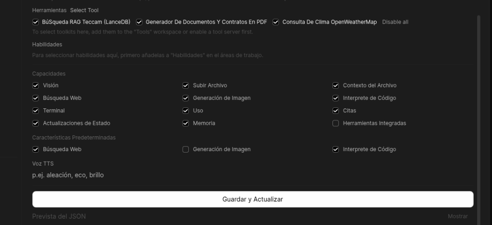

5. **¿Por qué esta solución?**
   * **Preserva la arquitectura limpia:** No altera ni puentea las funciones nativas de Open-WebUI mediante interceptores ("Pipes") que podrían romper funcionalidades futuras si el usuario sube archivos individuales al chat.
   * **Cero ambigüedad para el LLM:** El modelo recibe un esquema de funciones unívoco, forzando la consulta directa a LanceDB desde el primer intento.

---

### 5.4. Orquestación Segura de VRAM para Ingesta y Sincronización (`sync_rag_scheduled.sh`)

#### A. Por qué CUDA en lugar de CPU para Embeddings Masivos:
Durante la ingesta y re-indexación de la biblioteca corporativa (14 obras completas y más de 6.000 fragmentos / 10 millones de tokens):
* **En CPU:** El cálculo matricial en float32 consume el 700% de CPU durante más de una hora, resultando inviable para mantenimiento continuo.
* **En GPU CUDA (RTX 3090):** La aceleración masiva por Tensor Cores liquida la vectorización de toda la biblioteca en **121 segundos** (~300 veces más rápido).

#### B. Mecánica de Protección de VRAM:
Para evitar picos de memoria cuando el LLM (`vllm.service`, ~14.2 GB de VRAM) y la ingesta masiva compiten por la GPU:
1. El script orquestador [`sync_rag_scheduled.sh`](sync_rag_scheduled.sh) detecta si el LLM está activo y lo detiene temporalmente.
2. Comprueba mediante `nvidia-smi` que el uso de VRAM en la GPU 0 descienda por debajo de los 10 GB.
3. Ejecuta `app_rag_sync.py` con aceleración CUDA completa, límites de oración, solapamiento de 180c y cálculo exacto de tokens.
4. **Garantía de Restauración (`trap cleanup EXIT INT TERM`):** Al finalizar la sincronización (por éxito o por error), el script reanuda automáticamente el servicio `vllm.service`.
5. **Programación Automática:** Se ejecuta 1 vez al día a la **medianoche en punto (00:00:00)** a través del temporizador systemd `vllm-rag-sync.timer`.
6. **Sincronización Manual desde el Dashboard:** Al pulsar "Sincronizar Base RAG Ahora" en la Web GUI (`:8004`), el sistema muestra un modal de advertencia preventiva y ejecuta este mismo flujo seguro en segundo plano.

---

### 6. Ejemplos de Consulta Directa por API (cURL)

#### A. Búsqueda Vectorial Híbrida (`/api/tools/rag-search`):
```bash
curl -X POST http://localhost:8000/api/tools/rag-search \
  -H "Authorization: Bearer TU_CLAVE_API_VLLM" \
  -H "Content-Type: application/json" \
  -d '{
    "query": "tiempo maximo de accion de soporte en puesto",
    "temas": ["Procedimientos Teccam"],
    "top_k": 3
  }'
```

#### B. Lectura de Documento Completo para Síntesis (`/api/tools/rag-document`):
```bash
curl -X POST http://localhost:8000/api/tools/rag-document \
  -H "Authorization: Bearer TU_CLAVE_API_VLLM" \
  -H "Content-Type: application/json" \
  -d '{
    "doc_id": "67b2111008223c9b3c3e5608",
    "parte": 1,
    "token_threshold": 60000
  }'
```

### 7. Diagnóstico y Auto-Reparación del Subsistema RAG (`check_rag_health.sh`)

Para auditar, supervisar y restablecer la operatividad de todo el ecosistema RAG ante cualquier eventualidad o cuello de botella (ej. microservicio de embeddings en estado 503 tras pruebas de carga extrema de VRAM o reinicios del sistema), la suite incluye el script interactivo y autónomo [`check_rag_health.sh`](check_rag_health.sh).

#### A. Las 5 Capas de Auditoría en Tiempo Real:

```
+---------------------------------------------------------------------------------------------------+
|                     FLUJO DE AUDITORÍA EN 5 CAPAS (check_rag_health.sh)                           |
+---------------------------------------------------------------------------------------------------+
|  [1/5] Persistencia LanceDB:       Valida directorio 'data/lancedb/' y tablas de vectores (.lance)|
|  [2/5] Microservicio Embeddings:   Consulta GET /v1/models en :18005 (Modelo Qwen3-Embedding)     |
|  [3/5] Vectorización en Vivo:      Ejecuta POST /v1/embeddings y valida vector de 1024 dimensiones|
|  [4/5] Búsqueda RAG en Dashboard:  Ejecuta POST /api/rag/search en :8004 con consulta semántica   |
|  [5/5] Tool Calling en Gateway:    Ejecuta POST /api/tools/rag-search en :8000 con API Key Bearer |
+---------------------------------------------------------------------------------------------------+
```

#### B. Modos de Ejecución:

* **1. Modo Diagnóstico / Inspección (Solo lectura):**
  ```bash
  ./check_rag_health.sh
  ```
  *Muestra un informe detallado con tiempos de latencia en milisegundos para cada capa sin modificar el estado de los servicios.*

* **2. Modo Auto-Reparación (`--fix` o `--heal`):**
  ```bash
  ./check_rag_health.sh --fix
  ```
  *Si detecta que el servicio de embeddings o el gateway están caídos, bloqueados o devolviendo `HTTP 503 / 500`, ejecuta automáticamente `sudo systemctl restart vllm-embeddings vllm-gateway`, espera la inicialización y re-ejecuta el diagnóstico completo hasta confirmar 100% de operatividad.*

#### C. Casos de Uso y Resolución de Problemas:

1. **Error HTTP 503 en Embeddings tras pruebas de modelos pesados:**
   * **Causa:** Al cargar modelos masivos en VRAM (ej. GLM-4.7 30B con 22 GB VRAM), el servicio `vllm-embeddings` puede perder la asignación de tensores en CUDA.
   * **Solución:** Ejecutar `./check_rag_health.sh --fix` para reenganchar el servicio en segundos.
2. **"Latencia LanceDB: undefined ms" en la pestaña Base RAG del Dashboard:**
   * **Causa:** El endpoint `/api/rag/search` arrojó error 500 porque el motor de embeddings no respondió.
   * **Solución:** Correr `./check_rag_health.sh` para ver qué capa específica falló.
3. **Verificación post-sincronización de libros:**
   * Comprueba que los nuevos fragmentos indexados desde Teccam PDF respondan de inmediato al motor híbrido (Vectorial + BM25).

#### D. Ejemplo de Salida en Producción:

```text
======================================================================
   🔍 DIAGNÓSTICO INTEGRAL DEL SUBSISTEMA RAG (LANCEDB + vLLM SUITE)  
======================================================================

[1/5] Verificando Base Vectorial LanceDB en disco...
  ✔ Directorio LanceDB operativo: /home/jose/vllm/data/lancedb (1 tabla/s encontradas)

[2/5] Verificando Microservicio de Embeddings (Puerto :18005)...
  ✔ Servicio vllm-embeddings respondiendo en puerto :18005 (HTTP 200)
    Modelo activo: Qwen/Qwen3-Embedding-0.6B

[3/5] Probando generación de vector de prueba (1024 dimensiones)...
  ✔ Vectorización completada en 64 ms (HTTP 200)
    Dimensiones generadas: 1024D (Vector Qwen3-Embedding)

[4/5] Probando Búsqueda RAG en API del Dashboard (Puerto :8004)...
  ✔ Búsqueda RAG del Dashboard exitosa en 77 ms (HTTP 200)
    Fragmentos recuperados: 3 | Primer resultado: Procedimiento General de Soporte en Puestos de Trabajo

[5/5] Probando Tool Calling RAG en el Gateway (Puerto :8000)...
  ✔ Tool Calling en Gateway exitoso en 78 ms (HTTP 200)
    Fragmentos entregados al LLM: 3

======================================================================
🎉 ¡EL SUBSISTEMA RAG ESTÁ 100% SALUDABLE Y OPERATIVO!
======================================================================
```

---

## 📄 Procesamiento de Documentos y OCR: Docling Serve

`docling-serve` es un motor de análisis y extracción de documentos (PDFs, tablas complejas, layout y OCR) de alto rendimiento, optimizado para GPU (~800MB VRAM) y expuesto en el puerto **`5020`**.

### 1. Rol en la Arquitectura y Ecosistema

Docling cumple un **doble propósito estratégico y desacoplado** dentro de la infraestructura:

1. **Motor de Extracción y OCR de Alta Fidelidad para [Teccam PDF](https://github.com/JoseLVillaronga/teccam_pdf):**
   * Actúa como el backend de procesamiento profundo para la biblioteca de **Teccam PDF** (`DOCLING_IP:5020`).
   * Convierte documentos escaneados y PDFs técnicos a Markdown preservando tablas, encabezados y jerarquías visuales.
   * `teccam_pdf` extrae complementariamente las figuras e imágenes reales vía PyMuPDF (en `static/documentos/<doc_id>/`), reemplaza los placeholders `<!-- image -->` de Docling por las rutas locales y persiste el libro normalizado en MongoDB para la lectura interactiva de los usuarios.

2. **Motor de Chunking Semántico para el Pipeline RAG:**
   * Expone endpoints de segmentación inteligente (`/v1/chunk/hierarchical` y `/v1/chunk/hybrid`).
   * Es consumido por el proceso de sincronización periódica (2 veces al día) que lee la API RAG de Teccam PDF (`:5022`), trocea los libros sin romper artículos ni tablas, genera vectores con **Qwen3-Embedding** en CPU y los indexa en **LanceDB** (ver detalle en [`ROADMAP_IDEAS.md`](ROADMAP_IDEAS.md#5-embeddings-semánticos-y-rag-qwen3-embedding-06b)).

### 2. Instalación del servicio systemd

```bash
./install_docling_service.sh
```

### 3. Comandos de administración

* **Ver logs en tiempo real:** `sudo journalctl -u docling -f`
* **Ver estado:** `sudo systemctl status docling`
* **Detener servicio:** `sudo systemctl stop docling`
* **Reiniciar servicio:** `sudo systemctl restart docling`
* **Documentación interactiva Swagger:** `http://localhost:5020/docs`
* **Documentación interactiva Scalar:** `http://localhost:5020/scalar`
* **Control Web:** Integrado directamente en la cuadrícula de servicios del [Dashboard Web](http://localhost:8004) (`:8004`).

---

## 🧪 Pruebas con `curl`

### 1. Probar el Chat (Gemma 4 en Puerto 8000)

```bash
curl http://localhost:8000/v1/chat/completions \
  -H "Content-Type: application/json" \
  -H "Authorization: Bearer tu_clave_api_aqui" \
  -d '{
    "model": "nvidia/Gemma-4-26B-A4B-NVFP4",
    "messages": [
      {"role": "user", "content": "¡Hola! ¿Puedes presentarte?"}
    ],
    "max_tokens": 150
  }'
```

### 2. Probar Texto a Voz con Clonación (F5-TTS en Puerto 8002)

Usa los siguientes comandos `curl` para generar audios en diferentes idiomas con pronunciación nativa manteniendo tu clon de voz:

#### 🇪🇸 Español (Voz `alloy` o `jose`)

```bash
curl -X POST http://localhost:8002/v1/audio/speech \
  -H "Authorization: Bearer tu_clave_api_aqui" \
  -H "Content-Type: application/json" \
  -d '\''{
    "model": "tts-1",
    "input": "Hola. Este es un mensaje de prueba generado en español usando mi propia voz clonada de forma local en mi computadora.",
    "voice": "alloy",
    "response_format": "mp3"
  }'\'' \
  -o espanol_clonado.mp3
```

#### 🇺🇸 Inglés (Voz `echo` o `jose-en`)

```bash
curl -X POST http://localhost:8002/v1/audio/speech \
  -H "Authorization: Bearer tu_clave_api_aqui" \
  -H "Content-Type: application/json" \
  -d '\''{
    "model": "tts-1",
    "input": "Hello! This is a test of my cloned voice speaking in English. It runs completely locally on my machine.",
    "voice": "echo",
    "response_format": "mp3"
  }'\'' \
  -o ingles_clonado.mp3
```

#### 🇫🇷 Francés (Voz `fable` o `jose-fr`)

```bash
curl -X POST http://localhost:8002/v1/audio/speech \
  -H "Authorization: Bearer tu_clave_api_aqui" \
  -H "Content-Type: application/json" \
  -d '\''{
    "model": "tts-1",
    "input": "Bonjour! C’est un test de ma voix clonée en français. Le rendu est généré instantanément.",
    "voice": "fable",
    "response_format": "mp3"
  }'\'' \
  -o frances_clonado.mp3
```

#### 🇩🇪 Alemán (Voz `onyx` o `jose-de`)

```bash
curl -X POST http://localhost:8002/v1/audio/speech \
  -H "Authorization: Bearer tu_clave_api_aqui" \
  -H "Content-Type: application/json" \
  -d '\''{
    "model": "tts-1",
    "input": "Guten Tag! Ich spreche Deutsch mit meiner eigenen geklonten Stimme auf meiner RTX dreißig-neunzig.",
    "voice": "onyx",
    "response_format": "mp3"
  }'\'' \
  -o aleman_clonado.mp3
```

#### 🇯🇵 Japonés (Voz `shimmer` o `jose-ja`)

```bash
curl -X POST http://localhost:8002/v1/audio/speech \
  -H "Authorization: Bearer tu_clave_api_aqui" \
  -H "Content-Type: application/json" \
  -d '\''{
    "model": "tts-1",
    "input": "こんにちは！これは私のクローン音声の日本語のテストです。完全にローカルで動作しています。",
    "voice": "shimmer",
    "response_format": "mp3"
  }'\'' \
  -o japones_clonado.mp3
```

#### 🇨🇳 Chino (Voz `echo` o `jose-en`)

```bash
curl -X POST http://localhost:8002/v1/audio/speech \
  -H "Authorization: Bearer tu_clave_api_aqui" \
  -H "Content-Type: application/json" \
  -d '{
    "model": "tts-1",
    "input": "你好！这是我本地克隆声音 de 中文测试。运行速度非常快。",
    "voice": "echo",
    "response_format": "mp3"
  }' \
  -o chino_clonado.mp3
```

#### 🇧🇷 Portugués (Voz `jose-pt`)

```bash
curl -X POST http://localhost:8002/v1/audio/speech \
  -H "Authorization: Bearer tu_clave_api_aqui" \
  -H "Content-Type: application/json" \
  -d '{
    "model": "tts-1",
    "input": "Olá! Este é um teste da minha voz clonada em português do Brasil, rodando localmente.",
    "voice": "jose-pt",
    "response_format": "mp3"
  }' \
  -o portugues_clonado.mp3
```

### 3. Probar Transcripción y Diarización en Vivo (Micrófono)

El proyecto incluye el cliente interactivo y de grado de producción [live_transcribe.py](live_transcribe.py) para capturar audio desde el micrófono físico, transcribir y separar hablantes en tiempo real.

Este cliente cuenta con tres características clave de estabilidad de audio:

1. **Autodetección de Frecuencia de Grabación:** Obtiene la tasa nativa del dispositivo de entrada predeterminado (por ejemplo, `44100 Hz` o `48000 Hz`) para evitar fallos de inicialización del controlador de audio (`paInvalidSampleRate`).
2. **Calibración Automática de Ruido Ambiente:** Durante los primeros 1.5 segundos de ejecución, mide la estática del entorno para calibrar dinámicamente el umbral de detección de voz (`THRESHOLD`), ignorando el ruido blanco de micrófonos USB.
3. **Procesamiento Asíncrono Desacoplado (Queue + Worker Thread):** Cuando se detecta un silencio, el fragmento de audio se introduce a una cola segura y se libera el micrófono inmediatamente (<1ms). Un hilo de fondo se encarga de realizar las llamadas HTTP a las APIs de Diarización (puerto `8003`) y Whisper (puerto `8001`) de manera secuencial sin bloquear la grabación activa, eliminando los errores de `input overflow`.

#### Requisitos de grabación

```bash
sudo apt update && sudo apt install -y libportaudio2
pip install sounddevice numpy scipy requests python-dotenv
```

#### Ejecución

```bash
python live_transcribe.py
```

### 4. Generador de Subtítulos en Vivo para Películas (Audio de Sistema)

El proyecto incluye el cliente [live_subtitles.py](live_subtitles.py) diseñado para capturar la **salida de audio del sistema (monitor PulseAudio/PipeWire)** en lugar del micrófono físico. Permite reproducir una película, vídeo de YouTube o videoconferencia y generar subtítulos sincronizados en tiempo real.

#### Características clave

1. **Captura Loopback Automática:** Detecta automáticamente la fuente de monitorización del sistema (`.monitor`) para escuchar lo que sale por los altavoces o auriculares.
2. **Generación Doble de Subtítulos:**
   * **`subtitulos.txt`**: Fichero de registro legible por humanos con marcas de tiempo `[HH:MM:SS]` e identificación de locutores `[Hablante A / B]`.
   * **`subtitulos.srt`**: Fichero de subtítulos en formato estándar SubRip con marcas de tiempo de milisegundos (`00:01:23,450 --> 00:01:26,100`), listo para cargar en reproducotes como VLC, MPV o Plex.
3. **Diarización + Transcripción Sincronizada:** Combina PyAnnote (puerto `8003`) y Whisper (puerto `8001`) asignando etiquetas continuas a cada personaje durante la película.

#### Ejecución

```bash
python live_subtitles.py
```

Opcionalmente se pueden especificar rutas personalizadas o ajustar el tiempo de pausa:

```bash
python live_subtitles.py --out-txt pelicula.txt --out-srt pelicula.srt --silence-limit 1.0
```

---

## 📚 Aprendizajes Técnicos y Optimizaciones

Durante el proceso de configuración y depuración de este proyecto se identificaron y resolvieron diversos aspectos clave sobre la arquitectura de vLLM y el hardware Ampere (RTX 3090):

### 1. Requerimiento del Compilador CUDA (`nvcc`)

* **Problema:** Error `RuntimeError: Could not find nvcc`.
* **Causa:** `FlashInfer` (utilizado por vLLM para el muestreo de tokens) requiere compilar kernels C++/CUDA JIT.
* **Solución:** Instalar `nvidia-cuda-toolkit` en el sistema Linux.

### 2. Tipo de Datos para Caché KV en GPUs SM86 (RTX 3090)

* **Problema:** Error `ValueError: FP8 KV cache is not supported by Triton attention backend on RTX 3090 (compute capability 8.6)`.
* **Causa:** El soporte nativo para FP8 en caché KV requiere GPUs de arquitectura Ada Lovelace/Hopper (SM89+).
* **Solución:** Configurar explícitamente `KV_CACHE_DTYPE=bfloat16`.

### 3. Ajuste de Muestreo por Tamaño de Vocabulario (Sampler Warmup OOM)

* **Problema:** `CUDA out of memory` durante la fase de *warmup* del sampler.
* **Causa:** Gemma 4 posee un vocabulario muy amplio (~256.000 tokens). Al realizar el *warmup* con 256 secuencias simultáneas por defecto, la asignación del mapa de probabilidades colapsaba la VRAM restante.
* **Solución:** Limitar `--max-num-seqs 64`, garantizando un consumo controlado durante el arranque.

### 4. Rendimiento de GPU Pura vs. CPU Offload (`SWAP_SPACE`)

* **Demostración Empírica:**
  * **GPU Pura (`SWAP_SPACE=0`):** Inferencia ultrarrápida de **~70-80 tokens/segundo** en generación y **~128+ tokens/segundo** en prompt throughput al ejecutarse 100% en la VRAM GDDR6X (~936 GB/s).
  * **CPU Offload (`SWAP_SPACE>0`):** La transferencia continua por el bus PCIe (~32 GB/s) genera un cuello de botella que reduce la tasa de generación a **~4 tokens/segundo**.
* **Conclusión:** Se configuró `app.py` para omitir automáticamente la bandera `--cpu-offload-gb` cuando `SWAP_SPACE=0`, obteniendo el máximo rendimiento nativo de la GPU.

### 5. Coexistencia Eficiente de VRAM (Gemma + Whisper)

* **Descubrimiento:** El motor vLLM pre-aloca estáticamente la VRAM al arrancar (default 90% por servidor). Correr dos instancias por defecto colapsaría la GPU (43.2 GB necesarios).
* **Solución:**
  * Limitamos a Gemma 4 en `.env` con `GPU_MEMORY_UTILIZATION=0.50` (ocupa ~13 GB). Su arquitectura híbrida sliding-window reduce el peso de la caché KV para 128K tokens a solo ~3.6 GB.
  * Limitamos a Whisper en `app_whisper.py` con `--gpu-memory-utilization 0.10` (ocupa ~2.8 GB).
  * **Resultado:** Ambos servicios corren permanentemente en GPU consumiendo juntos ~15.8 GB, dejando más de 8 GB libres para el uso intermitente de F5-TTS.

### 6. Muestreo Frecuencial de Audio para Modelos de Voz

* **Problema:** Enviar audios convertidos para F5-TTS (24 kHz) a modelos de procesamiento conversacional (como Whisper o Gemma 4) producía transcripciones incomprensibles y bucles infinitos en alemán (*"die neunzehntausend..."*).
* **Causa:** Los modelos de reconocimiento de voz esperan ondas remuestreadas estrictamente a la frecuencia estándar de **16.000 Hz (16 kHz)**.
* **Solución:** Implementar re-muestreo dinámico a 16kHz mono mediante `torchaudio` antes del envío (ver [test_transcription.py](test_transcription.py) y [test_whisper_api.py](test_whisper_api.py)).

### 7. Sintaxis de Prompts Multimodales de Audio

* **Descubrimiento:** vLLM recibe el audio serializado en Base64 mediante el esquema `data:audio/wav;base64,...` en el tipo `audio_url`.
* **Ubicación:** Para el modelo Gemma 4, el audio debe ir colocado *después* del texto. Además, el texto del prompt debe incluir la etiqueta de marcador de posición **`<|audio|>`** para indicarle al modelo dónde inyectar los embeddings de audio:
  `"Transcribe este audio de voz: <|audio|>"`
  Sin la etiqueta en el prompt, el modelo ignora el archivo de audio o responde: *"No se proporcionó ningún audio para transcribir."*

### 8. CPU-GPU Offloading Dinámico para Multilingüismo

* **Problema:** Cargar en paralelo 6 modelos de voz distintos (uno por cada idioma) colapsaría la GPU (~7.2 GB de VRAM requeridos solo para TTS).
* **Solución:** Implementar administración perezosa (*lazy loading*) en [app_tts.py](app_tts.py). Los modelos inactivos se instancian en la RAM del sistema (CPU) y se transfieren a la GPU (CUDA) sobre el bus PCIe bajo demanda en menos de 0.2 segundos.
* **Resultado:** Soporte completo de 6 idiomas nativos con un consumo constante y controlado de **~1.2 GB de VRAM**.

### 9. Formatos de Adaptadores LoRA: PyTorch PEFT vs. MLX (Apple Silicon)

* **Problema:** Error `ValueError: Missing required configuration fields: {'r', 'target_modules', 'lora_alpha'}` al cargar un adaptador en vLLM.
* **Causa:** Intentar cargar adaptadores LoRA compilados para el framework **MLX (Apple Silicon)** en un entorno de inferencia basado en Linux/Nvidia (PyTorch). MLX almacena tensores con formatos y nombres de claves de configuración de bajo nivel distintos (ej. `"rank"` y `"alpha"` en vez de `"r"` y `"lora_alpha"`).
* **Solución:** Utilizar la versión nativa del adaptador portada a formato **PyTorch PEFT estándar** (como `josuediazflores/gemma-4-e4b-opus-reasoning-lora`), que incluye las matrices de bajo rango en ficheros Safetensors estándar estructuradas para el cargador de vLLM.

### 10. Inyección y Delimitación Estricta de Prompts de Sistema para Razonamiento (`<think>`)

* **Problema:** Los modelos de razonamiento (como Gemma 4 con LoRA de razonamiento o al sintetizar datos de herramientas) requieren delimitadores precisos para su proceso deductivo. Si el prompt de sistema no establece una frontera estricta entre el pensamiento y la respuesta, el modelo puede continuar redactando la respuesta final dentro del mismo flujo de pensamiento o sin cerrar etiquetas, haciendo que Open-WebUI formatee todo el mensaje en cursiva (*itálica*) dentro del bloque colapsado de *"Pensando"*.
* **Solución:** Establecer la **arquitectura de prompt en dos fases (Pensamiento vs. Respuesta Final)** tanto en el Gateway como en los perfiles de Open-WebUI:
  ```text
  Eres un asistente de inteligencia artificial con capacidad de razonamiento avanzado y uso de herramientas.

  Sigue estrictamente esta estructura de dos fases en tus respuestas:

  1. FASE DE PENSAMIENTO (Razonamiento Interno):
  Si requieres analizar información, planificar la respuesta o procesar datos de herramientas, escribe todo tu proceso deductivo paso a paso EXCLUSIVAMENTE envuelto dentro de las etiquetas <think> y </think>.

  2. FASE DE RESPUESTA FINAL (Al Usuario):
  Inmediatamente después de cerrar la etiqueta </think>, escribe tu respuesta final dirigida al usuario en español, con redacción natural, limpia y bien estructurada. Jamás incluyas la respuesta final dentro de las etiquetas de pensamiento ni continúes razonando fuera de ellas.
  ```
  Esto garantiza que el bloque `<think>` se colapse limpiamente en la interfaz de usuario y la respuesta final se renderice en texto normal sin mezclarse.

### 11. Eliminación del Token de Fin de Turno (`<turn|>`) en Respuestas de Cliente

* **Problema:** Los modelos Gemma 4 (tanto el base `google/gemma-4-E4B-it` como el LoRA de razonamiento `gemma-4-reasoning`) devuelven la cadena de caracteres literal `<turn|>` al final de cada generación de texto en Open-WebUI y otras aplicaciones de cliente, lo cual resulta molesto y carece de utilidad para el usuario.
* **Causa:** El token de fin de turno (`ID 106`) detiene correctamente la inferencia en vLLM. Sin embargo, al no estar catalogado en el tokenizador base como un "special token" a omitir en la decodificación, el decodificador lo traduce textualmente a la cadena de caracteres `<turn|>` y la incluye en la respuesta.
* **Solución:** Implementar un **filtrado en streaming mediante búfer circular** en el generador de eventos asíncrono (`event_generator`) del Gateway Proxy (`app_gateway.py`). El búfer analiza los fragmentos en tránsito en tiempo real y remueve la cadena `"<turn|>"` antes de entregarla al cliente final.
* **Nota Técnica de Seguridad:** Originalmente se había intentado solucionar forzando la inyección de `"<turn|>"` en el parámetro `stop` de las peticiones JSON. Sin embargo, se descubrió que alterar el parámetro `stop` en vLLM inhabilita por completo el parser nativo de llamadas a funciones (`--tool-call-parser gemma4`) e interfiere con los prompts del motor multimodal (visión). Por ello, se eliminó la inyección en el request, permitiendo el uso óptimo de búsqueda en Internet y visión, delegando exclusivamente la limpieza del token al búfer de streaming de salida del Gateway.

### 12. Prevención de Sobrecarga de VRAM en Contextos Largos (Chunked Prefill)

* **Problema:** Caídas por `CUDA Out of Memory` (OOM) o picos excesivos de VRAM durante la fase de procesamiento inicial (*prefill*) al enviar prompts muy largos o contextos extensos (ej. 128K tokens en Gemma 4).
* **Causa:** Por defecto, vLLM procesa todo el prompt de entrada en un único paso de pre-carga. Para contextos muy extensos, la matriz de atención requiere una cantidad masiva de memoria temporal para calcular los scores de atención simultáneamente.
* **Solución:** Agregar las banderas `--enable-chunked-prefill` y `--max-num-batched-tokens` (con un valor predeterminado de `4096` configurable mediante la variable `MAX_NUM_BATCHED_TOKENS` en el archivo `.env`).
* **Mecanismo:** El *Chunked Prefill* divide la fase de procesamiento del prompt de entrada en pequeños fragmentos (chunks) de tamaño máximo de 4096 tokens. Esto permite intercalar fragmentos de pre-carga con pasos de generación de tokens (*decoding*) de otras secuencias, aplanando los picos de consumo de VRAM y garantizando la estabilidad del servidor ante contextos masivos sin degradar significativamente la latencia.

### 13. Aceleración de Encadenamiento de Herramientas y Comparativas con Prefix Caching (RadixAttention)

* **Problema:** En tareas complejas de RAG donde el modelo debe encadenar múltiples llamadas a herramientas consecutivas (ej. inspeccionar el Capítulo A, luego el Capítulo B, comparar causales y finalmente generar un PDF), cada nuevo paso acumula miles de tokens de contexto previo. Sin optimización, la GPU se ve obligada a re-procesar todo el historial desde cero en cada llamada intermedia (*prefill lag*), ralentizando severamente los pasos finales de la cadena.
* **Solución:** Activar `--enable-prefix-caching` (configurable mediante `ENABLE_PREFIX_CACHING=True` en `.env` y gestionado en `app.py`).
* **Mecanismo de RadixAttention:** vLLM mantiene los bloques de la memoria *KV Cache* correspondientes al System Prompt del MEA, las definiciones de herramientas y los fragmentos ya leídos en una estructura de árbol (*Radix Tree*) dentro del pool de memoria ya reservado.
* **Beneficios en Producción:**
  * **Hit Rate de Prefijo del 80% al 95%:** En el segundo, tercer o cuarto turno de herramientas, la GPU solo computa los nuevos tokens del request delta (< 50 tokens), reduciendo el *Time-To-First-Token* (TTFT) de ~800 ms a **menos de 20 ms**.
  * **Cero Costo Adicional de VRAM:** No reserva memoria extra. Si el servidor se satura, desaloja automáticamente los prefijos más antiguos mediante una política estándar LRU (*Least Recently Used*).
  * **Exhaustividad sin Penalización:** Facilita que modelos compactos o cuantizados con AWQ (`olberdingbrands/gemma-4-12B-it-awq`) ejecuten múltiples extracciones quirúrgicas sucesivas sin degradar la experiencia de usuario.

---

## 🎙️ Clonación de Voz con F5-TTS (Zero-Shot TTS)

El proyecto incluye el script [test_f5.py](test_f5.py) para realizar pruebas de clonación de voz (*Zero-Shot Voice Cloning*) utilizando la arquitectura **F5-TTS**.

### 🌍 Repositorios y Checkpoints por Idioma en Hugging Face

En F5-TTS, el idioma se define descargando e instanciando el *checkpoint* específico para ese idioma mediante `hf_hub_download`:

| Idioma | Repositorio (`repo_id`) | Archivo (`filename`) | Arquitectura | Notas |
| :--- | :--- | :--- | :--- | :--- |
| 🇪🇸 **Español** | `jpgallegoar/F5-Spanish` | `model_1200000.safetensors` | `F5TTS_Base` | 218h audio (AR, CL, ES, PE, VE). |
| 🇺🇸 / 🇨🇳 **Inglés y Chino** | `SWivid/F5-TTS` | *(descarga automática)* | `F5TTS_v1_Base` | Modelo base oficial de SWivid. |
| 🇫🇷 **Francés** | `RASPIAUDIO/F5-French-MixedSpeakers-reduced` | `model_last_reduced.pt` | `F5TTS_Base` | LibriVox FR, múltiples hablantes. |
| 🇩🇪 **Alemán** | `aihpi/F5-TTS-German` | `F5TTS_Base/model_420000.safetensors` | `F5TTS_Base` | HPI, Common Voice + Emilia_DE. |
| 🇷🇺 **Ruso** | `hotstone228/F5-TTS-Russian` | `model_last.safetensors` | `F5TTS_Base` | Afinado en ruso. |
| 🇯🇵 **Japonés** | `Jmica/F5TTS` | `JA_21999120/model_21999120.pt` | `F5TTS_Base` | Requiere `vocab_japanese.txt`. |

> **⚠️ IMPORTANTE:** Los modelos comunitarios (ES, FR, DE, RU, JA) fueron entrenados sobre `F5TTS_Base` (con `text_mask_padding: False`). El modelo base oficial (EN/ZH) usa `F5TTS_v1_Base`. Usar la arquitectura incorrecta produce audio incomprensible.

#### Ejemplo de uso en Python (`test_f5-es.py`)

```python
from huggingface_hub import hf_hub_download
from f5_tts.api import F5TTS

# Cargar checkpoint específico para Español
ckpt_path = hf_hub_download(repo_id="jpgallegoar/F5-Spanish", filename="model_1200000.safetensors")
vocab_path = hf_hub_download(repo_id="jpgallegoar/F5-Spanish", filename="vocab.txt")

# IMPORTANTE: especificar model="F5TTS_Base" para modelos comunitarios
f5tts = F5TTS(model="F5TTS_Base", ckpt_file=ckpt_path, vocab_file=vocab_path)

f5tts.infer(
    ref_file="mi_voz_24k_mono.wav",
    ref_text="Texto correspondiente a tu muestra de audio",
    gen_text="Texto en español que quieres que diga tu voz clonada",
    speed=1.0,
    file_wave="resultado_clonado.wav"
)
```

---

## 🧠 Modelos de Inferencia (vLLM)

El servidor central de inferencia ([app.py](app.py)) ejecuta los LLMs locales utilizando **vLLM**, optimizando el rendimiento mediante el uso compartido de la GPU Nvidia RTX 3090.

### 💻 1. Modelo de Programación MoE: Qwen3 Coder 30B

Para tareas avanzadas de desarrollo de software (con herramientas como **Aider** y **Goose**), la suite soporta el modelo especializado **`Qwen3-Coder-30B-A3B-Instruct-AWQ`** (Mixture of Experts).

* **Parámetros Óptimos de Inferencia:**
  * `MODEL`: `dark-side-of-the-code/Qwen3-Coder-30B-A3B-Instruct-AWQ`
  * `GPU_MEMORY_UTILIZATION`: `0.81` (~19.4 GB de VRAM asignados por vLLM).
  * `MAX_MODEL_LEN`: `16384` (Ventana de contexto segura de 16K en GPU).
  * `QUANTIZATION`: `compressed-tensors` (Formato nativo Marlin WNA16 en vLLM).
* **Gestión de VRAM y Coexistencia de Servicios:**
    Al ejecutar Qwen3 Coder, el consumo de VRAM de inferencia asciende a ~18.3 GB totales (pesos y caché KV). Para asegurar un rendimiento fluido y evitar fallos de memoria en la GPU:
  * **Con Servicios de Voz:** Con 16K de contexto, quedan ~4.7 GB libres, suficiente para mantener activos los servicios de Whisper (STT) y F5-TTS (TTS).
  * **Máximo Margen / Contexto Superior:** Si requieres el máximo rendimiento del modelo o deseas evitar cualquier riesgo de colisión de VRAM, puedes apagar temporalmente los servicios de voz y diarización mediante systemd:

        ```bash
        sudo systemctl stop vllm-whisper vllm-tts vllm-diarization
        ```

        Para reanudarlos al volver a modelos más ligeros:

        ```bash
        sudo systemctl start vllm-whisper vllm-tts vllm-diarization
        ```

### 💎 2. Modelo de Razonamiento: Gemma 4 E4B-it y Control de LoRA Condicional

Para inferencia general y razonamiento dinámico, el modelo por defecto es `google/gemma-4-E4B-it` con soporte para adaptadores LoRA de razonamiento (`gemma-4-reasoning`).

* **Control de LoRA desde la GUI:**
    El Dashboard incluye un selector desplegable de **LORA (Adaptador)**. Esto permite activar o desactivar la inyección del adaptador LoRA de razonamiento dinámico en caliente.
* **Ajuste Inteligente de VRAM:**
    Para optimizar el uso de recursos, el Dashboard modifica de manera reactiva el parámetro `GPU_MEMORY_UTILIZATION` de Gemma 4 E4B-it según el estado de LoRA:
  * **LORA Habilitado (`True`):** Asigna **`0.55`** para reservar el espacio de memoria requerido por las matrices del adaptador.
  * **LORA Deshabilitado (`False`):** Reduce la reserva a **`0.51`**, liberando 1 GB adicional de VRAM en la GPU.
* **Protección de Arquitectura:**
    Para prevenir bloqueos del sistema o errores fatales de `CUDA Out of Memory`, el archivo `app.py` valida la compatibilidad: el cargador de adaptadores LoRA de Gemma 4 sólo se habilitará si el parámetro `LORA` está activo **y** el nombre del modelo contiene la palabra `"gemma"`. Al seleccionar otros modelos (como Qwen3 Coder), el selector de LoRA de la GUI se desactiva automáticamente a `False` por seguridad.

---

## 💻 Agentes de Programación en Consola (Aider)

El ecosistema local permite la integración de agentes de programación interactivos basados en terminal como **Aider** (`aider.chat`), permitiéndoles conectarse directamente a tu motor GPU local para realizar modificaciones de código de múltiples archivos y control de versiones automático en Git.

### ⚙️ Instalación en Entornos con Anaconda (Python 3.13+)

Dado que Aider requiere entornos con Python 3.9–3.12 y no soporta de forma nativa versiones muy recientes como Python 3.13 o superior (común en entornos nuevos de Anaconda), se utiliza la utilidad oficial `aider-install` para encapsular la herramienta de manera aislada sin alterar tu entorno Anaconda global:

1. **Instalar el asistente de instalación oficial:**

   ```bash
   pip install aider-install
   ```

2. **Ejecutar el instalador aislado:**

   ```bash
   aider-install
   ```

---

### 🌐 Configuración del Entorno (`.bashrc`)

Para que Aider se conecte automáticamente al Gateway local y localice el ejecutable aislado, añade las siguientes líneas a tu archivo `~/.bashrc`:

```bash
# Apuntar Aider al Gateway local
export OPENAI_API_BASE="http://localhost:8000/v1"
export OPENAI_API_KEY="vllm_key_6a8415b561c810996239ea3ed66ff41fcbe4452c" # Clave maestra de la suite

# Agregar ejecutables locales al PATH (para ubicar uv y Aider)
export PATH="/home/jose/.local/bin:$PATH"
```

Carga la nueva configuración en tu terminal actual:

```bash
source ~/.bashrc
```

---

### 🚀 Uso de Aider con el Modelo de Razonamiento Local

Una vez configurado el entorno, sitúate en la carpeta raíz de cualquier repositorio Git y lanza Aider apuntando al modelo de razonamiento dinámico cargado con LoRA:

```bash
aider --model openai/gemma-4-reasoning
```

#### 💡 Consejos de Uso

* **Formato de Edición:** El modelo `gemma-4-reasoning` cuenta con razonamiento estructurado avanzado. Si notas imprecisiones en los diffs, puedes forzar a Aider a reescribir archivos completos utilizando:

  ```bash
  aider --model openai/gemma-4-reasoning --edit-format whole
  ```

* **Salir del Chat:** Para salir de la consola de Aider, escribe `/exit`, `/quit` o presiona `Ctrl + D`.

---

## 🛡️ Gateway de Seguridad y Protección Perimetral

Para proteger el ecosistema de IA y permitir la exposición segura de la suite a Internet (por ejemplo, detrás de un proxy como **Caddy**), la suite local implementa un **Gateway Proxy Reverso asíncrono** (`app_gateway.py`) que actúa como la primera línea de defensa perimetral.

### 🏛️ Arquitectura de Aislamiento de Red

Los motores de inferencia reales (Gemma, Whisper, F5-TTS y PyAnnote) están enlazados exclusivamente en la dirección de bucle local (`127.0.0.1`) en puertos privados reubicados (`18000`-`18003`). El Gateway de seguridad escucha en las interfaces públicas estándar en los puertos públicos (`8000`-`8003`), interceptando, validando y normalizando cada petición entrante antes de delegar el procesamiento.

---

### 🔑 1. Sistema de Claves API (Autenticación)

El acceso a las APIs requiere obligatoriamente una firma Bearer:

1. **Clave Maestra (`API_KEY` en `.env`):** Otorga privilegios de administrador y acceso total e irrestricto a los 4 servicios. Es la que utiliza la propia interfaz del Dashboard y Open-WebUI por defecto.
2. **Claves API Secundarias (Persistidas en MongoDB):**
    * Administradas en caliente desde la pestaña **"Seguridad"** del Dashboard Web.
    * Permiten acceso granular por servicios individuales (ej: habilitar solo STT para un bot de transcripción).
    * Cuentan con **fecha de expiración opcional** (la clave se suspende automáticamente al expirar) y pueden ser activadas/desactivadas manualmente con un clic.

---

### 🌐 2. Control de Acceso por IP (Whitelist / Blacklist CIDR)

El Gateway valida la IP de origen del cliente contra reglas persistidas en MongoDB:

* **Soporte CIDR Completo:** Permite ingresar direcciones IP individuales (ej. `192.168.1.50`) u obtener compatibilidad con rangos y subredes completas utilizando notación CIDR estándar (ej. `192.168.0.0/16`).
* **Políticas de Lista:**
  * *Lista Blanca (Whitelist):* Si tiene elementos, se comporta como "restrictivo por defecto" (solo entran las IPs que pertenezcan a la lista blanca).
  * *Lista Negra (Blacklist):* Si tiene elementos, deniega de inmediato con `403 Forbidden` a cualquier IP que coincida.
* **Compatibilidad con Proxy Reverso (Caddy, Nginx):** El Gateway analiza automáticamente las cabeceras estándar `X-Real-IP` y `X-Forwarded-For` (extrayendo el primer cliente). Esto garantiza que la IP validada en los filtros y registrada en la telemetría sea siempre la IP pública del usuario original y no la IP local del host o del proxy reverso.
* **Ejemplo de Configuración de Caddy (Proxy Reverso):**
  Para exponer las APIs públicas de la suite (`8000`-`8003`) a internet de forma segura bajo puertos SSL dedicados, puedes usar la siguiente plantilla de configuración de Caddy (`Caddyfile`). Nota cómo se configuran las cabeceras `X-Real-IP` para que el Gateway pueda extraer la IP pública real del cliente de forma correcta:
  ```caddy
  # Exponer Gemma Proxy (vLLM)
  tu-dominio.com.ar:19000 {
      reverse_proxy http://127.0.0.1:8000 {
          header_up X-Real-IP {remote_host}
          header_up X-Forwarded-For {remote_host}
          header_up X-Forwarded-Proto {scheme}
      }
  }

  # Exponer Whisper Proxy (ASR)
  tu-dominio.com.ar:19001 {
      reverse_proxy http://127.0.0.1:8001 {
          header_up X-Real-IP {remote_host}
          header_up X-Forwarded-For {remote_host}
          header_up X-Forwarded-Proto {scheme}
      }
  }

  # Exponer F5-TTS Proxy (Voz)
  tu-dominio.com.ar:19002 {
      reverse_proxy http://127.0.0.1:8002 {
          header_up X-Real-IP {remote_host}
          header_up X-Forwarded-For {remote_host}
          header_up X-Forwarded-Proto {scheme}
      }
  }

  # Exponer Diarización Proxy (PyAnnote)
  tu-dominio.com.ar:19003 {
      reverse_proxy http://127.0.0.1:8003 {
          header_up X-Real-IP {remote_host}
          header_up X-Forwarded-For {remote_host}
          header_up X-Forwarded-Proto {scheme}
      }
  }
  ```
* **Validación de Sintaxis:** La base de datos y la UI validan la sintaxis utilizando el módulo estándar `ipaddress` para evitar configuraciones de red corruptas.
* **Cero Latencia:** Para no degradar el rendimiento de la GPU, el Gateway no consulta la base de datos en cada petición. Valida las peticiones contra copias en memoria RAM de los rangos ($O(1)$) que un hilo asíncrono en segundo plano sincroniza desde MongoDB cada 10 segundos.

---

### 🚨 3. Sistema de Prevención de Intrusos (Fail2ban Nativo)

Para mitigar escaneos de puertos y ataques de fuerza bruta al publicar la suite a Internet:

* **Detección en RAM:** El Gateway rastrea los intentos fallidos de autenticación (tokens faltantes o inválidos) en caliente usando un diccionario de memoria RAM protegido contra concurrencia.
* **Regla de los 3 Fallos:** Si una IP de cliente genera **3 intentos fallidos en un lapso de 5 minutos (300 segundos)**, el sistema la considera hostil.
* **Baneo Automático por 48 horas:**
  * La IP es bloqueada automáticamente mediante la inserción de una regla de lista negra (`blacklist`) en MongoDB con una vigencia de 48 horas (`expires_at`).
  * El bloqueo se propaga al caché de todos los puertos públicos del Gateway en segundos.
* **Autolimpieza Eficiente:** MongoDB limpia y remueve de forma automática las IPs baneadas expiradas utilizando un índice TTL dinámico en la colección `ip_rules` (`expireAfterSeconds=0` sobre el campo `expires_at`). Las reglas de IP estáticas (permanentes) carecen de este campo y nunca expiran.

---

### 📊 4. Telemetría de Consumo y Métricas Asíncronas

Para evaluar el uso de los recursos de la GPU (RTX 3090) a lo largo del tiempo sin penalizar la velocidad de inferencia:

* **Procesamiento Asíncrono Desacoplado:** El Gateway utiliza `BackgroundTasks` de FastAPI para guardar las métricas de consumo en segundo plano. Esto asegura que el cliente final reciba la respuesta de inmediato y el registro en la base de datos no sume latencia a la petición HTTP.
* **Extracción Inteligente de Tokens (Gemma 4):** El Gateway analiza en tiempo real el flujo SSE (*Server-Sent Events*) del streaming. Extrae los contadores oficiales de tokens de entrada (`prompt_tokens`) y salida (`completion_tokens`). Para clientes antiguos que no los solicitan, implementa una heurística conservadora basada en caracteres/bytes (`caracteres // 4`).
* **Cálculo de Tiempos de Audio:**
  * *STT (Whisper):* Determinado en base al tamaño en bytes del audio adjunto en la petición multipart.
  * *TTS (F5-TTS):* Calculado de forma exacta basándose en el formato de salida PCM de 24kHz Mono (restando la cabecera WAV de 44 bytes y dividiendo por la tasa de transferencia de $48\,000$ bytes por segundo).
* **Expiración Automática de Métricas:** Se configura un índice TTL sobre la colección `usage_logs` de MongoDB que purga los registros automáticamente a los **6 meses** (15,552,000 segundos) para evitar el crecimiento ilimitado de la base de datos.
* **Dashboard Visual Reactivo:** La pestaña "Métricas" dibuja gráficos temporales (Chart.js local y offline) combinando tokens y segundos de audio en ejes Y independientes, y desglosa el consumo por Claves API y Modelos mediante gráficos interactivos de tipo Doughnut.

---

### 🕵️ 5. Auditoría de Seguridad, Paginación y Exportación a Excel

El firewall del Gateway no solo bloquea a los atacantes, sino que provee una pista de auditoría interactiva para monitorear incidentes perimetrales:

* **Registro Asíncrono Completo:** Cada vez que una IP es denegada (Lista Blanca, Lista Negra o baneo automático) o un cliente falla la autenticación de Clave API (con un error `401 Unauthorized`), se registra el incidente de forma asíncrona mediante un hilo independiente (`asyncio.create_task` con `asyncio.to_thread`). Esto evita la pérdida de logs cuando FastAPI corta el flujo de ejecución debido a la excepción HTTP de seguridad.
* **Paginación Inteligente en Servidor:** Para soportar miles de intentos bloqueados sin saturar el Dashboard Web ni la RAM del servidor, el endpoint `/api/blocked-requests` implementa una paginación nativa en MongoDB usando `skip` y `limit` (por defecto 10 registros por página), calculando la paginación dinámicamente en el footer de la tabla.
* **Filtros Avanzados e Interactivos:** La tabla de seguridad permite realizar búsquedas en caliente por rango de fechas (elegibles desde calendarios), coincidencia parcial de IP, tipo de servicio, subcadena del endpoint (ej: `/v1/chat/completions`) y motivo del bloqueo.
* **Exportación Regional a Excel (CSV):** Implementa el endpoint `/api/blocked-requests/export` que devuelve un archivo CSV optimizado para Excel en español:
  * Inyecta el prefijo **BOM UTF-8 (`\ufeff`)** para evitar la deformación de caracteres especiales.
  * Utiliza el separador de **punto y coma (`;`)**, que es el estándar para configuraciones regionales de Microsoft Excel en español.

---

### 📦 6. Portabilidad y Despliegue en Producción

Para garantizar que el proyecto se pueda instalar y clonar en cualquier máquina de producción sin adaptaciones manuales de código:

* **Configuración por Variable de Entorno:** El directorio de módulos LoRA en `app.py` utiliza variables de entorno (`LORA_DIR` de `.env`), lo que permite reubicar la carpeta de adaptadores en discos secundarios sin tocar el código fuente.
* **Resolución de Directorios Dinámica:** En `app_dashboard.py`, el directorio de subida de voces clonadas y almacenamiento temporal se calcula en base a la ubicación física del script actual (`os.path.dirname(os.path.abspath(__file__))`), evitando dependencias con el usuario del sistema o rutas absolutas estáticas.
* **Portabilidad de Base de Datos (Audios):** En lugar de hacer reemplazos fijos de rutas absolutas, la URL de reproducción de voces clonadas se extrae dinámicamente cortando el path desde la subcarpeta `/static/`. Esto permite migrar o respaldar la base de datos de MongoDB de un servidor a otro y que las grabaciones de voz se sigan reproduciendo de inmediato en cualquier host.

---

### ☁️ 7. Integración Híbrida Local/Nube (AI Cloud Proxy)

Para combinar la potencia local de la GPU RTX 3090 con modelos externos avanzados, la suite actúa como un **AI Gateway híbrido**:

* **Gestión y Sincronización Asíncrona:** El Dashboard web permite dar de alta proveedores compatibles con OpenAI (como OpenRouter, DeepSeek o la propia OpenAI). Cada 60 segundos, un hilo de segundo plano del Gateway consulta el endpoint `/v1/models` de cada proveedor activo para mantener actualizada la lista consolidada en memoria.
* **Espacios de Nombres (*Namespaces*) y Prefijos de Modelos (`local/` y `<proveedor>/`):**
  * *¿Por qué se hizo?* Si múltiples proveedores en la nube (o el motor local) exponen modelos con el mismo nombre (ej: `deepseek-chat` o `gemma-4`), la indexación plana tradicional provocaba que el último proveedor sincronizado sobrescribiera a los anteriores en la memoria del Gateway. Además, los usuarios no podían elegir explícitamente qué proveedor debía facturar o atender su petición.
  * *¿Cómo funciona?*
    * **Modelos Locales:** Se exponen en `/v1/models` con el prefijo unívoco `local/` (ej: `local/gemma-4-reasoning`, `local/google/gemma-4-E4B-it`) con `owned_by: "local"`.
    * **Modelos en la Nube:** Se exponen bajo el espacio de nombres de su proveedor (ej: `deepseek/deepseek-chat`, `openrouter/anthropic/claude-3.5-sonnet`) con `owned_by: <nombre_proveedor>`.
    * **Eliminación Automática de Prefijo (*Prefix Stripping*):** En tiempo de ejecución (`/v1/chat/completions`), el Gateway analiza el modelo solicitado, despoja el prefijo `local/` antes de delegar a vLLM (puerto 18000), o despoja el prefijo `<proveedor>/` antes de reenviar el JSON al endpoint externo en la nube.
    * **Retrocompatibilidad Inteligente:** Si un cliente envía el nombre nativo sin prefijo, el Gateway evalúa los permisos de la clave API para enrutar la petición de forma segura al proveedor autorizado correspondiente.
* **Control Granular de Modelos por Clave API y Persistencia Local en MongoDB (`api_key_models`):**
  * *¿Por qué se hizo?*
    1. **Seguridad y Control de Costes:** Habilitar un proveedor completo exponía indiscriminadamente todos sus modelos (por ejemplo, cientos de modelos en OpenRouter o modelos extremadamente costosos como `o1` o `claude-3.5-opus`), sin permitir limitar a los usuarios a modelos específicos más económicos o adecuados a su perfil.
    2. **Resiliencia ante Reinicios y Caídas de Internet:** Anteriormente, la asignación dependía de la sincronización en memoria RAM. Si el servidor se reiniciaba durante una caída de red o lentitud externa, el Gateway perdía temporalmente el catálogo de modelos de la nube.
  * *¿Cómo funciona?*
    * **Consulta en Vivo y Selección Interactiva en GUI:** Al dar de alta o editar una clave API en la pestaña **Seguridad**, al marcar un proveedor en la nube se consulta en vivo su endpoint `/models` (`GET /api/cloud-providers/<id>/models`). Se despliega un panel interactivo con buscador en tiempo real, botones rápidos (*"Todos"* / *"Ninguno"*), contador de modelos seleccionados y checkboxes individuales.
    * **Persistencia en la Colección `api_key_models`:** Cada modelo seleccionado se almacena en MongoDB con su `key_id`, `provider_id`, `provider_name`, `provider_slug`, `model_id` y `prefixed_id`.
    * **Servicio Determinista e Inmediato (`GET /v1/models`):** Al consultar `/v1/models` con una clave API secundaria, el Gateway lee directamente los modelos permitidos desde MongoDB local. El usuario solo ve los modelos explícitamente autorizados, funcionando instantáneamente y sin depender de Internet.
    * **Validación Granular en Inferencia (`POST /v1/chat/completions`):** El Gateway comprueba que el modelo solicitado exista en `api_key_models` para esa clave, recupera las credenciales seguras del proveedor desde `cloud_providers` y despacha la inferencia. Si se invoca un modelo no autorizado, se rechaza con **`403 Forbidden`** (*"Acceso denegado: Esta clave API no tiene permisos..."*) y se audita en `blocked_requests`.
    * **Limpieza en Cascada:** Al eliminar una clave API o un proveedor en la nube, el sistema elimina automáticamente sus modelos asociados en `api_key_models`.
    * **UX y Accesibilidad del Modal:** El modal de edición de claves incorpora scroll independiente (`overflow-y-auto`), límite de altura (`max-h-[90vh]`) y barra de acciones inferior fija (*"Cancelar"* / *"Guardar Cambios"*), garantizando visibilidad y control en cualquier resolución de pantalla.
* **Enrutamiento Dinámico con Saneamiento de Red:** Al recibir una petición a `/v1/chat/completions`, si el modelo seleccionado pertenece a la nube:
    1. **Deduplicación de rutas `/v1`:** Detecta y normaliza colisiones del prefijo de API (evitando `/v1/v1/...`) si la URL del proveedor y el endpoint coinciden.
    2. **Enmascaramiento de API Keys:** Inyecta la clave real del proveedor en la cabecera `Authorization` de forma invisible para el usuario interno, permitiendo compartir una cuenta corporativa de forma segura.
    3. **Reescritura de Cabecera `Host`:** Extrae dinámicamente el host del proveedor y reescribe la cabecera de red (ej: `openrouter.ai` o `api.openai.com`), burlando bloqueos y denegaciones perimetrales de cortafuegos o CDNs (Cloudflare) externos.
* **Extracción de Tokens Dual (Streaming / No-Streaming):**
  * *Streaming (SSE):* Analiza los chunks de texto en vivo buscando la línea `data:` para extraer el objeto `usage` y acumular la respuesta de texto.
  * *No-Streaming (JSON):* Acumula el búfer de respuesta completo y, si el flujo de datos es un JSON tradicional de API, decodifica el cuerpo al finalizar la petición y lee los contadores oficiales de tokens.
* **Exportación de Telemetría a Excel (Consumo):** Implementa el endpoint `/api/metrics/export` que hereda en caliente los filtros visuales (fechas, claves, modelos) de la pestaña Métricas. Este genera un archivo CSV con codificación **BOM UTF-8 (`\ufeff`)** y delimitador de **punto y coma (`;`)**, garantizando una visualización tabulada nativa e inmediata de los costos y consumos de red en Microsoft Excel bajo configuraciones regionales en español.

---

### 💳 8. Control Desacoplado de Cupo de Tokens por Clave API (HTTP 429)

Para prevenir abusos, bucles infinitos en aplicaciones cliente o sobrecostos en proveedores externos, la suite incorpora un sistema de **límite y cupo de tokens** de alto rendimiento:

* **¿Por qué se hizo?**
  * Brinda un control presupuestario y de recursos estricto por cliente/aplicación.
  * Protege la GPU local contra saturación y previene el vaciado involuntario de saldo en APIs externas.
* **Cero Latencia en Inferencia (Diseño Desacoplado):**
  * El cómputo y la suma de tokens consumidos se ejecutan de forma **asíncrona** en segundo plano (`BackgroundTasks`) al finalizar la petición mediante un incremento atómico `$inc: {"used_tokens": total_tokens}` en la colección `api_keys` de MongoDB.
  * Durante la autenticación previa a la inferencia, el Gateway realiza una validación $O(1)$ comparando `used_tokens >= max_tokens`. No se realizan consultas pesadas de agregación (`sum`) ni bloqueos en la ruta crítica de streaming.
* **Bloqueo Automático (HTTP 429 Too Many Requests):**
  * Si la clave API ha agotado su cupo (`used_tokens >= max_tokens`), el Gateway bloquea inmediatamente la inferencia y devuelve:
    ```json
    {
      "detail": "Cupo de tokens agotado para esta clave API (161 / 100 consumidos). Contacta al administrador para renovar o reiniciar tu cupo."
    }
    ```
  * El intento bloqueado se guarda de inmediato en la tabla de auditoría de seguridad bajo la causa `token_quota_exceeded`.
* **Periodos de Renovación Automática de Cupo (Diario / Mensual / Manual):**
  * *¿Por qué se hizo?* Para permitir esquemas de asignación de crédito recurrentes (como cuotas diarias de desarrollo o presupuestos mensuales de departamento) sin requerir intervención manual constante del administrador.
  * *Modalidades Disponibles:*
    * ⏹️ **Manual / Sin reinicio (`none`):** El contador de tokens se acumula continuamente como saldo total hasta que se reinicie manualmente.
    * 📅 **Diario (`daily`):** El contador `used_tokens` se restablece a `0` automáticamente a las 00:00 hs UTC al iniciar cada nuevo día.
    * 🗓️ **Mensual (`monthly`):** El contador `used_tokens` se restablece a `0` automáticamente el día 1 de cada nuevo mes.
  * *Evaluación Transparente y Desacoplada:* Al procesar una petición en el Gateway o cargar la lista en el Dashboard, se evalúa `last_reset_at`. Si el periodo expiró, se efectúa un reseteo instantáneo en MongoDB sin demoras ni procesos pesados en segundo plano.
* **Panel Visual y Reinicio de Crédito en la GUI:**
  * **Creación y Edición:** Selector *"Periodo de Renovación de Cupo"* y campo *"Cupo Máximo de Tokens"*.
  * **Barra de Progreso Reactiva:** Cada tarjeta de clave API muestra su avance (`Tokens: 45,210 / 100,000 (45.2%)`) con insignia del periodo (`📅 Diario`, `🗓️ Mensual`, `Manual`) y código de colores dinámico (🟢 < 75%, 🟡 75%-90%, 🔴 ≥ 90%).
  * **Botón "Reiniciar Cupo":** Permite al administrador restablecer el contador `used_tokens = 0` y actualizar `last_reset_at` al instante con un solo clic a través del endpoint `POST /api/keys/<id>/reset-quota`.

---

### 🎛️ 9. Supervisión y Control del Gateway desde el Dashboard

* **Monitoreo Unificado en "Monitor e Hilos":** Se integró la tarjeta de estado del servicio `vllm-gateway` en el panel de control de servicios systemd junto a Gemma, Whisper, F5-TTS y Diarización.
* **Control de Ciclo de Vida en Caliente:** Permite iniciar, detener o reiniciar el servicio `vllm-gateway` directamente desde la interfaz web, agilizando la propagación inmediata de cambios en reglas de red o nuevos proveedores sin requerir acceso por terminal SSH.

---

### 🌐 10. Búsqueda Web en Tiempo Real con Ollama Cloud & Modelo Virtual `local/gemma-4-web`

La suite integra un sistema desacoplado de búsqueda web en internet utilizando la API de **Ollama Cloud** (`https://ollama.com/api/web_search`):

* **¿Por qué se hizo?**
  * Permite dotar a modelos locales (como Gemma 4) y modelos en la nube (DeepSeek, Claude, OpenAI) de información en tiempo real, noticias recientes y hechos actualizados directamente desde internet sin requerir scrappers pesados de terceros.
  * Mantiene la GPU completamente aislada y dedicada al cálculo de inferencia vLLM en el puerto `18000`, mientras el Gateway se encarga de las consultas de red HTTP asíncronas de manera no bloqueante.

* **Modalidades de Uso:**

  1. **Modelo Virtual Directo (`local/gemma-4-web`):**
     * Aparece en el catálogo `/v1/models` como `local/gemma-4-web`.
     * Al enviar una consulta a este modelo (desde Open-WebUI, cURL, scripts, o el Dashboard), el Gateway extrae la pregunta del usuario, consulta a Ollama Cloud en segundo plano, inyecta los snippets y URLs de las fuentes en el prompt del sistema y envía la petición a vLLM en un solo pase ultrarrápido.
     * **Prompt de Sistema Recomendado (Estructura de Dos Fases + Búsqueda Estricta sin Alucinación):**
       Para obtener respuestas estructuradas, con citas precisas y razonamiento visible (`<think>`) perfectamente colapsado en Open-WebUI o clientes compatibles:
       ```text
       Eres un asistente de inteligencia artificial con capacidad de razonamiento avanzado y búsqueda web en tiempo real.

       Sigue estrictamente esta estructura de dos fases en tus respuestas:

       1. FASE DE PENSAMIENTO (Razonamiento Interno):
       Escribe tu análisis de los resultados web y la planificación de la respuesta EXCLUSIVAMENTE envuelto dentro de las etiquetas <think> y </think>.

       2. FASE DE RESPUESTA FINAL (Al Usuario):
       Inmediatamente después de cerrar la etiqueta </think>, escribe tu respuesta final dirigida al usuario en español, con redacción limpia y estructurada, citando siempre las fuentes (nombre y URL). Si no hay información confiable, indícalo con claridad. Jamás incluyas la respuesta final dentro de las etiquetas de pensamiento ni continúes razonando fuera de ellas.
       ```
     * **Ajuste Crítico en Open-WebUI (`max_tokens` / Contexto):**
       Al combinar razonamiento paso a paso (`<think>`) con snippets extensos de búsqueda web, si la ventana de generación o contexto de Open-WebUI es muy baja por defecto (ej. 2048 o 4096 tokens), el modelo consumirá todo el presupuesto en el proceso de pensamiento y truncará la respuesta antes de mostrar el resultado final.
       * **Recomendación:** En Open-WebUI (Menú **Administración** ➔ **Modelos** ➔ Editar `local/gemma-4-web` ➔ **Parámetros Avanzados**), establecer `max_tokens` en **`65536`** (o al límite soportado).
       <p align="center">
         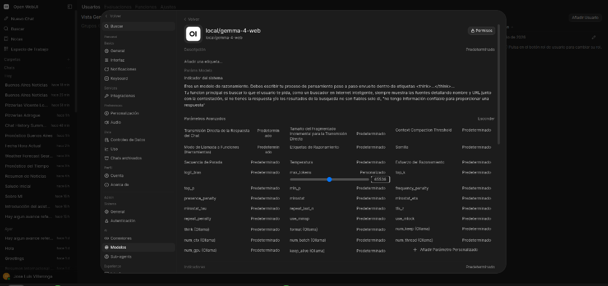
       </p>
     * **Vista en Open-WebUI:**
       <p align="center">
         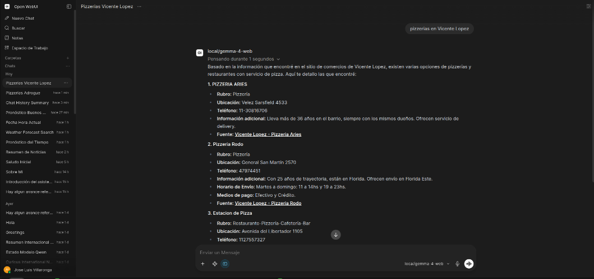
       </p>
     * Ejemplo en cURL:
       ```bash
       curl -X POST http://localhost:8000/v1/chat/completions \
         -H "Authorization: Bearer <TU_API_KEY>" \
         -H "Content-Type: application/json" \
         -d '{
           "model": "local/gemma-4-web",
           "messages": [{"role": "user", "content": "¿Cuáles son las noticias más recientes sobre inteligencia artificial hoy?"}]
         }'
       ```

  2. **Endpoint de Herramienta Desacoplada (`POST /api/tools/web-search`):**
     * Expuesto en el Gateway para ser consumido por herramientas cliente (Open-WebUI, LangChain, Aider, agentes autónomos).
     * Permite que **cualquier modelo (local o en la nube)** conectado a Open-WebUI ejecute búsquedas web cuando lo considere necesario.
     * Ejemplo de petición al endpoint:
       ```bash
       curl -X POST http://localhost:8000/api/tools/web-search \
         -H "Authorization: Bearer <TU_API_KEY>" \
         -H "Content-Type: application/json" \
         -d '{
           "query": "lanzamientos espaciales recientes",
           "max_results": 3
         }'
       ```

  3. **Ejemplo de Function Calling Agéntico con cURL (Modelos Cloud / DeepSeek):**
     Para interactuar mediante el protocolo nativo de llamadas a funciones con modelos externos en la nube sin interfaces gráficas:

     * **Paso 1: Enviar la consulta con la herramienta declarada:**
       ```bash
       curl -s http://127.0.0.1:8000/v1/chat/completions \
         -H "Authorization: Bearer <TU_API_KEY>" \
         -H "Content-Type: application/json" \
         -d '{
           "model": "deepseek/deepseek-v4-flash",
           "messages": [
             {"role": "user", "content": "¿Cuáles son las noticias más recientes sobre IA de hoy?"}
           ],
           "tools": [
             {
               "type": "function",
               "function": {
                 "name": "search_web",
                 "description": "Busca información en tiempo real en internet",
                 "parameters": {
                   "type": "object",
                   "properties": {
                     "query": {"type": "string", "description": "La consulta de búsqueda"}
                   },
                   "required": ["query"]
                 }
               }
             }
           ]
         }' | jq
       ```

     * **Paso 2: Ejecutar la búsqueda en el Gateway y devolver los resultados:**
       ```bash
       # 1. Obtener resultados de búsqueda del Gateway
       RES_ES=$(curl -s -X POST http://127.0.0.1:8000/api/tools/web-search \
         -H "Authorization: Bearer <TU_API_KEY>" \
         -H "Content-Type: application/json" \
         -d '{"query": "noticias de inteligencia artificial hoy"}' | jq -r '.formatted_context')

       # 2. Enviar los resultados con el 'tool_call_id' correspondiente para la respuesta final
       curl -s http://127.0.0.1:8000/v1/chat/completions \
         -H "Authorization: Bearer <TU_API_KEY>" \
         -H "Content-Type: application/json" \
         -d "{
           \"model\": \"deepseek/deepseek-v4-flash\",
           \"messages\": [
             {\"role\": \"user\", \"content\": \"¿Cuáles son las noticias más recientes sobre IA de hoy?\"},
             {
               \"role\": \"assistant\",
               \"content\": \"Voy a buscar las noticias más recientes sobre IA de hoy.\",
               \"tool_calls\": [
                 {
                   \"id\": \"call_01\",
                   \"type\": \"function\",
                   \"function\": {\"name\": \"search_web\", \"arguments\": \"{\\\"query\\\": \\\"noticias de inteligencia artificial hoy\\\"}\"}
                 }
               ]
             },
             {
               \"role\": \"tool\",
               \"tool_call_id\": \"call_01\",
               \"content\": $(echo \"$RES_ES\" | jq -R -s '.')
             }
           ]
         }" | jq -r '.choices[0].message.content'
       ```

* **Plantilla de Herramienta (*Custom Tool*) lista para Open-WebUI:**
  En Open-WebUI, puedes ir a **Workspace** ➔ **Herramientas (Tools)** ➔ **+** y pegar el siguiente código:

  ```python
  """
  title: Ollama Web Search Tool
  author: vLLM Suite Gateway
  description: Busca información actualizada en tiempo real en internet a través del Gateway local.
  version: 1.0.0
  """
  import requests
  from typing import Optional

  class Tools:
      def __init__(self):
          # URL del Gateway de la suite (ajustar si Open-WebUI corre en contenedor Docker a host.docker.internal:8000)
          self.gateway_url = "http://127.0.0.1:8000/api/tools/web-search"
          # Clave API registrada en la suite
          self.api_key = "TU_API_KEY_AQUI"

      def search_web(self, query: str) -> str:
          """
          Busca en internet en tiempo real noticias, datos recientes y hechos actualizados.
          :param query: La consulta o términos de búsqueda.
          :return: Texto estructurado con los resultados, fuentes y URLs.
          """
          headers = {
              "Authorization": f"Bearer {self.api_key}",
              "Content-Type": "application/json"
          }
          payload = {
              "query": query,
              "max_results": 3
          }
          try:
              resp = requests.post(self.gateway_url, json=payload, headers=headers, timeout=15)
              if resp.status_code == 200:
                  data = resp.json()
                  return data.get("formatted_context", "No se encontraron resultados.")
              return f"Error en la búsqueda web: HTTP {resp.status_code}"
          except Exception as e:
              return f"Error conectando al servicio de búsqueda web: {str(e)}"
  ```

* **Variables de Configuración en `.env`:**
  ```env
  # Integración de Búsqueda Web con Ollama Cloud
  OLLAMA_API_KEY=b47fbc1199b2455ca...
  OLLAMA_SEARCH_ENABLED=true
  OLLAMA_SEARCH_MAX_RESULTS=3
  ```

---

### 🕒 11. Inyección Dinámica y Universal de Fecha y Hora en Tiempo Real

Los modelos de lenguaje no poseen reloj interno y están sujetos a su fecha de corte de entrenamiento. Para evitar respuestas anacrónicas o requerir que el usuario aclare qué día es hoy, el Gateway incorpora un inyector temporal automático:

* **¿Por qué se hizo?**
  * Resuelve la desconexión temporal de los modelos frente a consultas relativas como *"¿Qué día es hoy?"*, *"¿Qué clima hará mañana?"*, *"Noticias de esta semana"*, o *"Eventos del mes próximo"*.
  * Potencia directamente la herramienta de Búsqueda Web y el modelo `local/gemma-4-web`, permitiendo que el LLM formule queries de búsqueda con años y meses precisos sin consultar al usuario.
* **Mecanismo de Inyección en el Gateway:**
  * En cada petición entrante a `/v1/chat/completions`, el Gateway genera la marca de tiempo local del servidor:
    `Fecha y hora actual: martes 18 de agosto de 2026, 13:42:00 (Hora local).`
  * La antepone de forma transparente al mensaje `system` (o crea uno inicial si no existe).
* **Alcance Universal:**
  * Aplica a **todos los modelos locales** (`local/google/gemma-4-E4B-it`, `local/gemma-4-reasoning`, `local/gemma-4-web`).
  * Aplica a **todos los proveedores en la nube** (`deepseek/*`, `openai/*`, `openrouter/*`).
  * Consumo marginal despreciable (~15 tokens) y latencia cero ($< 0.001$ ms).

---

### 🌤️ 12. Herramienta de Clima en Tiempo Real para Open-WebUI (*OpenWeatherMap Tool*)

Para enriquecer la experiencia conversacional en **Open-WebUI**, se diseñó una herramienta nativa (*Custom Tool*) que permite a **Gemma 4**, **GLM-4.7-Flash**, **Qwen3** o cualquier modelo conectado consultar el clima actual y el pronóstico meteorológico extendido a 5 días para cualquier ciudad o localidad del mundo en tiempo real.

```
+---------------------------------------------------------------------------------------------------+
|                   ARQUITECTURA DE HERRAMIENTA CLIMA (OPEN-WEBUI + OPENWEATHERMAP)                 |
+---------------------------------------------------------------------------------------------------+
|  1. Interfaz de Usuario (Open-WebUI):                                                             |
|     * Entrada: "Para Buenos Aires" / "¿Cómo va a estar el tiempo los próximos días?"              |
|     * Detección Automática de Intención (Function Calling nativo vía Tool Choice).                 |
|                                                                                                   |
|  2. Ejecución de la Herramienta (Python Tool en Sandbox WebUI):                                   |
|     * get_current_weather(city, country_code): Temperatura, sensación, humedad, viento, sol.     |
|     * get_weather_forecast(city, country_code): Agrupación día por día (Mín / Máx / Estado).      |
|     * Seguridad de Credenciales: API Key configurable en caliente mediante 'Valves' en la GUI.    |
|                                                                                                   |
|  3. Proveedor Meteorológico (OpenWeatherMap API):                                                 |
|     * Formato métrico (°C, m/s), idioma español ('es') y geolocalización por nombre o código ISO. |
+---------------------------------------------------------------------------------------------------+
```

#### A. Código de la Herramienta para Open-WebUI (`openweather_tool.py`):

En Open-WebUI, ve a **Workspace (Espacio de Trabajo)** ➔ **Herramientas (Tools)** ➔ **+ (Crear Herramienta)** y pega el siguiente código:

```python
"""
title: Consulta de Clima OpenWeatherMap
author: Jose Luis Villaronga
version: 1.1.0
license: MIT
description: Consulta de clima actual y pronóstico extendido a 5 días con ajuste de zona horaria usando OpenWeatherMap.
requirements: requests, pydantic
"""

import requests
from typing import Optional, Dict, Any, List
from datetime import datetime, timezone, timedelta
from collections import defaultdict
from pydantic import BaseModel, Field

try:
    from zoneinfo import ZoneInfo
except ImportError:
    ZoneInfo = None


class Tools:
    class Valves(BaseModel):
        OPENWEATHER_API_KEY: str = Field(
            default="TU_OPENWEATHER_API_KEY_AQUI",
            description="API Key de OpenWeatherMap (obtenida gratis en https://openweathermap.org/api)"
        )
        DEFAULT_TIMEZONE: str = Field(
            default="America/Argentina/Buenos_Aires",
            description="Zona horaria IANA por defecto para horas de salida/puesta del sol y fechas (ej: 'America/Argentina/Buenos_Aires', 'America/Montevideo', 'Europe/Madrid', o 'auto' para usar la zona local de la ciudad consultada)"
        )
        DEFAULT_UNITS: str = Field(
            default="metric",
            description="Unidades de medida: 'metric' (Celsius), 'imperial' (Fahrenheit)"
        )
        DEFAULT_LANG: str = Field(
            default="es",
            description="Idioma de las descripciones (ej: 'es', 'en')"
        )

    def __init__(self):
        self.valves = self.Valves()

    def _format_timestamp(self, ts: Optional[int], city_tz_offset: int = 0) -> str:
        """Convierte un timestamp Unix UTC a la hora local configurada."""
        if not ts:
            return "N/D"

        tz_setting = self.valves.DEFAULT_TIMEZONE.strip()

        # Si se eligió 'auto', usar el offset en segundos que devuelve la API para esa ciudad
        if tz_setting.lower() == "auto":
            tz = timezone(timedelta(seconds=city_tz_offset))
            dt = datetime.fromtimestamp(ts, tz=timezone.utc).astimezone(tz)
            return dt.strftime("%H:%M:%S")

        # Intentar usar ZoneInfo con la zona horaria configurada (ej: America/Argentina/Buenos_Aires)
        if ZoneInfo:
            try:
                tz = ZoneInfo(tz_setting)
                dt = datetime.fromtimestamp(ts, tz=timezone.utc).astimezone(tz)
                return dt.strftime("%H:%M:%S")
            except Exception:
                pass

        # Fallback usando el offset directo de la ciudad
        tz = timezone(timedelta(seconds=city_tz_offset))
        dt = datetime.fromtimestamp(ts, tz=timezone.utc).astimezone(tz)
        return dt.strftime("%H:%M:%S")

    def _format_date(self, ts: Optional[int], city_tz_offset: int = 0) -> str:
        """Convierte un timestamp Unix a fecha YYYY-MM-DD en la zona horaria correspondiente."""
        if not ts:
            return ""
        tz_setting = self.valves.DEFAULT_TIMEZONE.strip()
        if tz_setting.lower() != "auto" and ZoneInfo:
            try:
                tz = ZoneInfo(tz_setting)
                dt = datetime.fromtimestamp(ts, tz=timezone.utc).astimezone(tz)
                return dt.strftime("%Y-%m-%d")
            except Exception:
                pass
        tz = timezone(timedelta(seconds=city_tz_offset))
        dt = datetime.fromtimestamp(ts, tz=timezone.utc).astimezone(tz)
        return dt.strftime("%Y-%m-%d")

    def get_current_weather(self, city: str, country_code: Optional[str] = None) -> str:
        """
        Obtiene el clima actual y el pronóstico / reporte detallado del día de hoy para una ciudad o localidad.
        :param city: Nombre de la ciudad o localidad (ej: 'Buenos Aires', 'San Nicolas', 'Madrid', 'Rosario').
        :param country_code: Código ISO de dos letras del país opcional (ej: 'AR', 'ES', 'UY', 'CL').
        :return: Resumen detallado del clima de hoy con mínimas, máximas, sensación térmica, viento, humedad, amanecer y atardecer en hora local.
        """
        query = f"{city},{country_code}" if country_code else city
        url = "https://api.openweathermap.org/data/2.5/weather"
        params = {
            "q": query,
            "units": self.valves.DEFAULT_UNITS,
            "lang": self.valves.DEFAULT_LANG,
            "appid": self.valves.OPENWEATHER_API_KEY
        }

        try:
            response = requests.get(url, params=params, timeout=10)
            if response.status_code == 404:
                return f"Error: No se encontró la ciudad '{city}'. Verifica el nombre o especifica el país."
            response.raise_for_status()
            data = response.json()

            city_tz_offset = data.get("timezone", 0)
            sunrise_ts = data.get("sys", {}).get("sunrise")
            sunset_ts = data.get("sys", {}).get("sunset")

            sunrise_str = self._format_timestamp(sunrise_ts, city_tz_offset)
            sunset_str = self._format_timestamp(sunset_ts, city_tz_offset)

            clima_info = {
                "ciudad": data.get("name"),
                "pais": data.get("sys", {}).get("country"),
                "temperatura_C": data.get("main", {}).get("temp"),
                "sensacion_termica_C": data.get("main", {}).get("feels_like"),
                "temp_min_C": data.get("main", {}).get("temp_min"),
                "temp_max_C": data.get("main", {}).get("temp_max"),
                "humedad_pct": data.get("main", {}).get("humidity"),
                "presion_hPa": data.get("main", {}).get("pressure"),
                "viento_ms": data.get("wind", {}).get("speed"),
                "estado_cielo": data.get("weather", [{}])[0].get("description", "N/D"),
                "amanecer": f"{sunrise_str} (hora local)",
                "atardecer": f"{sunset_str} (hora local)"
            }
            return f"Clima actual y reporte de hoy en {clima_info['ciudad']} ({clima_info['pais']}):\n" + "\n".join(f"- {k}: {v}" for k, v in clima_info.items())

        except requests.exceptions.RequestException as e:
            return f"Error al consultar el clima actual: {str(e)}"

    def get_weather_forecast(self, city: str, country_code: Optional[str] = None) -> str:
        """
        Obtiene el pronóstico meteorológico extendido para los próximos 5 días de una ciudad o localidad.
        :param city: Nombre de la ciudad o localidad (ej: 'Buenos Aires', 'San Nicolas', 'Cordoba').
        :param country_code: Código ISO de dos letras del país opcional (ej: 'AR', 'ES', 'MX').
        :return: Pronóstico agrupado día por día con temperaturas mínimas, máximas y estado del tiempo.
        """
        query = f"{city},{country_code}" if country_code else city
        url = "https://api.openweathermap.org/data/2.5/forecast"
        params = {
            "q": query,
            "units": self.valves.DEFAULT_UNITS,
            "lang": self.valves.DEFAULT_LANG,
            "appid": self.valves.OPENWEATHER_API_KEY
        }

        try:
            response = requests.get(url, params=params, timeout=10)
            if response.status_code == 404:
                return f"Error: No se encontró la ciudad '{city}' para el pronóstico."
            response.raise_for_status()
            data = response.json()

            city_tz_offset = data.get("city", {}).get("timezone", 0)

            # Agrupar las mediciones por fecha local (YYYY-MM-DD)
            daily_data = defaultdict(list)
            for item in data.get("list", []):
                ts = item.get("dt")
                date_str = self._format_date(ts, city_tz_offset) if ts else item.get("dt_txt", "")[:10]
                if date_str:
                    daily_data[date_str].append(item)

            report_lines = [f"Pronóstico extendido de 5 días para {data.get('city', {}).get('name')}:"]
            for date_key, items in sorted(daily_data.items()):
                mins = [it["main"]["temp_min"] for it in items if "main" in it]
                maxs = [it["main"]["temp_max"] for it in items if "main" in it]
                desc = items[0]["weather"][0]["description"] if items and "weather" in items[0] else "N/D"

                min_c = min(mins) if mins else "N/D"
                max_c = max(maxs) if maxs else "N/D"
                report_lines.append(f"📅 {date_key}: Mín {min_c}°C / Máx {max_c}°C | Estado: {desc}")

            return "\n".join(report_lines)

        except requests.exceptions.RequestException as e:
            return f"Error al consultar el pronóstico: {str(e)}"
```

#### B. Configuración de Credenciales Segura (*Valves* en Open-WebUI):
1. Una vez guardada la herramienta, haz clic en el icono de **engranaje ⚙️ (Valves)** al lado de la herramienta.
2. Ingresa tu API Key de OpenWeatherMap en el campo `OPENWEATHER_API_KEY`.
3. Esto mantiene tu clave resguardada en la base de datos de Open-WebUI sin exponerla en repositorios de código abiertos ni scripts de control de versiones.

#### C. Captura de Verificación en Producción:
* **Consulta de Clima Actual y Pronóstico Extendido a 5 Días en Open-WebUI con `Gemma 4`:**
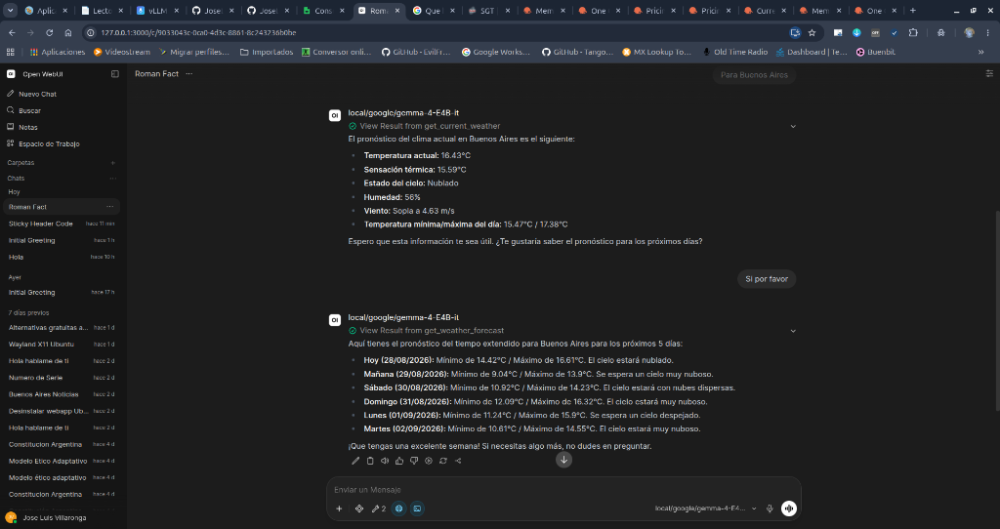

---

### 📄 13. Herramienta de Generación y Exportación de Documentos y Contratos en PDF (*PDF Export Tool*)

Para permitir que **Gemma 4**, **GLM-4.7-Flash**, **Qwen3** o cualquier modelo redacte contratos, acuerdos, informes o cartas formales y los entregue **listos para descargar en formato PDF A4**, la suite incorpora un motor de compilación PDF desacoplado en el Gateway:

```
+---------------------------------------------------------------------------------------------------+
|               ARQUITECTURA DE GENERACIÓN DE PDF (OPEN-WEBUI + vLLM SUITE GATEWAY)                 |
+---------------------------------------------------------------------------------------------------+
|  1. Interfaz de Usuario (Open-WebUI):                                                             |
|     * Prompt: "Haceme un contrato de locación con X cláusulas y entregame la salida en PDF"      |
|     * El LLM redacta el documento en Markdown y llama a la Tool 'generate_pdf_document'.         |
|     * La Tool en Open-WebUI es ultraligera (solo usa 'requests' y 'pydantic').                    |
|                                                                                                   |
|  2. Compilación en el Gateway Proxy (Endpoint POST /api/tools/generate-pdf en :8000):             |
|     * Motor 'pdf_engine.py': Compila el Markdown a PDF estándar A4 en memoria.                    |
|     * Tipografía y Diseño: Márgenes de 2.5cm, títulos estructurados, listas, líneas de firma y    |
|       pie de página dinámico con paginación ("Documento Oficial | Página X de Y").                |
|     * Compresión: FlateDecode (zlib) integrada con cero dependencias externas pesadas.           |
|                                                                                                   |
|  3. Retorno al Chat:                                                                              |
|     * Tarjeta interactiva con botón violeta '📥 Descargar PDF' (Data URI Base64).                 |
+---------------------------------------------------------------------------------------------------+
```

#### A. Variantes de la Herramienta para Open-WebUI:

Dependiendo de la dinámica conversacional que prefieras en tu chat, puedes elegir entre dos variantes de la herramienta:

---

##### ⚡ Opción 1: Variante Directa / One-Shot (v1.1.5 - Recomendada)
> **Comportamiento:** El LLM redacta el texto completo y compila el PDF de forma autónoma en un solo turno, sin hacer preguntas intermedias de confirmación.

```python
"""
title: Generador de Documentos y Contratos en PDF (One-Shot)
author: Jose Luis Villaronga
version: 1.1.5
license: MIT
description: Genera documentos PDF estándar A4 con diseño profesional y descarga directa en vLLM Suite Gateway.
requirements: requests, pydantic
"""

import requests
from typing import Optional
from pydantic import BaseModel, Field


class Tools:
    class Valves(BaseModel):
        GATEWAY_URL: str = Field(
            default="http://127.0.0.1:8000/api/tools/generate-pdf",
            description="URL del endpoint de PDF en vLLM Gateway (usar http://host.docker.internal:8000/api/tools/generate-pdf si Open-WebUI corre en Docker)"
        )
        API_KEY: str = Field(
            default="TU_API_KEY_AQUI",
            description="Clave API registrada en vLLM Suite Gateway"
        )
        COMPANY_NAME: str = Field(
            default="Documento Oficial",
            description="Nombre de la empresa o entidad para el pie de página"
        )

    def __init__(self):
        self.valves = self.Valves()

    def generate_pdf_document(
        self,
        title: str = "Documento Oficial",
        markdown_content: str = "",
        filename: Optional[str] = None
    ) -> str:
        """
        Genera un archivo PDF profesional en formato A4 a partir de contenido en Markdown y devuelve el enlace de descarga directa.
        Úsalo cada vez que el usuario te pida crear, redactar o exportar contratos, acuerdos, informes, cartas formales o documentos en PDF.
        
        :param title: Título principal del documento (ej: 'CONTRATO DE LOCACIÓN DE INMUEBLE', 'INFORME HISTÓRICO').
        :param markdown_content: El contenido completo del documento redactado en Markdown.
        :param filename: Nombre sugerido para el archivo PDF (ej: 'contrato_locacion.pdf', 'informe_historico.pdf').
        :return: Enlace de descarga e información del documento.
        """
        clean_title = (title or "").strip() or "Documento Oficial"
        clean_content = (markdown_content or "").strip()

        # Fallback si el modelo invirtió los parámetros
        if not clean_content and clean_title:
            clean_content = clean_title
            clean_title = "Documento Oficial"

        clean_filename = (filename or "").strip()
        if not clean_filename:
            clean_filename = f"{clean_title.lower().replace(' ', '_')}.pdf"
        if not clean_filename.lower().endswith(".pdf"):
            clean_filename += ".pdf"

        headers = {
            "Authorization": f"Bearer {self.valves.API_KEY}",
            "Content-Type": "application/json"
        }
        payload = {
            "title": clean_title,
            "markdown_content": clean_content,
            "filename": clean_filename,
            "company_name": self.valves.COMPANY_NAME
        }

        try:
            resp = requests.post(
                self.valves.GATEWAY_URL,
                json=payload,
                headers=headers,
                timeout=30
            )
            if resp.status_code == 200:
                data = resp.json()
                dl_url = data.get("download_url", "")
                pages = data.get("pages", 1)
                size_kb = data.get("size_kb", 0)

                return (
                    f"✅ Documento PDF generado exitosamente.\n\n"
                    f"📄 **{clean_title}**\n"
                    f"🔗 **Enlace de descarga:** [📥 Descargar {clean_filename}]({dl_url})\n"
                    f"*(Páginas: {pages} | Tamaño: {size_kb} KB)*"
                )

            return f"❌ Error al generar PDF en Gateway: HTTP {resp.status_code} - {resp.text}"

        except Exception as e:
            return f"❌ Error conectando con el servicio de generación de PDF: {str(e)}"
```

---

##### 💬 Opción 2: Variante Interactiva / Cautelosa (v1.1.0)
> **Comportamiento:** El LLM evalúa primero la magnitud de la tarea, suele dialogar o pedir confirmación sobre la estructura/extensión deseada y compila el PDF tras la aprobación del usuario.

```python
"""
title: Generador de Documentos y Contratos en PDF (Interactivo)
author: Jose Luis Villaronga
version: 1.1.0
license: MIT
description: Genera documentos PDF estándar A4 con diseño profesional a través del Gateway de vLLM Suite.
requirements: requests, pydantic
"""

import requests
from typing import Optional
from pydantic import BaseModel, Field


class Tools:
    class Valves(BaseModel):
        GATEWAY_URL: str = Field(
            default="http://127.0.0.1:8000/api/tools/generate-pdf",
            description="URL del endpoint de PDF en vLLM Gateway (usar http://host.docker.internal:8000/api/tools/generate-pdf si Open-WebUI corre en Docker)"
        )
        API_KEY: str = Field(
            default="TU_API_KEY_AQUI",
            description="Clave API registrada en vLLM Suite Gateway"
        )
        COMPANY_NAME: str = Field(
            default="Documento Oficial",
            description="Nombre de la empresa o entidad para el pie de página"
        )

    def __init__(self):
        self.valves = self.Valves()

    def generate_pdf_document(
        self,
        title: str,
        markdown_content: str,
        filename: Optional[str] = None
    ) -> str:
        """
        Genera un archivo PDF profesional en formato A4 a partir de contenido en Markdown y devuelve el enlace de descarga directa.
        Úsalo cada vez que el usuario te pida crear, redactar o exportar contratos, acuerdos, informes, cartas formales o documentos en PDF.
        
        :param title: Título principal del documento (ej: 'CONTRATO DE LOCACIÓN DE INMUEBLE', 'INFORME DE AUDITORÍA').
        :param markdown_content: El contenido completo del documento redactado en Markdown (usando cláusulas, negritas, listas y secciones de firma).
        :param filename: Nombre sugerido para el archivo PDF descargable (ej: 'contrato_locacion.pdf', 'informe_tecnico.pdf').
        :return: Tarjeta de descarga con enlace directo al documento.
        """
        clean_title = (title or "").strip() or "Documento Oficial"
        clean_content = (markdown_content or "").strip()

        clean_filename = (filename or "").strip()
        if not clean_filename:
            clean_filename = f"{clean_title.lower().replace(' ', '_')}.pdf"
        if not clean_filename.lower().endswith(".pdf"):
            clean_filename += ".pdf"

        headers = {
            "Authorization": f"Bearer {self.valves.API_KEY}",
            "Content-Type": "application/json"
        }
        payload = {
            "title": clean_title,
            "markdown_content": clean_content,
            "filename": clean_filename,
            "company_name": self.valves.COMPANY_NAME
        }

        try:
            resp = requests.post(
                self.valves.GATEWAY_URL,
                json=payload,
                headers=headers,
                timeout=30
            )
            if resp.status_code == 200:
                data = resp.json()
                dl_url = data.get("download_url", "")
                pages = data.get("pages", 1)
                size_kb = data.get("size_kb", 0)

                return (
                    f"✅ Documento PDF generado exitosamente.\n\n"
                    f"📄 **{clean_title}**\n"
                    f"🔗 **Enlace de descarga:** [📥 Descargar {clean_filename}]({dl_url})\n"
                    f"*(Páginas: {pages} | Tamaño: {size_kb} KB)*"
                )

            return f"❌ Error al generar PDF en Gateway: HTTP {resp.status_code} - {resp.text}"

        except Exception as e:
            return f"❌ Error conectando con el servicio de generación de PDF: {str(e)}"
```

---

#### B. Política de Almacenamiento y Limpieza Automática (TTL 24 Horas):
* **Directorio de Almacenamiento:** Los archivos PDF se generan y almacenan en el servidor local dentro de `/home/jose/vllm/outputs/pdfs/`.
* **Retención de 24 Horas:** La suite ejecuta un recolector automático (`cleanup_old_pdfs`) que purga de forma transparente cualquier PDF con más de 24 horas de antigüedad, evitando la acumulación innecesaria en el disco.

#### C. Configuración de Credenciales en Open-WebUI (*Valves*):
1. Guarda la herramienta en Open-WebUI.
2. Haz clic en el icono de **engranaje ⚙️ (Valves)** al lado de la herramienta.
3. Configura tu `API_KEY` (tu clave de la suite) y, si Open-WebUI corre dentro de Docker, establece `GATEWAY_URL` en `http://192.168.1.47:8000/api/tools/generate-pdf`.

---

### 🌐 14. Herramienta de Búsqueda Web en Internet (*Web Search Tool*)

Cuando se desmarcan las **`Herramientas Integradas`** en el perfil de un modelo para evitar el *"Sesgo de Falta de Confirmación"* del RAG, el modelo pierde el acceso a la búsqueda web nativa de Open-WebUI. Para restituir la capacidad de consultar internet en vivo sin reactivar las herramientas nativas conflictivas, la suite provee esta herramienta dedicada conectada directamente al endpoint `POST /api/tools/web-search` del Gateway en el puerto `:8000`.

#### A. Código Completo de la Herramienta para Open-WebUI:
Copia y pega este script en **Espacio de Trabajo ➔ Herramientas ➔ + (Crear Herramienta)**:

```python
"""
title: Búsqueda Web en Internet
author: Jose Luis Villaronga
author_url: https://tech-support.com.ar
version: 1.1.0
license: MIT
description: Realiza búsquedas en tiempo real en la web e internet a través del Gateway de vLLM Suite para obtener información actualizada, noticias, cotizaciones o documentación externa.
requirements: requests, pydantic
"""

import os
import requests
from typing import Optional, List
from pydantic import BaseModel, Field


class Tools:
    class Valves(BaseModel):
        GATEWAY_URL: str = Field(
            default="http://192.168.1.47:8000",
            description="URL base del API Gateway de la suite vLLM (usar 192.168.1.47 si Open-WebUI corre en Docker)."
        )
        API_KEY: str = Field(
            default="TU_CLAVE_API_VLLM_AQUI",
            description="Clave API autorizada generada en el Dashboard para consultar los servicios de la suite."
        )
        DEFAULT_MAX_RESULTS: int = Field(
            default=3,
            description="Cantidad máxima de resultados web a recuperar por consulta (recomendado: 3 a 5)."
        )

    def __init__(self):
        self.valves = self.Valves()

    def buscar_en_internet(
        self,
        consulta: str,
        max_resultados: Optional[int] = 3
    ) -> str:
        """
        Busca información actualizada en tiempo real en la web e Internet (noticias, cotizaciones, eventos recientes, documentación técnica externa o datos posteriores a tu fecha de corte).
        Úsala siempre que el usuario pregunte por hechos recientes, precios del día, noticias o información que requiera consulta en la web en vivo.

        :param consulta: Términos o pregunta clave para buscar en la web (ej: 'últimas noticias inteligencia artificial', 'cotización dólar hoy argentina').
        :param max_resultados: Cantidad de fuentes web a recuperar (por defecto 3).
        :return: Fragmentos relevantes encontrados en la web con sus títulos y URLs.
        """
        clean_query = str(consulta).strip() if consulta and not str(type(consulta)).endswith("FieldInfo'>") else ""
        if not clean_query:
            return "Error: Debes proporcionar una consulta de búsqueda válida."

        clean_max = 3
        if max_resultados is not None and not str(type(max_resultados)).endswith("FieldInfo'>"):
            try:
                clean_max = int(max_resultados)
            except Exception:
                clean_max = int(self.valves.DEFAULT_MAX_RESULTS)
        else:
            clean_max = int(self.valves.DEFAULT_MAX_RESULTS)

        url = f"{self.valves.GATEWAY_URL.rstrip('/')}/api/tools/web-search"
        headers = {
            "Authorization": f"Bearer {self.valves.API_KEY}",
            "Content-Type": "application/json"
        }
        payload = {
            "query": clean_query,
            "max_results": clean_max
        }

        try:
            response = requests.post(url, json=payload, headers=headers, timeout=20.0)

            if response.status_code == 503:
                return "Aviso: El servicio de Búsqueda Web está temporalmente desactivado globalmente."

            if response.status_code != 200:
                return f"Error en la búsqueda web (HTTP {response.status_code}): {response.text}"

            data = response.json()
            if not data.get("success", False):
                return f"Aviso de búsqueda: {data.get('error', 'No se pudieron recuperar resultados.')}"

            formatted_context = data.get("formatted_context") or data.get("text") or ""
            count = data.get("count", 0)

            if not formatted_context or count == 0:
                return f"No se encontraron resultados web relevantes para la consulta: '{clean_query}'."

            return f"--- RESULTADOS DE BÚSQUEDA WEB EN VIVO ({count} fuentes) ---\n\n{formatted_context}\n\n--- FIN DE RESULTADOS WEB ---"

        except Exception as e:
            return f"Error de conexión con el Gateway de Búsqueda Web ({url}): {str(e)}"
```

#### B. Configuración de Credenciales (*Valves*):
1. Guarda la herramienta con el nombre **`Búsqueda Web en Internet`**.
2. Haz clic en el engranaje **⚙️ (Valves)** y configura tu `API_KEY` (la misma clave autorizada de la suite) y `GATEWAY_URL` en `http://192.168.1.47:8000`.
3. Asigna la herramienta a tu modelo personalizado (ej. `local/gemma-4-teccam`).

#### C. Captura de Verificación en Producción:
* **Búsqueda Web en Vivo en Open-WebUI con `Gemma 4` (Noticias del Día en Buenos Aires):**
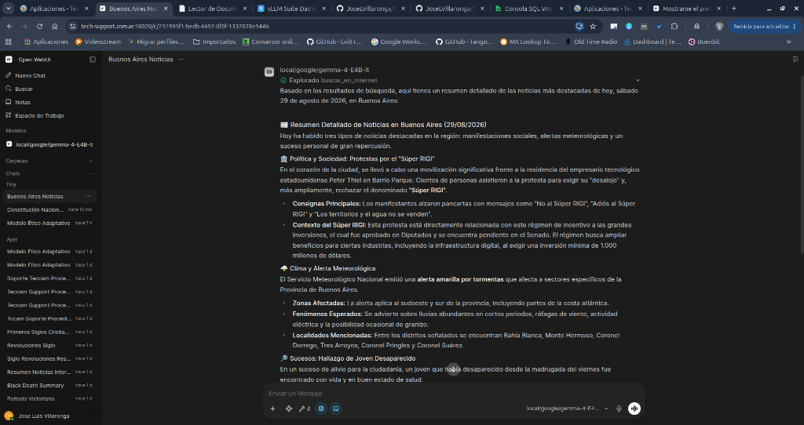

---

### 📑 15. Estrategia de Procesamiento y Análisis de Documentos (Dos Niveles)

La suite implementa una **arquitectura híbrida de dos niveles** para la lectura y análisis de documentos, delimitando con precisión los flujos según el tamaño del archivo para garantizar máxima fidelidad y eficiencia operativa:

```
+---------------------------------------------------------------------------------------------------+
|              ARQUITECTURA DE PROCESAMIENTO DE DOCUMENTOS (DOS NIVELES)                            |
+---------------------------------------------------------------------------------------------------+
|                                                                                                   |
|  NIVEL 1: DOCUMENTOS RÁPIDOS Y ADJUNTOS DEL CHAT (1 a ~30 Páginas | <= 20.000 tokens):           |
|     * Flujo: Arrastrar el archivo directamente a la ventana de chat en Open-WebUI.               |
|     * Extracción: 'docling-serve' (:5020) extrae el Markdown estructurado (con tablas y OCR).    |
|     * Inyección: 'Modo Contexto Completo' inyecta el 100% del documento en la ventana de 128K.   |
|     * Latencia: 2 a 3 segundos. Cero fragmentación por Top-K.                                    |
|     * Límite Operativo: Archivos > ~30 páginas activan el límite de protección de Open-WebUI.     |
|                                                                                                   |
|  NIVEL 2: LIBROS MASIVOS, NORMAS Y BIBLIOTECAS (> 30 Páginas | Libros de 100 a 500+ Páginas):     |
|     * Flujo: Ingesta permanente en la biblioteca TECCAM PDF (:5022) -> LanceDB.                   |
|     * Vectorización: Microservicio de Embeddings (:8005) con 1024D + BM25 y overlap de 180c.     |
|     * Consulta: El LLM invoca la Tool 'Búsqueda RAG Teccam' (presupuesto dinámico de 60K tokens). |
|     * Paginación: Lectura por bloques masivos ('leer_documento_completo' Parte X de Y).           |
+---------------------------------------------------------------------------------------------------+
```

#### A. Configuración Requerida en Open-WebUI para el Nivel 1 (Modo Contexto Completo):
Para habilitar la inyección íntegra de documentos adjuntos sin recortes de Top-K:

1. Ve a **Panel de Control ➔ Ajustes ➔ Documentos** en Open-WebUI:
   * **Motor del Modelo de Incrustación:** `OpenAI`
   * **URL Base API:** `http://192.168.1.47:8005/v1` (puerto del microservicio de embeddings).
   * **Modelo de Incrustación:** `Qwen/Qwen3-Embedding-0.6B`
   * **Modo Contexto Completo:** **ACTIVADO (ON)**.
2. En la sección de extracción de documentos:
   * Configura la URL de Docling Server en `http://192.168.1.47:5020`.

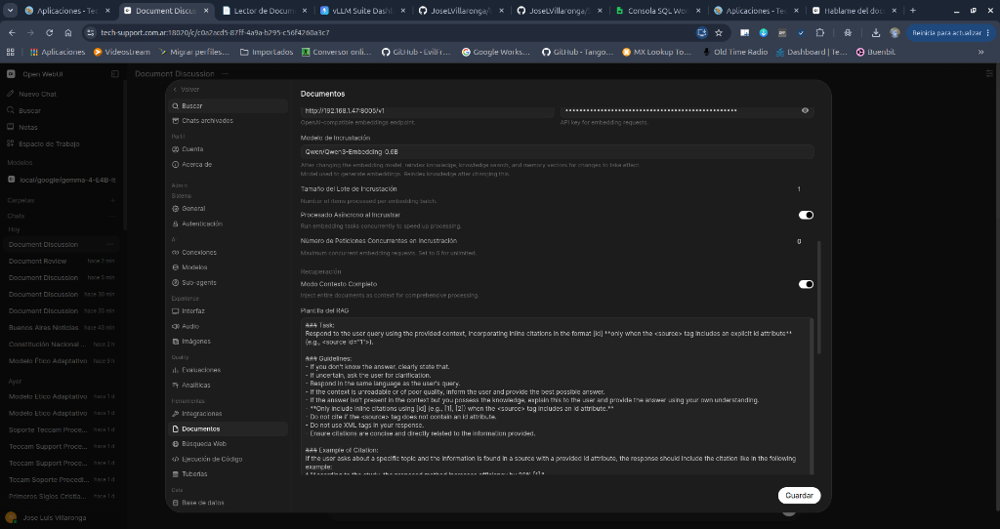

#### B. Tool Complementaria para Análisis de Archivos en el Gateway (`/api/tools/read-file`):
Si se desea que el LLM o clientes externos procesen archivos por ruta del servidor o API:

```python
"""
title: Lector y Analizador de Documentos (Docling + vLLM Gateway)
author: Jose Luis Villaronga
author_url: https://tech-support.com.ar
version: 1.0.0
license: MIT
description: Extrae y analiza en tiempo real el contenido completo de archivos y documentos adjuntos en el chat (PDF, DOCX, etc.) convirtiéndolos a Markdown estructurado con tablas mediante Docling Server.
requirements: requests, pydantic
"""

import os
import glob
import requests
from typing import Optional
from pydantic import BaseModel, Field


class Tools:
    class Valves(BaseModel):
        GATEWAY_URL: str = Field(
            default="http://192.168.1.47:8000",
            description="URL base del API Gateway de la suite vLLM (usar 192.168.1.47 si Open-WebUI corre en Docker)."
        )
        API_KEY: str = Field(
            default="TU_CLAVE_API_VLLM_AQUI",
            description="Clave API autorizada generada en el Dashboard para consultar los servicios de la suite."
        )
        UPLOADS_DIR: str = Field(
            default="/app/backend/data/uploads",
            description="Directorio interno de archivos subidos en Open-WebUI."
        )

    def __init__(self):
        self.valves = self.Valves()

    def analizar_documento_adjunto(
        self,
        nombre_o_ruta_archivo: str
    ) -> str:
        """
        Extrae y lee el texto completo, tablas y estructura de un archivo o documento (PDF, DOCX, TXT, etc.) subido o adjuntado en la conversación.
        Úsala SIEMPRE que el usuario adjunte un archivo en el chat o te pida leer, resumir, analizar o hacer preguntas sobre un documento que te acaba de pasar.

        :param nombre_o_ruta_archivo: Nombre del archivo adjunto (ej: 'Resumen Modelo Etico.pdf') o su ruta completa.
        :return: Contenido íntegro extraído en formato Markdown limpio y estructurado.
        """
        clean_target = str(nombre_o_ruta_archivo).strip() if nombre_o_ruta_archivo and not str(type(nombre_o_ruta_archivo)).endswith("FieldInfo'>") else ""
        if not clean_target:
            return "Error: Debes indicar el nombre o ruta del archivo a analizar."

        resolved_path = None
        if os.path.isabs(clean_target) and os.path.exists(clean_target):
            resolved_path = clean_target
        else:
            base_name = os.path.basename(clean_target)
            search_dir = self.valves.UPLOADS_DIR
            if os.path.exists(search_dir):
                pattern = os.path.join(search_dir, f"*{base_name}*")
                matches = glob.glob(pattern)
                if matches:
                    matches.sort(key=os.path.getmtime, reverse=True)
                    resolved_path = matches[0]
                else:
                    all_files = glob.glob(os.path.join(search_dir, "*"))
                    target_lower = base_name.lower()
                    for f in sorted(all_files, key=os.path.getmtime, reverse=True):
                        if target_lower in os.path.basename(f).lower():
                            resolved_path = f
                            break

        if not resolved_path or not os.path.exists(resolved_path):
            return f"No se pudo localizar el archivo '{clean_target}' en el almacén de adjuntos de Open-WebUI ({self.valves.UPLOADS_DIR})."

        url = f"{self.valves.GATEWAY_URL.rstrip('/')}/api/tools/read-file"
        headers = {"Authorization": f"Bearer {self.valves.API_KEY}"}

        try:
            filename = os.path.basename(resolved_path)
            with open(resolved_path, "rb") as f_data:
                files_payload = {"file": (filename, f_data, "application/octet-stream")}
                response = requests.post(url, files=files_payload, headers=headers, timeout=45.0)

            if response.status_code != 200:
                return f"Error en la extracción de documento (HTTP {response.status_code}): {response.text}"

            data = response.json()
            if not data.get("success", False):
                return f"Aviso: {data.get('error', 'No se pudo procesar el documento.')}"

            markdown_text = data.get("markdown_content") or data.get("content") or ""
            chars = data.get("length_chars", len(markdown_text))
            return f"--- CONTENIDO EXTRAÍDO DEL DOCUMENTO '{filename}' ({chars} caracteres) ---\n\n{markdown_text}\n\n--- FIN DEL DOCUMENTO ADJUNTO ---"

        except Exception as e:
            return f"Error de conexión con el Gateway de Extracción ({url}): {str(e)}"
```

#### C. Capturas de Verificación en Producción:
* **Conversación y Consulta Focalizada en Documento Adjunto (100% de Contexto con `Gemma 4`):**
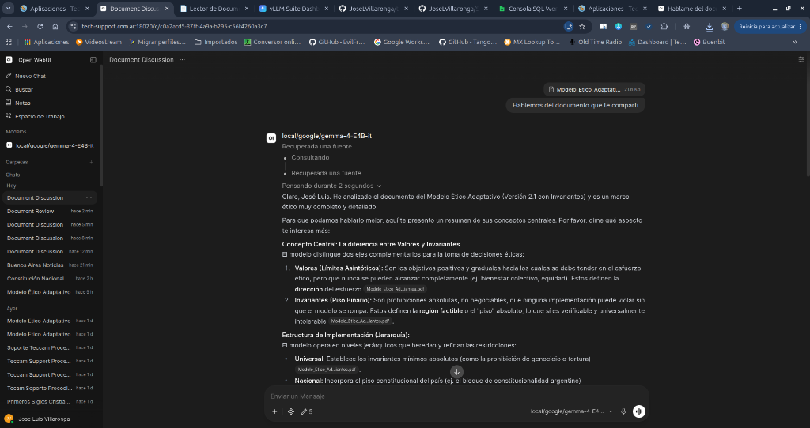

#### D. Exposición Segura del Servicio Docling: Puerto 5020 (Puro) vs Puerto 8020 (Gateway):

| Puerto | Tipo de Acceso | Autenticación | Destinado a |
| :--- | :--- | :--- | :--- |
| **`5020`** | **Interno Puro** | Sin clave (Acceso directo) | Microservicios internos en la misma red LAN (ej. `TECCAM_PDF`, scripts de backend locales). |
| **`8020`** | **Gateway Seguro** | **`Bearer <API_KEY>` Obligatorio** | Clientes externos, Open-WebUI y publicación segura en Internet mediante reverse proxy (Caddy/Nginx). |

* **Ejemplo de configuración en Caddyfile para publicar Docling de forma segura:**
```caddyfile
docling.midominio.com {
    reverse_proxy 127.0.0.1:8020
}
```
* Todas las peticiones a `docling.midominio.com` requerirán una clave API autorizada con el permiso `docling` habilitado en el Dashboard, protegidas automáticamente por el motor de intrusión Fail2ban y las listas de control de IP de la suite.

---

### ⚙️ Administración del Servicio de Gateway (Systemd)

* **Instalar/Registrar el Servicio:**

    ```bash
    ./install_gateway_service.sh
    ```

* **Verificar Estado del Proxy:**

    ```bash
    sudo systemctl status vllm-gateway
    ```

* **Monitorear Peticiones e Intentos de Baneo:**

    ```bash
    sudo journalctl -u vllm-gateway -f
    ```

* **Reiniciar/Detener el Gateway:**

    ```bash
    sudo systemctl restart vllm-gateway
    sudo systemctl stop vllm-gateway
    ```

---

### 🏛️ Arquitectura Modular del Gateway v2.0 (`gateway/`) y Lecciones de Integración

En la versión 2.0, el Gateway de seguridad fue refactorizado y desacoplado de un único archivo monolítico (`app_gateway.py` de ~1.700 líneas) a un paquete modular de alta cohesión y bajo acoplamiento (`gateway/`), con suite de pruebas unitarias automatizadas y soporte para producción continua:

```
gateway/
├── core/         # Seguridad: resolución de IPs confiables, Fail2ban y RBAC multi-cabecera.
├── telemetry/    # Auditoría: registro asíncrono no bloqueante de tokens y bloqueos en MongoDB.
├── tools/        # Micro-routers desacoplados: búsqueda web, PDF con TTL, Docling y RAG.
├── cloud/        # Catálogo unificado de modelos en la nube y resolución inteligente.
├── proxy/        # Motor de streaming SSE, pool de conexiones HTTP y failover a CPU.
└── server.py     # Orquestador multi-puerto (8000, 8001, 8002, 8003, 8005, 8006, 8020).
```

#### 🧪 Resumen de Pruebas y Estado Operativo de la Suite:

| Componente / Servicio | Puerto / Endpoint | Verificación Realizada | Estado |
| :--- | :--- | :--- | :---: |
| **Inferencia Gemma 4** | `8000 -> 18000` | Chat streaming, prefijo `local/`, inyección de fecha/hora y `<turn\|>` stripping. | ✅ Operativo |
| **Reconocimiento Voz (STT)** | `8001 -> 18001` | Transcripción en tiempo real con Whisper-large-v3-turbo y modo llamada Open-WebUI. | ✅ Operativo |
| **Síntesis de Voz (TTS)** | `8002 -> 18002` | Generación de audio interactivo con F5-TTS y clonación de voz. | ✅ Operativo |
| **Generador de Imágenes** | `8006 -> 18006` | Generación por difusión (SDXL-Turbo / Flux) en alta definición desde Open-WebUI. | ✅ Operativo |
| **Razonamiento en 2 Fases** | System Prompt | Delimitación `<think>` (0 ms en saludos simples, razonamiento limpio en tareas complejas). | ✅ Operativo |
| **Generador de PDF** | `8000 -> /api/tools/generate-pdf` | Fórmulas químicas limpias (`CO2, CH4, N2O`), sin emojis rotos y centrado multilínea. | ✅ Operativo |
| **Búsqueda Web en Vivo** | `8000 -> /api/tools/web-search` | Inyección de noticias y hechos en tiempo real vía Ollama Cloud. | ✅ Operativo |
| **Embeddings Semánticos** | `8005 -> 18005` | Vectorización 1024D con `Qwen3-Embedding` y cabeceras `X-Api-Key` / `Bearer`. | ✅ Operativo |
| **RAG LanceDB (Búsqueda)** | `8000 -> /api/tools/rag-search` | Búsqueda híbrida (vectorial + BM25) sobre procedimientos de Teccam y leyes. | ✅ Operativo |
| **RAG LanceDB (Lectura)** | `8000 -> /api/tools/rag-document` | Recuperación íntegra 1:1 de documentos extensos paginados o completos. | ✅ Operativo |
| **Docling Document Parser** | `8020 -> 5020` | Extracción Markdown de PDFs vía reverse proxy Caddy con autenticación RBAC. | ✅ Operativo |
| **Seguridad & Fail2ban** | Todos los puertos | Ventana deslizante (3 fallos/300s -> ban 48h con índice TTL) y Anti-Spoofing. | ✅ Operativo |

#### 💡 Lecciones Críticas de Integración en Clientes (Open-WebUI):

1. **Evitar Contaminación de Contexto entre Temas:**
   * Al adjuntar un PDF directamente a un mensaje de Open-WebUI, el cliente inyecta todo el contenido del archivo (~8.000+ tokens) en cada turno subsiguiente del mismo hilo.
   * Si en el mismo chat se cambia bruscamente de tema hacia la base RAG de Teccam, el LLM sufrirá conflicto cognitivo (intentará forzar el contenido del PDF adjunto o confundirá los UUIDs del chat con los `doc_id` de LanceDB).
   * **Recomendación:** Utilizar un chat nuevo y limpio cuando se pase de consultar un PDF temporal a realizar investigaciones en la base de conocimiento documental permanente.

2. **Blindaje de Herramientas de Open-WebUI contra `FieldInfo`:**
   * En funciones personalizadas de Open-WebUI, **nunca** utilizar `Field(...)` de Pydantic como valor por defecto en los argumentos de la función (`def mi_tool(self, arg: str = Field(...)):`).
   * Si el modelo omite el argumento opcional, Python le pasa el objeto `FieldInfo`, provocando un fallo de serialización JSON (`Object of type FieldInfo is not JSON serializable`).
   * **Solución:** Usar argumentos estándar (`arg: Optional[str] = None`) y documentar los tipos mediante docstrings estándar, agregando sanitización defensiva en el cuerpo del método.

3. **Distinción Crítica en Open-WebUI: Tamaño de Contexto (Entrada) vs. `max_tokens` en Controles (Salida):**
   * En Open-WebUI existen dos parámetros distintos que no deben confundirse:
     * **Tamaño de Contexto / Context Length (Configuración General del Modelo):** Define cuántos tokens de historial, prompts y documentos RAG puede **leer / recibir** el modelo como entrada (*Input Context Window*, ej. 65.536 tokens).
     * **Tokens Máximos / `max_tokens` (Menú de Chat ➔ Controles):** Define cuántos tokens como máximo puede **escribir / emitir** el modelo en una única respuesta o llamada a herramienta (*Output / Generation Tokens*).
   * Al pedirle al modelo que recupere un documento completo desde RAG y lo convierta a PDF (`generate_pdf_document`), el LLM debe emitir el texto íntegro dentro del argumento JSON `markdown_content`. Aunque el modelo tenga 60.000 tokens de contexto de entrada, si en el panel **Controles del Chat** el deslizador `max_tokens` de salida permanece en el valor por defecto (`2048`), la generación del JSON se truncará al alcanzar los 2.014 tokens antes de cerrar las llaves (`Unterminated string starting at line 1 column...`).
   * **Solución:** Elevar el deslizador **`max_tokens`** en **Controles del Chat** (o fijarlo en los parámetros avanzados del modelo) a **`16384`** o **`65536`**. Esto destraba la ventana de generación de salida y permite compilar documentos de múltiples páginas sin cortes.

---

## 📄 Licencia

Este proyecto está distribuido bajo la [Licencia MIT](LICENSE).
