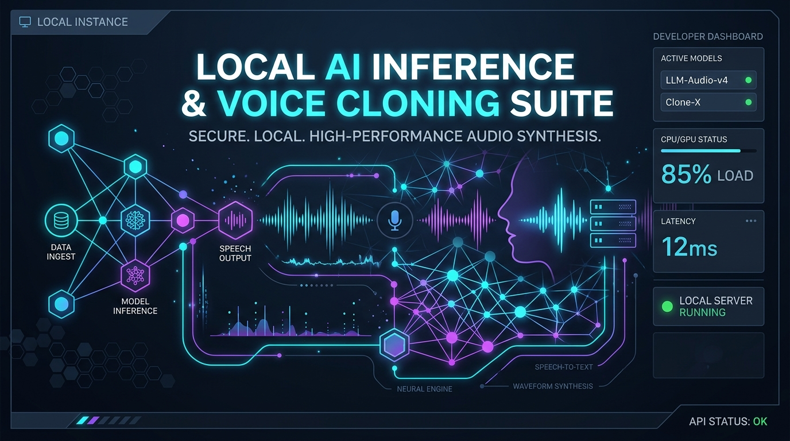
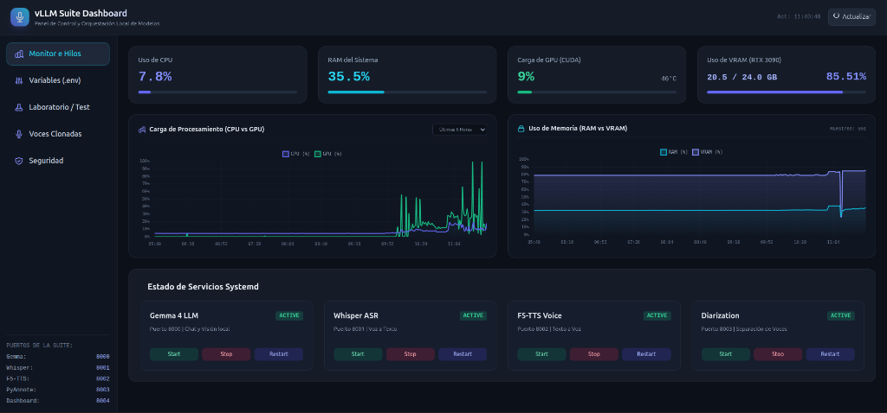
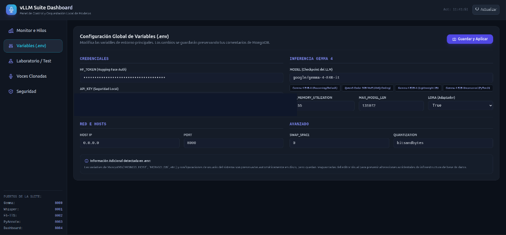
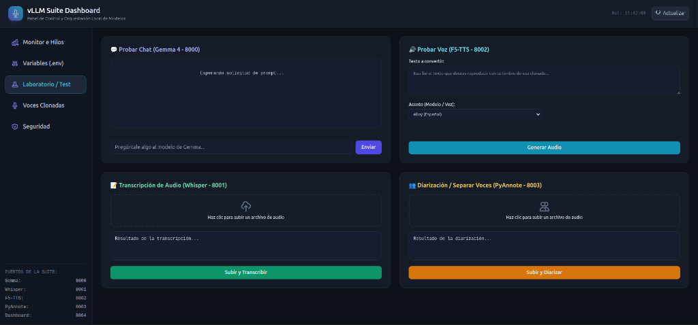
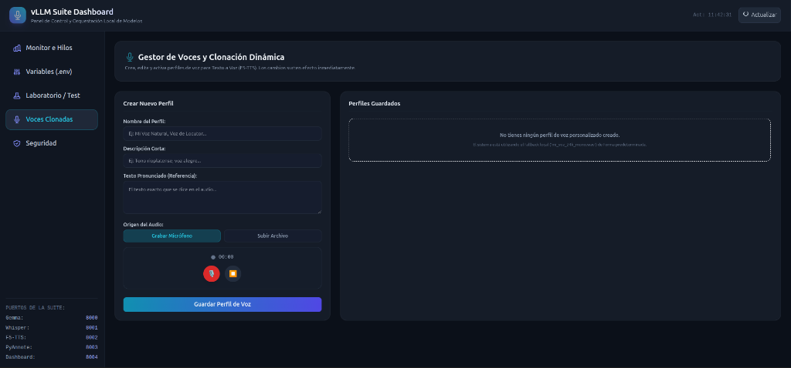
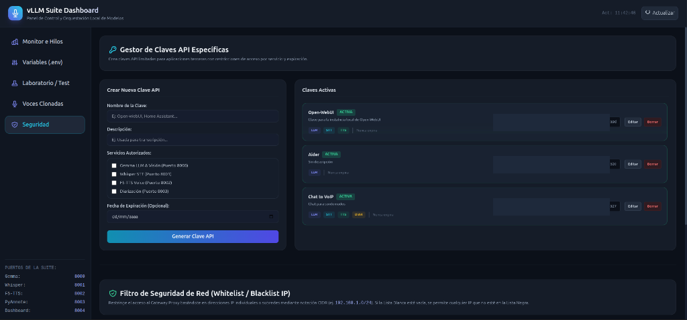
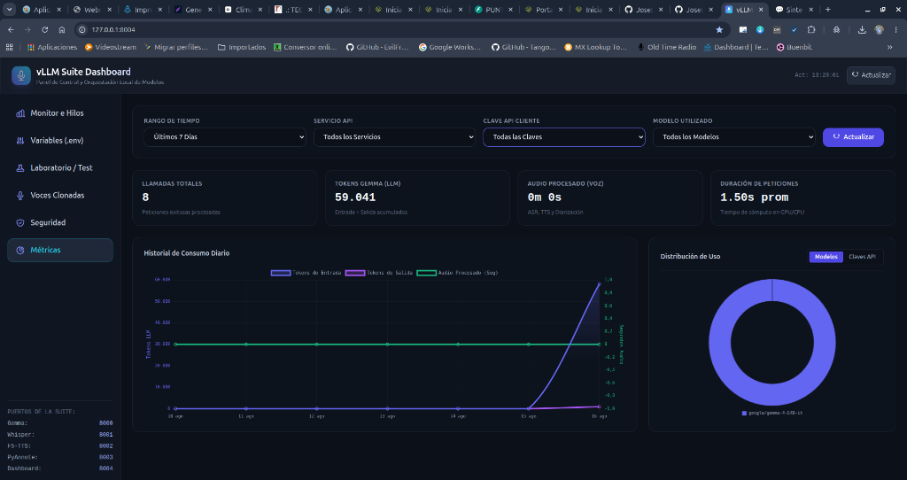

# 🚀 vLLM Local Server: Gemma 4 26B (Multimodal & Reasoning)



Servidor de Inferencia de Modelos de Lenguaje (LLM) de alto rendimiento basado en **vLLM**, configurado para desplegar el modelo **NVIDIA Gemma 4 26B-A4B-NVFP4** con soporte **Multimodal (Visión/OCR)**, **Razonamiento** y **Llamadas a Herramientas (*Tool Choice*)**, totalmente integrado con clientes como **Open-WebUI**.

---

## 🛠️ Especificaciones del Entorno

* **Sistema Operativo:** Ubuntu Linux
* **GPU:** NVIDIA GeForce RTX 3090 (24 GB VRAM, Compute Capability 8.6 - Ampere)
* **Memoria RAM:** 64 GB DDR4/DDR5
* **Entorno Python:** Virtualenv (`venv`) con Python 3.13
* **Motor de Inferencia:** vLLM v0.26.0 (Engine V1)

---

## 💾 Arquitectura de Coexistencia de VRAM (RTX 3090 / 24 GB)

Para permitir que los 4 servicios de Inteligencia Artificial corran en caliente en la misma tarjeta sin colisionar por memoria, se definió la siguiente distribución de la VRAM y de puertos de red:

| Servicio | Puerto Público (Gateway) | Puerto Interno (Backend) | Consumo de VRAM Fijo | Rol en el Ecosistema |
| :--- | :---: | :---: | :--- | :--- |
| **Gemma 4-E4B-it** | `8000` | `18000` (127.0.0.1) | **~13.2 GB** | Chat LLM y Visión (128K tokens context) |
| **Whisper-large-v3-turbo** | `8001` | `18001` (127.0.0.1) | **~2.9 GB** | Reconocimiento de Voz (ASR / Transcripción) |
| **F5-TTS (Texto a Voz)** | `8002` | `18002` (127.0.0.1) | **~1.9 GB** | Inferencia de Audio (Clonación multilingüe) |
| **PyAnnote 3.1 (Diarizador)** | `8003` | `18003` (127.0.0.1) | **~0.4 GB** | Segmentación e Identificación de Hablantes |
| **Dashboard Web GUI** | `8004` | *(Directo)* | **0 GB (VRAM)** | Monitoreo del sistema, edición de .env y test |
| **Gnome / Sistema Linux** | - | - | **~1.1 GB** | Entorno gráfico y aplicaciones de usuario |

* **VRAM Total Usada:** **`~19.5 GB`**
* **VRAM Total Libre:** **`~4.5 GB`** (Margen de seguridad perfecto para evitar caídas por *Out Of Memory*).

> **🛡️ Nota de Red y Seguridad:** Por motivos de seguridad, los motores de IA reales (backends) enlazan exclusivamente en localhost (`127.0.0.1`) en los puertos del rango `18000`. Todo tráfico externo pasa obligatoriamente por el **vLLM Gateway Proxy** en los puertos públicos estándar (`8000`-`8003`), el cual realiza la validación de credenciales.

---

## 🌟 Características Principales

1. **Ecosistema de Cinco Servidores locales (Gemma 4 en 8000, Whisper en 8001, F5-TTS en 8002, PyAnnote en 8003, Dashboard en 8004)**: Coexistencia de cinco instancias locales en segundo plano para chat, transcripción, generación de voz, separación de interlocutores y gestión web.
2. **Despliegue Multimodal de Audio y Visión**: Soporte nativo para procesar imágenes y voz directamente.
3. **Gestión Coordinada de VRAM**: Asignación estricta de memoria (Gemma 4 al 50%, Whisper al 10%, F5-TTS al 10% y PyAnnote a GPU con ~400MB), manteniendo la suite completa siempre cargada en caliente sin colisiones.
4. **Dashboard Web Interactivo**: Monitoreo de recursos de hardware en tiempo real (CPU, RAM, VRAM), controlador de servicios systemd y pruebas interactivas de todas las APIs.
5. **Instalación como Servicios del Sistema (`systemd`)**: Autoinstaladores integrados (`install_service.sh`, `install_whisper_service.sh`, `install_tts_service.sh`, `install_diarization_service.sh` y `install_dashboard_service.sh`) con autorreinicio.
6. **Scripts de Integración de Audio**: Scripts para re-muestrear ondas a la frecuencia nativa esperada (16kHz para Whisper/Gemma y 24kHz para F5-TTS).
7. **Exposición Swagger UI (`/docs`)**: Documentación interactiva completa autogenerada en el puerto de cada servicio de forma nativa.

---

## 🚀 Guía de Instalación y Despliegue

### 1. Clonar el repositorio y crear el entorno virtual

```bash
git clone <URL_DEL_REPOSITORIO>
cd vllm
python -m venv venv
source venv/bin/activate
```

### 2. Instalar dependencias del sistema y Python

Primero, instala las herramientas del sistema necesarias (el compilador CUDA `nvcc` para vLLM, `libportaudio2` para capturar audio, y asegúrate de tener el servidor **MongoDB** instalado y ejecutándose en tu máquina):

```bash
sudo apt update && sudo apt install -y nvidia-cuda-toolkit libportaudio2
```

Luego, instala vLLM junto con los paquetes necesarios para la diarización, el procesamiento de audio, las peticiones de red y la conexión a la base de datos:

```bash
pip install vllm python-dotenv pyannote.audio faster-whisper sounddevice numpy scipy requests pymongo
```

> **Nota:** El paquete `nvidia-cuda-toolkit` provee el compilador `nvcc`, requerido por el backend FlashInfer de vLLM para la compilación en tiempo de ejecución (JIT).

### 3. Configurar las variables de entorno (`.env`)

Copia la plantilla `.env.example` para crear tu propio `.env`:

```bash
cp .env.example .env
```

Edita tu archivo `.env` configurando tu token de Hugging Face y clave API:

```env
HF_TOKEN=tu_token_huggingface_aqui
API_KEY=tu_clave_api_aqui

HOST=0.0.0.0
PORT=8000
MODEL="google/gemma-4-E4B-it"

GPU_MEMORY_UTILIZATION=0.51
MAX_MODEL_LEN=131072
MAX_NUM_SEQS=64
KV_CACHE_DTYPE=bfloat16
SWAP_SPACE=0
QUANTIZATION=bitsandbytes
MAX_NUM_BATCHED_TOKENS=4096
```

---

## ⚙️ Modos de Ejecución

### Opción A: Ejecución Manual

```bash
python app.py
```

### Opción B: Instalación como Servicio Systemd (Recomendado)

Ejecuta el script instalador para registrar e iniciar el servidor como un servicio del sistema Linux:

```bash
./install_service.sh
```

#### Comandos de administración de systemd

* **Ver estado:** `sudo systemctl status vllm`
* **Ver logs en tiempo real:** `sudo journalctl -u vllm -f`
* **Detener servicio:** `sudo systemctl stop vllm`
* **Reiniciar servicio:** `sudo systemctl restart vllm`

---

## 🎙️ Servidor de Transcripción Persistente: vLLM-Whisper

Para evitar tiempos de carga en frío de Whisper, el proyecto incluye un servidor de transcripción permanente e independiente corriendo en vLLM bajo el puerto **`8001`**.

El servidor levanta el modelo `openai/whisper-large-v3-turbo` reservando únicamente el **10% de la VRAM** (~2.8 GB), permitiendo que coexista con el LLM principal.

### 1. Instalación del servicio systemd

```bash
./install_whisper_service.sh
```

### 2. Comandos de administración

* **Ver logs en tiempo real:** `sudo journalctl -u vllm-whisper -f`
* **Ver estado:** `sudo systemctl status vllm-whisper`
* **Detener servicio:** `sudo systemctl stop vllm-whisper`
* **Reiniciar servicio:** `sudo systemctl restart vllm-whisper`

### 3. Probar transcripción vía API (`POST /v1/audio/transcriptions`)

Ejecuta el cliente de prueba para mandar un archivo local:

```bash
python test_whisper_api.py
```

### 4. Integración con Open-WebUI (Voz a Texto / STT)

Para habilitar la transcripción por voz local en la interfaz de Open-WebUI, ve a **Ajustes de Administrador > Audio** y configura la sección **Voz a Texto (STT)** con los siguientes valores:

* **Motor Voz a Texto (STT):** `OpenAI`
* **URL Base API:** `http://localhost:8001/v1` *(Si corres Open-WebUI en Docker, usa `http://host.docker.internal:8001/v1`)*
* **Clave API:** `tu_clave_api_aqui` *(o la clave configurada en tu `.env`)*
* **Request Format:** `Multipart Upload`
* **Modelo STT:** `openai/whisper-large-v3-turbo`

---

## 🗣️ Servidor de Texto a Voz: vLLM-TTS

Para tener generación de voz con clonación zero-shot en caliente y sin retrasos de carga, el proyecto incluye un servidor de Texto a Voz (TTS) multilingüe basado en FastAPI y F5-TTS que corre en el puerto **`8002`**.

El servidor administra dinámicamente múltiples acentos intercambiando el modelo activo en la GPU en milisegundos y manteniendo los inactivos en la RAM del sistema, consumiendo apenas **~1.2 GB de VRAM fija**. Expone la API compatible con OpenAI `/v1/audio/speech`.

### 1. Instalación del servicio systemd

```bash
./install_tts_service.sh
```

### 2. Comandos de administración

* **Ver logs en tiempo real:** `sudo journalctl -u vllm-tts -f`
* **Ver estado:** `sudo systemctl status vllm-tts`
* **Detener servicio:** `sudo systemctl stop vllm-tts`
* **Reiniciar servicio:** `sudo systemctl restart vllm-tts`

### 3. Documentación interactiva (Swagger UI)

Accede desde tu navegador para probar y documentar los endpoints:
`http://localhost:8002/docs`

> **🔒 Autenticación en Swagger:** Haz clic en el botón **"Authorize"** en la parte superior derecha e introduce tu API key (`tu_clave_api_aqui`) para desbloquear las pruebas.

### 4. Integración con Open-WebUI (Texto a Voz / TTS)

Para escuchar las respuestas con tu voz clonada y el acento correcto según el idioma en Open-WebUI, ve a **Ajustes de Administrador > Audio** y configura la sección **Texto a Voz (TTS)** con los siguientes valores:

* **Motor Texto a Voz (TTS):** `OpenAI`
* **URL Base API:** `http://localhost:8002/v1` *(Si corres Open-WebUI en Docker, usa `http://host.docker.internal:8002/v1`)*
* **Clave API:** `tu_clave_api_aqui`
* **Modelo TTS:** `tts-1`
* **Voz TTS / Mapeo de Acentos:**
  Selecciona o escribe el identificador de voz correspondiente al acento nativo deseado:
  
  | Identificador de Voz (API / WebUI) | Idioma / Acento Nativo | Modelo Asociado |
  | :--- | :--- | :--- |
  | `jose`, `jose-es` o **`alloy`** | 🇪🇸 **Español** | `jpgallegoar/F5-Spanish` |
  | `jose-en` o **`echo`** | 🇺🇸 **Inglés** | `SWivid/F5-TTS` (Base Oficial) |
  | `jose-fr` o **`fable`** | 🇫🇷 **Francés** | `RASPIAUDIO/F5-French` |
  | `jose-de` o **`onyx`** | 🇩🇪 **Alemán** | `aihpi/F5-TTS-German` |
  | `jose-ru` o **`nova`** | 🇷🇺 **Ruso** | `hotstone228/F5-TTS-Russian` |
  | `jose-ja` o **`shimmer`** | 🇯🇵 **Japonés** | `Jmica/F5TTS` |
  | `jose-pt` | 🇧🇷 **Portugués (Brasil)** | `firstpixel/F5-TTS-pt-br` |

*(Nota: Todas las opciones clonan tu timbre de voz nativo en base a `mi_voz_24k_mono.wav`, pero con la pronunciación del acento seleccionado).*

---

## 👥 Servidor de Diarización de Voz: vLLM-Diarization

Para identificar "quién habla en cada momento" (separación de voces) en grabaciones de múltiples personas, el proyecto incluye un servidor de diarización basado en FastAPI y **PyAnnote 3.1** que corre en el puerto **`8003`**.

El servidor se ejecuta en la **GPU (CUDA)** para obtener la máxima velocidad de procesamiento, permaneciendo precargado con un consumo extremadamente ligero de apenas **~300 MB a 500 MB** de VRAM.

### 1. Requisito previo (Aceptar términos de uso en Hugging Face)

Los modelos de PyAnnote son de acceso restringido (*gated*). Antes de iniciar el servicio, debes ingresar con tu usuario a Hugging Face y aceptar las condiciones haciendo clic en:

1. [pyannote/speaker-diarization-3.1](https://huggingface.co/pyannote/speaker-diarization-3.1)
2. [pyannote/segmentation-3.0](https://huggingface.co/pyannote/segmentation-3.0)
3. [pyannote/speaker-diarization-community-1](https://huggingface.co/pyannote/speaker-diarization-community-1)

*(El token configurado en `HF_TOKEN` en tu `.env` se usará automáticamente para descargar los pesos).*

### 2. Instalación del servicio systemd

```bash
./install_diarization_service.sh
```

### 3. Comandos de administración

* **Ver logs en tiempo real:** `sudo journalctl -u vllm-diarization -f`
* **Ver estado:** `sudo systemctl status vllm-diarization`
* **Detener servicio:** `sudo systemctl stop vllm-diarization`
* **Reiniciar servicio:** `sudo systemctl restart vllm-diarization`

### 4. Probar Diarización mediante Swagger UI

Accede al panel interactivo y haz clic en **"Authorize"** con tu API key:
`http://localhost:8003/docs`

### 5. Ejemplo de prueba vía `curl`

```bash
curl -X POST http://localhost:8003/v1/audio/diarize \
  -H "Authorization: Bearer tu_clave_api_aqui" \
  -F "file=@mi_voz_24k_mono.wav"
```

---

## 🖥️ Dashboard Web de Administración: vLLM-Dashboard

Para gestionar la suite de manera más simple y visual sin recurrir a la terminal, el proyecto incluye un Dashboard Web responsive desarrollado con Flask y Tailwind CSS que corre en el puerto **`8004`**.

### 1. Características del Dashboard

* **Visualización de Recursos:** Gráficos en tiempo real de uso de CPU, RAM, temperatura de la GPU y porcentaje/cantidad de VRAM ocupada.
* **Controladores Systemd:** Botones para **Iniciar (Start)**, **Detener (Stop)** y **Reiniciar (Restart)** cada servicio local mediante llamadas seguras a `systemctl` con privilegios `sudo` pre-otorgados.
* **Editor de Configuración (.env):** Formulario visual para modificar variables críticas (como el checkpoint del modelo, puertos, y porcentajes de VRAM) y guardarlas de forma segura respetando tus comentarios y estructura original.
* **Laboratorio de Pruebas (Playground):** Interfaces interactivas para probar directamente el chat de Gemma, transcribir archivos de audio con Whisper, generar habla clonada con F5-TTS y visualizar diarizaciones de interlocutores.

### 2. Soporte Offline

El Dashboard incluye una copia local de la biblioteca Tailwind CSS en `static/js/tailwind.js`, permitiendo que toda la interfaz sea 100% funcional incluso si la máquina local no tiene conexión a Internet.

### 3. Instalación del servicio systemd

```bash
./install_dashboard_service.sh
```

### 4. Comandos de administración

* **Ver logs en tiempo real:** `sudo journalctl -u vllm-dashboard -f`
* **Ver estado:** `sudo systemctl status vllm-dashboard`
* **Detener servicio:** `sudo systemctl stop vllm-dashboard`
* **Reiniciar servicio:** `sudo systemctl restart vllm-dashboard`

### 5. Vista de la Interfaz (Capturas)

| **Monitor e Hilos** (Recursos en Tiempo Real) | **Variables (.env)** (Configuración Visual) |
| :---: | :---: |
|  |  |

| **Laboratorio / Test** (Playground de APIs) | **Voces Clonadas** (Gestor de Audio) |
| :---: | :---: |
|  |  |

| **Seguridad** (Claves API & Firewalls) | **Métricas** (Estadísticas y Reportes de Consumo) |
| :---: | :---: |
|  |  |

---

## 🧪 Pruebas con `curl`

### 1. Probar el Chat (Gemma 4 en Puerto 8000)

```bash
curl http://localhost:8000/v1/chat/completions \
  -H "Content-Type: application/json" \
  -H "Authorization: Bearer tu_clave_api_aqui" \
  -d '{
    "model": "nvidia/Gemma-4-26B-A4B-NVFP4",
    "messages": [
      {"role": "user", "content": "¡Hola! ¿Puedes presentarte?"}
    ],
    "max_tokens": 150
  }'
```

### 2. Probar Texto a Voz con Clonación (F5-TTS en Puerto 8002)

Usa los siguientes comandos `curl` para generar audios en diferentes idiomas con pronunciación nativa manteniendo tu clon de voz:

#### 🇪🇸 Español (Voz `alloy` o `jose`)

```bash
curl -X POST http://localhost:8002/v1/audio/speech \
  -H "Authorization: Bearer tu_clave_api_aqui" \
  -H "Content-Type: application/json" \
  -d '\''{
    "model": "tts-1",
    "input": "Hola. Este es un mensaje de prueba generado en español usando mi propia voz clonada de forma local en mi computadora.",
    "voice": "alloy",
    "response_format": "mp3"
  }'\'' \
  -o espanol_clonado.mp3
```

#### 🇺🇸 Inglés (Voz `echo` o `jose-en`)

```bash
curl -X POST http://localhost:8002/v1/audio/speech \
  -H "Authorization: Bearer tu_clave_api_aqui" \
  -H "Content-Type: application/json" \
  -d '\''{
    "model": "tts-1",
    "input": "Hello! This is a test of my cloned voice speaking in English. It runs completely locally on my machine.",
    "voice": "echo",
    "response_format": "mp3"
  }'\'' \
  -o ingles_clonado.mp3
```

#### 🇫🇷 Francés (Voz `fable` o `jose-fr`)

```bash
curl -X POST http://localhost:8002/v1/audio/speech \
  -H "Authorization: Bearer tu_clave_api_aqui" \
  -H "Content-Type: application/json" \
  -d '\''{
    "model": "tts-1",
    "input": "Bonjour! C’est un test de ma voix clonée en français. Le rendu est généré instantanément.",
    "voice": "fable",
    "response_format": "mp3"
  }'\'' \
  -o frances_clonado.mp3
```

#### 🇩🇪 Alemán (Voz `onyx` o `jose-de`)

```bash
curl -X POST http://localhost:8002/v1/audio/speech \
  -H "Authorization: Bearer tu_clave_api_aqui" \
  -H "Content-Type: application/json" \
  -d '\''{
    "model": "tts-1",
    "input": "Guten Tag! Ich spreche Deutsch mit meiner eigenen geklonten Stimme auf meiner RTX dreißig-neunzig.",
    "voice": "onyx",
    "response_format": "mp3"
  }'\'' \
  -o aleman_clonado.mp3
```

#### 🇯🇵 Japonés (Voz `shimmer` o `jose-ja`)

```bash
curl -X POST http://localhost:8002/v1/audio/speech \
  -H "Authorization: Bearer tu_clave_api_aqui" \
  -H "Content-Type: application/json" \
  -d '\''{
    "model": "tts-1",
    "input": "こんにちは！これは私のクローン音声の日本語のテストです。完全にローカルで動作しています。",
    "voice": "shimmer",
    "response_format": "mp3"
  }'\'' \
  -o japones_clonado.mp3
```

#### 🇨🇳 Chino (Voz `echo` o `jose-en`)

```bash
curl -X POST http://localhost:8002/v1/audio/speech \
  -H "Authorization: Bearer tu_clave_api_aqui" \
  -H "Content-Type: application/json" \
  -d '{
    "model": "tts-1",
    "input": "你好！这是我本地克隆声音 de 中文测试。运行速度非常快。",
    "voice": "echo",
    "response_format": "mp3"
  }' \
  -o chino_clonado.mp3
```

#### 🇧🇷 Portugués (Voz `jose-pt`)

```bash
curl -X POST http://localhost:8002/v1/audio/speech \
  -H "Authorization: Bearer tu_clave_api_aqui" \
  -H "Content-Type: application/json" \
  -d '{
    "model": "tts-1",
    "input": "Olá! Este é um teste da minha voz clonada em português do Brasil, rodando localmente.",
    "voice": "jose-pt",
    "response_format": "mp3"
  }' \
  -o portugues_clonado.mp3
```

### 3. Probar Transcripción y Diarización en Vivo (Micrófono)

El proyecto incluye el cliente interactivo y de grado de producción [live_transcribe.py](file:///home/jose/vllm/live_transcribe.py) para capturar audio desde el micrófono físico, transcribir y separar hablantes en tiempo real.

Este cliente cuenta con tres características clave de estabilidad de audio:

1. **Autodetección de Frecuencia de Grabación:** Obtiene la tasa nativa del dispositivo de entrada predeterminado (por ejemplo, `44100 Hz` o `48000 Hz`) para evitar fallos de inicialización del controlador de audio (`paInvalidSampleRate`).
2. **Calibración Automática de Ruido Ambiente:** Durante los primeros 1.5 segundos de ejecución, mide la estática del entorno para calibrar dinámicamente el umbral de detección de voz (`THRESHOLD`), ignorando el ruido blanco de micrófonos USB.
3. **Procesamiento Asíncrono Desacoplado (Queue + Worker Thread):** Cuando se detecta un silencio, el fragmento de audio se introduce a una cola segura y se libera el micrófono inmediatamente (<1ms). Un hilo de fondo se encarga de realizar las llamadas HTTP a las APIs de Diarización (puerto `8003`) y Whisper (puerto `8001`) de manera secuencial sin bloquear la grabación activa, eliminando los errores de `input overflow`.

#### Requisitos de grabación

```bash
sudo apt update && sudo apt install -y libportaudio2
pip install sounddevice numpy scipy requests python-dotenv
```

#### Ejecución

```bash
python live_transcribe.py
```

### 4. Generador de Subtítulos en Vivo para Películas (Audio de Sistema)

El proyecto incluye el cliente [live_subtitles.py](file:///home/jose/vllm/live_subtitles.py) diseñado para capturar la **salida de audio del sistema (monitor PulseAudio/PipeWire)** en lugar del micrófono físico. Permite reproducir una película, vídeo de YouTube o videoconferencia y generar subtítulos sincronizados en tiempo real.

#### Características clave

1. **Captura Loopback Automática:** Detecta automáticamente la fuente de monitorización del sistema (`.monitor`) para escuchar lo que sale por los altavoces o auriculares.
2. **Generación Doble de Subtítulos:**
   * **`subtitulos.txt`**: Fichero de registro legible por humanos con marcas de tiempo `[HH:MM:SS]` e identificación de locutores `[Hablante A / B]`.
   * **`subtitulos.srt`**: Fichero de subtítulos en formato estándar SubRip con marcas de tiempo de milisegundos (`00:01:23,450 --> 00:01:26,100`), listo para cargar en reproducotes como VLC, MPV o Plex.
3. **Diarización + Transcripción Sincronizada:** Combina PyAnnote (puerto `8003`) y Whisper (puerto `8001`) asignando etiquetas continuas a cada personaje durante la película.

#### Ejecución

```bash
python live_subtitles.py
```

Opcionalmente se pueden especificar rutas personalizadas o ajustar el tiempo de pausa:

```bash
python live_subtitles.py --out-txt pelicula.txt --out-srt pelicula.srt --silence-limit 1.0
```

---

## 📚 Aprendizajes Técnicos y Optimizaciones

Durante el proceso de configuración y depuración de este proyecto se identificaron y resolvieron diversos aspectos clave sobre la arquitectura de vLLM y el hardware Ampere (RTX 3090):

### 1. Requerimiento del Compilador CUDA (`nvcc`)

* **Problema:** Error `RuntimeError: Could not find nvcc`.
* **Causa:** `FlashInfer` (utilizado por vLLM para el muestreo de tokens) requiere compilar kernels C++/CUDA JIT.
* **Solución:** Instalar `nvidia-cuda-toolkit` en el sistema Linux.

### 2. Tipo de Datos para Caché KV en GPUs SM86 (RTX 3090)

* **Problema:** Error `ValueError: FP8 KV cache is not supported by Triton attention backend on RTX 3090 (compute capability 8.6)`.
* **Causa:** El soporte nativo para FP8 en caché KV requiere GPUs de arquitectura Ada Lovelace/Hopper (SM89+).
* **Solución:** Configurar explícitamente `KV_CACHE_DTYPE=bfloat16`.

### 3. Ajuste de Muestreo por Tamaño de Vocabulario (Sampler Warmup OOM)

* **Problema:** `CUDA out of memory` durante la fase de *warmup* del sampler.
* **Causa:** Gemma 4 posee un vocabulario muy amplio (~256.000 tokens). Al realizar el *warmup* con 256 secuencias simultáneas por defecto, la asignación del mapa de probabilidades colapsaba la VRAM restante.
* **Solución:** Limitar `--max-num-seqs 64`, garantizando un consumo controlado durante el arranque.

### 4. Rendimiento de GPU Pura vs. CPU Offload (`SWAP_SPACE`)

* **Demostración Empírica:**
  * **GPU Pura (`SWAP_SPACE=0`):** Inferencia ultrarrápida de **~70-80 tokens/segundo** en generación y **~128+ tokens/segundo** en prompt throughput al ejecutarse 100% en la VRAM GDDR6X (~936 GB/s).
  * **CPU Offload (`SWAP_SPACE>0`):** La transferencia continua por el bus PCIe (~32 GB/s) genera un cuello de botella que reduce la tasa de generación a **~4 tokens/segundo**.
* **Conclusión:** Se configuró `app.py` para omitir automáticamente la bandera `--cpu-offload-gb` cuando `SWAP_SPACE=0`, obteniendo el máximo rendimiento nativo de la GPU.

### 5. Coexistencia Eficiente de VRAM (Gemma + Whisper)

* **Descubrimiento:** El motor vLLM pre-aloca estáticamente la VRAM al arrancar (default 90% por servidor). Correr dos instancias por defecto colapsaría la GPU (43.2 GB necesarios).
* **Solución:**
  * Limitamos a Gemma 4 en `.env` con `GPU_MEMORY_UTILIZATION=0.50` (ocupa ~13 GB). Su arquitectura híbrida sliding-window reduce el peso de la caché KV para 128K tokens a solo ~3.6 GB.
  * Limitamos a Whisper en `app_whisper.py` con `--gpu-memory-utilization 0.10` (ocupa ~2.8 GB).
  * **Resultado:** Ambos servicios corren permanentemente en GPU consumiendo juntos ~15.8 GB, dejando más de 8 GB libres para el uso intermitente de F5-TTS.

### 6. Muestreo Frecuencial de Audio para Modelos de Voz

* **Problema:** Enviar audios convertidos para F5-TTS (24 kHz) a modelos de procesamiento conversacional (como Whisper o Gemma 4) producía transcripciones incomprensibles y bucles infinitos en alemán (*"die neunzehntausend..."*).
* **Causa:** Los modelos de reconocimiento de voz esperan ondas remuestreadas estrictamente a la frecuencia estándar de **16.000 Hz (16 kHz)**.
* **Solución:** Implementar re-muestreo dinámico a 16kHz mono mediante `torchaudio` antes del envío (ver [test_transcription.py](file:///home/jose/vllm/test_transcription.py) y [test_whisper_api.py](file:///home/jose/vllm/test_whisper_api.py)).

### 7. Sintaxis de Prompts Multimodales de Audio

* **Descubrimiento:** vLLM recibe el audio serializado en Base64 mediante el esquema `data:audio/wav;base64,...` en el tipo `audio_url`.
* **Ubicación:** Para el modelo Gemma 4, el audio debe ir colocado *después* del texto. Además, el texto del prompt debe incluir la etiqueta de marcador de posición **`<|audio|>`** para indicarle al modelo dónde inyectar los embeddings de audio:
  `"Transcribe este audio de voz: <|audio|>"`
  Sin la etiqueta en el prompt, el modelo ignora el archivo de audio o responde: *"No se proporcionó ningún audio para transcribir."*

### 8. CPU-GPU Offloading Dinámico para Multilingüismo

* **Problema:** Cargar en paralelo 6 modelos de voz distintos (uno por cada idioma) colapsaría la GPU (~7.2 GB de VRAM requeridos solo para TTS).
* **Solución:** Implementar administración perezosa (*lazy loading*) en [app_tts.py](file:///home/jose/vllm/app_tts.py). Los modelos inactivos se instancian en la RAM del sistema (CPU) y se transfieren a la GPU (CUDA) sobre el bus PCIe bajo demanda en menos de 0.2 segundos.
* **Resultado:** Soporte completo de 6 idiomas nativos con un consumo constante y controlado de **~1.2 GB de VRAM**.

### 9. Formatos de Adaptadores LoRA: PyTorch PEFT vs. MLX (Apple Silicon)

* **Problema:** Error `ValueError: Missing required configuration fields: {'r', 'target_modules', 'lora_alpha'}` al cargar un adaptador en vLLM.
* **Causa:** Intentar cargar adaptadores LoRA compilados para el framework **MLX (Apple Silicon)** en un entorno de inferencia basado en Linux/Nvidia (PyTorch). MLX almacena tensores con formatos y nombres de claves de configuración de bajo nivel distintos (ej. `"rank"` y `"alpha"` en vez de `"r"` y `"lora_alpha"`).
* **Solución:** Utilizar la versión nativa del adaptador portada a formato **PyTorch PEFT estándar** (como `josuediazflores/gemma-4-e4b-opus-reasoning-lora`), que incluye las matrices de bajo rango en ficheros Safetensors estándar estructuradas para el cargador de vLLM.

### 10. Inyección de Prompts de Sistema en Caliente para Razonamiento

* **Problema:** Los modelos de razonamiento (como Gemma 4 con LoRA de razonamiento) requieren tokens de disparo de pensamientos estructurados (como `<|think|>`), que no se inyectan automáticamente en todas las aplicaciones externas de cliente (como scripts automatizados o clientes API), causando que el modelo devuelva directamente la respuesta final sin pasar por la fase de cadena de pensamiento.
* **Solución:** Implementar un **interceptor de cuerpo de petición** en el Gateway Proxy (`app_gateway.py`). Si la llamada `POST` a `/v1/chat/completions` va dirigida a `gemma-4-reasoning`, el Gateway analiza el JSON e inyecta o concatena de manera transparente la directiva del sistema (`"Eres un modelo de razonamiento. Debes escribir tu proceso de pensamiento paso a paso envuelto dentro de etiquetas <think>...</think>..."`). Esto garantiza que el comportamiento de razonamiento colapsable sea universal y funcione de manera inmediata en todo el ecosistema de red.

### 11. Eliminación del Token de Fin de Turno (`<turn|>`) en Respuestas de Cliente

* **Problema:** Los modelos Gemma 4 (tanto el base `google/gemma-4-E4B-it` como el LoRA de razonamiento `gemma-4-reasoning`) devuelven la cadena de caracteres literal `<turn|>` al final de cada generación de texto en Open-WebUI y otras aplicaciones de cliente, lo cual resulta molesto y carece de utilidad para el usuario.
* **Causa:** El token de fin de turno (`ID 106`) detiene correctamente la inferencia en vLLM. Sin embargo, al no estar catalogado en el tokenizador base como un "special token" a omitir en la decodificación, el decodificador lo traduce textualmente a la cadena de caracteres `<turn|>` y la incluye en la respuesta.
* **Solución:** Implementar un **filtrado en streaming mediante búfer circular** en el generador de eventos asíncrono (`event_generator`) del Gateway Proxy (`app_gateway.py`). El búfer analiza los fragmentos en tránsito en tiempo real y remueve la cadena `"<turn|>"` antes de entregarla al cliente final.
* **Nota Técnica de Seguridad:** Originalmente se había intentado solucionar forzando la inyección de `"<turn|>"` en el parámetro `stop` de las peticiones JSON. Sin embargo, se descubrió que alterar el parámetro `stop` en vLLM inhabilita por completo el parser nativo de llamadas a funciones (`--tool-call-parser gemma4`) e interfiere con los prompts del motor multimodal (visión). Por ello, se eliminó la inyección en el request, permitiendo el uso óptimo de búsqueda en Internet y visión, delegando exclusivamente la limpieza del token al búfer de streaming de salida del Gateway.

### 12. Prevención de Sobrecarga de VRAM en Contextos Largos (Chunked Prefill)

* **Problema:** Caídas por `CUDA Out of Memory` (OOM) o picos excesivos de VRAM durante la fase de procesamiento inicial (*prefill*) al enviar prompts muy largos o contextos extensos (ej. 128K tokens en Gemma 4).
* **Causa:** Por defecto, vLLM procesa todo el prompt de entrada en un único paso de pre-carga. Para contextos muy extensos, la matriz de atención requiere una cantidad masiva de memoria temporal para calcular los scores de atención simultáneamente.
* **Solución:** Agregar las banderas `--enable-chunked-prefill` y `--max-num-batched-tokens` (con un valor predeterminado de `4096` configurable mediante la variable `MAX_NUM_BATCHED_TOKENS` en el archivo `.env`).
* **Mecanismo:** El *Chunked Prefill* divide la fase de procesamiento del prompt de entrada en pequeños fragmentos (chunks) de tamaño máximo de 4096 tokens. Esto permite intercalar fragmentos de pre-carga con pasos de generación de tokens (*decoding*) de otras secuencias, aplanando los picos de consumo de VRAM y garantizando la estabilidad del servidor ante contextos masivos sin degradar significativamente la latencia.

---

## 🎙️ Clonación de Voz con F5-TTS (Zero-Shot TTS)

El proyecto incluye el script [test_f5.py](file:///home/jose/vllm/test_f5.py) para realizar pruebas de clonación de voz (*Zero-Shot Voice Cloning*) utilizando la arquitectura **F5-TTS**.

### 🌍 Repositorios y Checkpoints por Idioma en Hugging Face

En F5-TTS, el idioma se define descargando e instanciando el *checkpoint* específico para ese idioma mediante `hf_hub_download`:

| Idioma | Repositorio (`repo_id`) | Archivo (`filename`) | Arquitectura | Notas |
| :--- | :--- | :--- | :--- | :--- |
| 🇪🇸 **Español** | `jpgallegoar/F5-Spanish` | `model_1200000.safetensors` | `F5TTS_Base` | 218h audio (AR, CL, ES, PE, VE). |
| 🇺🇸 / 🇨🇳 **Inglés y Chino** | `SWivid/F5-TTS` | *(descarga automática)* | `F5TTS_v1_Base` | Modelo base oficial de SWivid. |
| 🇫🇷 **Francés** | `RASPIAUDIO/F5-French-MixedSpeakers-reduced` | `model_last_reduced.pt` | `F5TTS_Base` | LibriVox FR, múltiples hablantes. |
| 🇩🇪 **Alemán** | `aihpi/F5-TTS-German` | `F5TTS_Base/model_420000.safetensors` | `F5TTS_Base` | HPI, Common Voice + Emilia_DE. |
| 🇷🇺 **Ruso** | `hotstone228/F5-TTS-Russian` | `model_last.safetensors` | `F5TTS_Base` | Afinado en ruso. |
| 🇯🇵 **Japonés** | `Jmica/F5TTS` | `JA_21999120/model_21999120.pt` | `F5TTS_Base` | Requiere `vocab_japanese.txt`. |

> **⚠️ IMPORTANTE:** Los modelos comunitarios (ES, FR, DE, RU, JA) fueron entrenados sobre `F5TTS_Base` (con `text_mask_padding: False`). El modelo base oficial (EN/ZH) usa `F5TTS_v1_Base`. Usar la arquitectura incorrecta produce audio incomprensible.

#### Ejemplo de uso en Python (`test_f5-es.py`)

```python
from huggingface_hub import hf_hub_download
from f5_tts.api import F5TTS

# Cargar checkpoint específico para Español
ckpt_path = hf_hub_download(repo_id="jpgallegoar/F5-Spanish", filename="model_1200000.safetensors")
vocab_path = hf_hub_download(repo_id="jpgallegoar/F5-Spanish", filename="vocab.txt")

# IMPORTANTE: especificar model="F5TTS_Base" para modelos comunitarios
f5tts = F5TTS(model="F5TTS_Base", ckpt_file=ckpt_path, vocab_file=vocab_path)

f5tts.infer(
    ref_file="mi_voz_24k_mono.wav",
    ref_text="Texto correspondiente a tu muestra de audio",
    gen_text="Texto en español que quieres que diga tu voz clonada",
    speed=1.0,
    file_wave="resultado_clonado.wav"
)
```

---

## 🧠 Modelos de Inferencia (vLLM)

El servidor central de inferencia ([app.py](file:///home/jose/vllm/app.py)) ejecuta los LLMs locales utilizando **vLLM**, optimizando el rendimiento mediante el uso compartido de la GPU Nvidia RTX 3090.

### 💻 1. Modelo de Programación MoE: Qwen3 Coder 30B

Para tareas avanzadas de desarrollo de software (con herramientas como **Aider** y **Goose**), la suite soporta el modelo especializado **`Qwen3-Coder-30B-A3B-Instruct-AWQ`** (Mixture of Experts).

* **Parámetros Óptimos de Inferencia:**
  * `MODEL`: `dark-side-of-the-code/Qwen3-Coder-30B-A3B-Instruct-AWQ`
  * `GPU_MEMORY_UTILIZATION`: `0.81` (~19.4 GB de VRAM asignados por vLLM).
  * `MAX_MODEL_LEN`: `16384` (Ventana de contexto segura de 16K en GPU).
  * `QUANTIZATION`: `compressed-tensors` (Formato nativo Marlin WNA16 en vLLM).
* **Gestión de VRAM y Coexistencia de Servicios:**
    Al ejecutar Qwen3 Coder, el consumo de VRAM de inferencia asciende a ~18.3 GB totales (pesos y caché KV). Para asegurar un rendimiento fluido y evitar fallos de memoria en la GPU:
  * **Con Servicios de Voz:** Con 16K de contexto, quedan ~4.7 GB libres, suficiente para mantener activos los servicios de Whisper (STT) y F5-TTS (TTS).
  * **Máximo Margen / Contexto Superior:** Si requieres el máximo rendimiento del modelo o deseas evitar cualquier riesgo de colisión de VRAM, puedes apagar temporalmente los servicios de voz y diarización mediante systemd:

        ```bash
        sudo systemctl stop vllm-whisper vllm-tts vllm-diarization
        ```

        Para reanudarlos al volver a modelos más ligeros:

        ```bash
        sudo systemctl start vllm-whisper vllm-tts vllm-diarization
        ```

### 💎 2. Modelo de Razonamiento: Gemma 4 E4B-it y Control de LoRA Condicional

Para inferencia general y razonamiento dinámico, el modelo por defecto es `google/gemma-4-E4B-it` con soporte para adaptadores LoRA de razonamiento (`gemma-4-reasoning`).

* **Control de LoRA desde la GUI:**
    El Dashboard incluye un selector desplegable de **LORA (Adaptador)**. Esto permite activar o desactivar la inyección del adaptador LoRA de razonamiento dinámico en caliente.
* **Ajuste Inteligente de VRAM:**
    Para optimizar el uso de recursos, el Dashboard modifica de manera reactiva el parámetro `GPU_MEMORY_UTILIZATION` de Gemma 4 E4B-it según el estado de LoRA:
  * **LORA Habilitado (`True`):** Asigna **`0.55`** para reservar el espacio de memoria requerido por las matrices del adaptador.
  * **LORA Deshabilitado (`False`):** Reduce la reserva a **`0.51`**, liberando 1 GB adicional de VRAM en la GPU.
* **Protección de Arquitectura:**
    Para prevenir bloqueos del sistema o errores fatales de `CUDA Out of Memory`, el archivo `app.py` valida la compatibilidad: el cargador de adaptadores LoRA de Gemma 4 sólo se habilitará si el parámetro `LORA` está activo **y** el nombre del modelo contiene la palabra `"gemma"`. Al seleccionar otros modelos (como Qwen3 Coder), el selector de LoRA de la GUI se desactiva automáticamente a `False` por seguridad.

---

## 💻 Agentes de Programación en Consola (Aider)

El ecosistema local permite la integración de agentes de programación interactivos basados en terminal como **Aider** (`aider.chat`), permitiéndoles conectarse directamente a tu motor GPU local para realizar modificaciones de código de múltiples archivos y control de versiones automático en Git.

### ⚙️ Instalación en Entornos con Anaconda (Python 3.13+)

Dado que Aider requiere entornos con Python 3.9–3.12 y no soporta de forma nativa versiones muy recientes como Python 3.13 o superior (común en entornos nuevos de Anaconda), se utiliza la utilidad oficial `aider-install` para encapsular la herramienta de manera aislada sin alterar tu entorno Anaconda global:

1. **Instalar el asistente de instalación oficial:**

   ```bash
   pip install aider-install
   ```

2. **Ejecutar el instalador aislado:**

   ```bash
   aider-install
   ```

---

### 🌐 Configuración del Entorno (`.bashrc`)

Para que Aider se conecte automáticamente al Gateway local y localice el ejecutable aislado, añade las siguientes líneas a tu archivo `~/.bashrc`:

```bash
# Apuntar Aider al Gateway local
export OPENAI_API_BASE="http://localhost:8000/v1"
export OPENAI_API_KEY="vllm_key_6a8415b561c810996239ea3ed66ff41fcbe4452c" # Clave maestra de la suite

# Agregar ejecutables locales al PATH (para ubicar uv y Aider)
export PATH="/home/jose/.local/bin:$PATH"
```

Carga la nueva configuración en tu terminal actual:

```bash
source ~/.bashrc
```

---

### 🚀 Uso de Aider con el Modelo de Razonamiento Local

Una vez configurado el entorno, sitúate en la carpeta raíz de cualquier repositorio Git y lanza Aider apuntando al modelo de razonamiento dinámico cargado con LoRA:

```bash
aider --model openai/gemma-4-reasoning
```

#### 💡 Consejos de Uso

* **Formato de Edición:** El modelo `gemma-4-reasoning` cuenta con razonamiento estructurado avanzado. Si notas imprecisiones en los diffs, puedes forzar a Aider a reescribir archivos completos utilizando:

  ```bash
  aider --model openai/gemma-4-reasoning --edit-format whole
  ```

* **Salir del Chat:** Para salir de la consola de Aider, escribe `/exit`, `/quit` o presiona `Ctrl + D`.

---

## 🛡️ Gateway de Seguridad y Protección Perimetral

Para proteger el ecosistema de IA y permitir la exposición segura de la suite a Internet (por ejemplo, detrás de un proxy como **Caddy**), la suite local implementa un **Gateway Proxy Reverso asíncrono** (`app_gateway.py`) que actúa como la primera línea de defensa perimetral.

### 🏛️ Arquitectura de Aislamiento de Red

Los motores de inferencia reales (Gemma, Whisper, F5-TTS y PyAnnote) están enlazados exclusivamente en la dirección de bucle local (`127.0.0.1`) en puertos privados reubicados (`18000`-`18003`). El Gateway de seguridad escucha en las interfaces públicas estándar en los puertos públicos (`8000`-`8003`), interceptando, validando y normalizando cada petición entrante antes de delegar el procesamiento.

---

### 🔑 1. Sistema de Claves API (Autenticación)

El acceso a las APIs requiere obligatoriamente una firma Bearer:

1. **Clave Maestra (`API_KEY` en `.env`):** Otorga privilegios de administrador y acceso total e irrestricto a los 4 servicios. Es la que utiliza la propia interfaz del Dashboard y Open-WebUI por defecto.
2. **Claves API Secundarias (Persistidas en MongoDB):**
    * Administradas en caliente desde la pestaña **"Seguridad"** del Dashboard Web.
    * Permiten acceso granular por servicios individuales (ej: habilitar solo STT para un bot de transcripción).
    * Cuentan con **fecha de expiración opcional** (la clave se suspende automáticamente al expirar) y pueden ser activadas/desactivadas manualmente con un clic.

---

### 🌐 2. Control de Acceso por IP (Whitelist / Blacklist CIDR)

El Gateway valida la IP de origen del cliente contra reglas persistidas en MongoDB:

* **Soporte CIDR Completo:** Permite ingresar direcciones IP individuales (ej. `192.168.1.50`) u obtener compatibilidad con rangos y subredes completas utilizando notación CIDR estándar (ej. `192.168.0.0/16`).
* **Políticas de Lista:**
  * *Lista Blanca (Whitelist):* Si tiene elementos, se comporta como "restrictivo por defecto" (solo entran las IPs que pertenezcan a la lista blanca).
  * *Lista Negra (Blacklist):* Si tiene elementos, deniega de inmediato con `403 Forbidden` a cualquier IP que coincida.
* **Validación de Sintaxis:** La base de datos y la UI validan la sintaxis utilizando el módulo estándar `ipaddress` para evitar configuraciones de red corruptas.
* **Cero Latencia:** Para no degradar el rendimiento de la GPU, el Gateway no consulta la base de datos en cada petición. Valida las peticiones contra copias en memoria RAM de los rangos ($O(1)$) que un hilo asíncrono en segundo plano sincroniza desde MongoDB cada 10 segundos.

---

### 🚨 3. Sistema de Prevención de Intrusos (Fail2ban Nativo)

Para mitigar escaneos de puertos y ataques de fuerza bruta al publicar la suite a Internet:

* **Detección en RAM:** El Gateway rastrea los intentos fallidos de autenticación (tokens faltantes o inválidos) en caliente usando un diccionario de memoria RAM protegido contra concurrencia.
* **Regla de los 3 Fallos:** Si una IP de cliente genera **3 intentos fallidos en un lapso de 5 minutos (300 segundos)**, el sistema la considera hostil.
* **Baneo Automático por 48 horas:**
  * La IP es bloqueada automáticamente mediante la inserción de una regla de lista negra (`blacklist`) en MongoDB con una vigencia de 48 horas (`expires_at`).
  * El bloqueo se propaga al caché de todos los puertos públicos del Gateway en segundos.
* **Autolimpieza Eficiente:** MongoDB limpia y remueve de forma automática las IPs baneadas expiradas utilizando un índice TTL dinámico en la colección `ip_rules` (`expireAfterSeconds=0` sobre el campo `expires_at`). Las reglas de IP estáticas (permanentes) carecen de este campo y nunca expiran.

---

### 📊 4. Telemetría de Consumo y Métricas Asíncronas

Para evaluar el uso de los recursos de la GPU (RTX 3090) a lo largo del tiempo sin penalizar la velocidad de inferencia:

* **Procesamiento Asíncrono Desacoplado:** El Gateway utiliza `BackgroundTasks` de FastAPI para guardar las métricas de consumo en segundo plano. Esto asegura que el cliente final reciba la respuesta de inmediato y el registro en la base de datos no sume latencia a la petición HTTP.
* **Extracción Inteligente de Tokens (Gemma 4):** El Gateway analiza en tiempo real el flujo SSE (*Server-Sent Events*) del streaming. Extrae los contadores oficiales de tokens de entrada (`prompt_tokens`) y salida (`completion_tokens`). Para clientes antiguos que no los solicitan, implementa una heurística conservadora basada en caracteres/bytes (`caracteres // 4`).
* **Cálculo de Tiempos de Audio:**
  * *STT (Whisper):* Determinado en base al tamaño en bytes del audio adjunto en la petición multipart.
  * *TTS (F5-TTS):* Calculado de forma exacta basándose en el formato de salida PCM de 24kHz Mono (restando la cabecera WAV de 44 bytes y dividiendo por la tasa de transferencia de $48\,000$ bytes por segundo).
* **Expiración Automática de Métricas:** Se configura un índice TTL sobre la colección `usage_logs` de MongoDB que purga los registros automáticamente a los **6 meses** (15,552,000 segundos) para evitar el crecimiento ilimitado de la base de datos.
* **Dashboard Visual Reactivo:** La pestaña "Métricas" dibuja gráficos temporales (Chart.js local y offline) combinando tokens y segundos de audio en ejes Y independientes, y desglosa el consumo por Claves API y Modelos mediante gráficos interactivos de tipo Doughnut.

---

### 🕵️ 5. Auditoría de Seguridad, Paginación y Exportación a Excel

El firewall del Gateway no solo bloquea a los atacantes, sino que provee una pista de auditoría interactiva para monitorear incidentes perimetrales:

* **Registro Asíncrono Completo:** Cada vez que una IP es denegada (Lista Blanca, Lista Negra o baneo automático) o un cliente falla la autenticación de Clave API (con un error `401 Unauthorized`), se registra el incidente de forma asíncrona mediante un hilo independiente (`asyncio.create_task` con `asyncio.to_thread`). Esto evita la pérdida de logs cuando FastAPI corta el flujo de ejecución debido a la excepción HTTP de seguridad.
* **Paginación Inteligente en Servidor:** Para soportar miles de intentos bloqueados sin saturar el Dashboard Web ni la RAM del servidor, el endpoint `/api/blocked-requests` implementa una paginación nativa en MongoDB usando `skip` y `limit` (por defecto 10 registros por página), calculando la paginación dinámicamente en el footer de la tabla.
* **Filtros Avanzados e Interactivos:** La tabla de seguridad permite realizar búsquedas en caliente por rango de fechas (elegibles desde calendarios), coincidencia parcial de IP, tipo de servicio, subcadena del endpoint (ej: `/v1/chat/completions`) y motivo del bloqueo.
* **Exportación Regional a Excel (CSV):** Implementa el endpoint `/api/blocked-requests/export` que devuelve un archivo CSV optimizado para Excel en español:
  * Inyecta el prefijo **BOM UTF-8 (`\ufeff`)** para evitar la deformación de caracteres especiales.
  * Utiliza el separador de **punto y coma (`;`)**, que es el estándar para configuraciones regionales de Microsoft Excel en español.

---

### 📦 6. Portabilidad y Despliegue en Producción

Para garantizar que el proyecto se pueda instalar y clonar en cualquier máquina de producción sin adaptaciones manuales de código:

* **Configuración por Variable de Entorno:** El directorio de módulos LoRA en `app.py` utiliza variables de entorno (`LORA_DIR` de `.env`), lo que permite reubicar la carpeta de adaptadores en discos secundarios sin tocar el código fuente.
* **Resolución de Directorios Dinámica:** En `app_dashboard.py`, el directorio de subida de voces clonadas y almacenamiento temporal se calcula en base a la ubicación física del script actual (`os.path.dirname(os.path.abspath(__file__))`), evitando dependencias con el usuario del sistema o rutas absolutas estáticas.
* **Portabilidad de Base de Datos (Audios):** En lugar de hacer reemplazos fijos de rutas absolutas, la URL de reproducción de voces clonadas se extrae dinámicamente cortando el path desde la subcarpeta `/static/`. Esto permite migrar o respaldar la base de datos de MongoDB de un servidor a otro y que las grabaciones de voz se sigan reproduciendo de inmediato en cualquier host.

---

### ☁️ 7. Integración Híbrida Local/Nube (AI Cloud Proxy)

Para combinar la potencia local de la GPU RTX 3090 con modelos externos avanzados, la suite actúa como un **AI Gateway híbrido**:

* **Gestión y Sincronización Asíncrona:** El Dashboard web permite dar de alta proveedores compatibles con OpenAI (como OpenRouter, DeepSeek o la propia OpenAI). Cada 60 segundos, un hilo de segundo plano del Gateway consulta el endpoint `/v1/models` de cada proveedor activo y almacena la lista consolidada de modelos en caché de RAM.
* **Listado Unificado de Modelos:** Al consultar `/v1/models` en el puerto público `8000`, el Gateway intercepta la petición, lee la lista de modelos locales del motor vLLM y los fusiona dinámicamente con los modelos en la nube activos recopilados, sirviendo una única lista unificada.
* **Enrutamiento Dinámico con Saneamiento de Red:** Al recibir una petición a `/v1/chat/completions`, si el modelo seleccionado pertenece a la nube:
    1. **Deduplicación de rutas `/v1`:** Detecta y normaliza colisiones del prefijo de API (evitando `/v1/v1/...`) si la URL del proveedor y el endpoint coinciden.
    2. **Enmascaramiento de API Keys:** Inyecta la clave real del proveedor en la cabecera `Authorization` de forma invisible para el usuario interno, permitiendo compartir una cuenta corporativa de forma segura.
    3. **Reescritura de Cabecera `Host`:** Extrae dinámicamente el host del proveedor y reescribe la cabecera de red (ej: `openrouter.ai` o `api.openai.com`), burlando bloqueos y denegaciones perimetrales de cortafuegos o CDNs (Cloudflare) externos.
* **Extracción de Tokens Dual (Streaming / No-Streaming):**
  * *Streaming (SSE):* Analiza los chunks de texto en vivo buscando la línea `data:` para extraer el objeto `usage` y acumular la respuesta de texto.
  * *No-Streaming (JSON):* Acumula el búfer de respuesta completo y, si el flujo de datos es un JSON tradicional de API, decodifica el cuerpo al finalizar la petición y lee los contadores oficiales de tokens.
* **Exportación de Telemetría a Excel (Consumo):** Implementa el endpoint `/api/metrics/export` que hereda en caliente los filtros visuales (fechas, claves, modelos) de la pestaña Métricas. Este genera un archivo CSV con codificación **BOM UTF-8 (`\ufeff`)** y delimitador de **punto y coma (`;`)**, garantizando una visualización tabulada nativa e inmediata de los costos y consumos de red en Microsoft Excel bajo configuraciones regionales en español.

---

### ⚙️ Administración del Servicio de Gateway (Systemd)

* **Instalar/Registrar el Servicio:**

    ```bash
    ./install_gateway_service.sh
    ```

* **Verificar Estado del Proxy:**

    ```bash
    sudo systemctl status vllm-gateway
    ```

* **Monitorear Peticiones e Intentos de Baneo:**

    ```bash
    sudo journalctl -u vllm-gateway -f
    ```

* **Reiniciar/Detener el Gateway:**

    ```bash
    sudo systemctl restart vllm-gateway
    sudo systemctl stop vllm-gateway
    ```

---

## 📄 Licencia

Este proyecto está distribuido bajo la [Licencia MIT](LICENSE).
