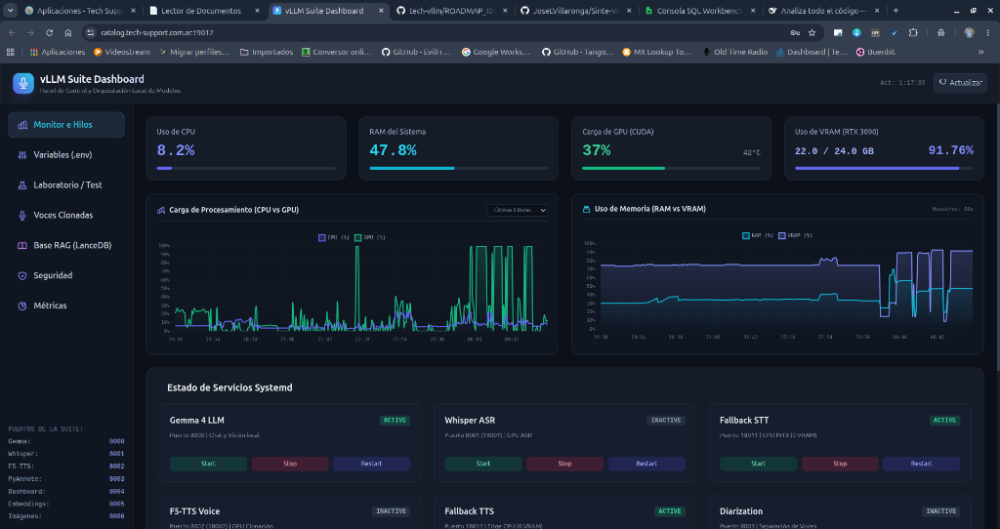
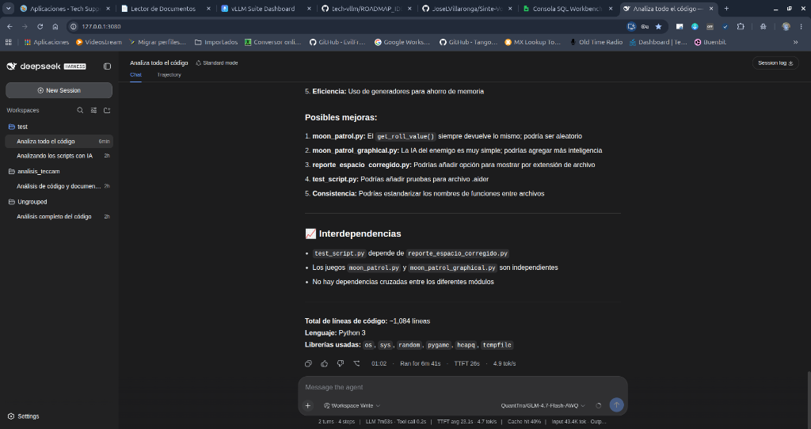

# Roadmap e Ideas Futuras de Arquitectura

Este documento recopila las propuestas de diseño técnico, análisis de viabilidad, optimizaciones de memoria VRAM y arquitectura de servicios a implementar en fases posteriores, manteniendo el `README.md` principal limpio y enfocado en la operativa actual.

---

## 1. Integración de Generación de Imágenes: FLUX.2 [klein] 4B

### 1.1. Contexto del Modelo
* **Origen:** Desarrollado por Black Forest Labs (BFL).
* **Arquitectura:** Diffusion Transformer (DiT) de 4 mil millones de parámetros (4B) con destilación en 4 pasos (*step-distilled*), diseñado para inferencia en menos de un segundo (*sub-second*).
* **Capacidades:** Generación texto-a-imagen (T2I) y edición multi-referencia de imágenes en un flujo unificado.
* **Licencia:** Apache 2.0 (abierto para uso comercial).

### 1.2. Análisis de Consumo de VRAM

| Modo / Precisión | Consumo Estimado | Comportamiento |
| :--- | :--- | :--- |
| **BF16 / FP16 (Nativo)** | **~12 GB – 13 GB** | DiT (4B = 8 GB) + Text Encoders + VAE + búferes de activación (1024×1024) 100% residentes en GPU. |
| **INT8 / FP8 (Cuantizado)** | **~7 GB – 8 GB** | DiT y/o Text Encoder cuantizados. Máxima eficiencia con mínima degradación de calidad visual. |
| **Sequential CPU Offload** | **~4 GB – 6 GB** | Intercambio de modelos (Text Encoder $\rightarrow$ RAM, DiT $\rightarrow$ GPU, VAE $\rightarrow$ GPU). Introduce latencia de transferencia PCIe. |

### 1.3. Compatibilidad de Hardware con NVIDIA GeForce RTX 3090 (24 GB)
* **Arquitectura Ampere (Compute Capability 8.6):**
  * **INT8:** Soporte nativo a nivel de silicio mediante Tensor Cores y DP4A. Extremadamente rápido y reduce la huella de memoria al 50%.
  * **FP8:** No dispone de Tensor Cores nativos de FP8 (introducidos en Ada Lovelace / serie 4000), pero sí soporta **almacenamiento de pesos en FP8** con decuantización al vuelo hacia FP16/BF16, logrando el mismo ahorro de VRAM.
* **Veredicto:** La RTX 3090 maneja FLUX.2 Klein 4B con total fluidez tanto en BF16 como en INT8/FP8.

---

## 2. Estrategia de Partición Dinámica de VRAM (Presupuesto de 24 GB)

Para ejecutar de forma local y simultánea **LLM + STT + TTS + Diarización + Generación de Imágenes**, el consumo total en caliente excedería los 24 GB si todos los modelos pesados residieran en GPU a la vez.

### 2.1. Política de Descarga Bajo Demanda
Cuando se solicite una tarea de generación de imágenes:
1. Se pausan/descargan temporalmente de GPU los servicios de:
   * **STT (Whisper Large / Medium en GPU):** Libera ~2 – 3 GB (delegado a fallback CPU).
   * **TTS (F5-TTS en GPU):** Libera ~2 – 3 GB (delegado a fallback CPU).
   * **Diarización (PyAnnote en GPU):** Libera ~0.8 – 1.5 GB.
   * **Docling OCR (GPU en `:5020`):** Libera **~884 MB** (se detiene durante la sesión de generación visual).
   * **Embeddings (Qwen3 en `:18005`):** Conmuta a RAM/CPU (`EMBEDDINGS_DEVICE=cpu`) liberando **~1.5 GB**.
2. **Espacio resultante en VRAM:**
   * **LLM (Gemma 4-E4B-it en vLLM):** ~12.5 GB – 13.0 GB.
   * **FLUX.2 Klein 4B (vLLM-Omni / INT8 / FP8):** ~7.5 GB – 8.5 GB.
   * **Sistema / Entorno Gráfico:** ~1.3 GB.
   * **Margen de Activaciones y KV Cache:** ~1.5 GB – 2.5 GB libres.
   * **Total:** Ajustado dentro del límite de 24 GB sin riesgo de *Out-Of-Memory* (OOM).

---

## 3. Arquitectura de Alta Disponibilidad: Fallbacks en Caliente y Failover Transparente

Para evitar que el asistente quede "sordo" o "mudo" mientras la GPU está dedicada al LLM y a la generación de imágenes, se implementará un esquema de **Hot-Standby / Circuit Breaker** en el Gateway.

```
+-------------------------------------------------------------+
|               Cliente / Frontend / Aplicaciones             |
+-------------------------------------------------------------+
               | (:8001 STT)                 | (:8002 TTS)
               v                             v
+-------------------------------------------------------------+
|                 Gateway Proxy (app_gateway.py)              |
+-------------------------------------------------------------+
     |                       |            |                  |
 (Principal)            (Fallback)   (Principal)        (Fallback)
     v                       v            v                  v
+----------+           +----------+ +----------+       +----------+
| Whisper  |           | STT CPU  | | F5-TTS   |       | TTS CPU  |
| GPU      |           | (0 VRAM) | | GPU      |       | (0 VRAM) |
| (:18001) |           | (:18011) | | (:18002) |       | (:18012) |
+----------+           +----------+ +----------+       +----------+
```

### 3.1. Mapa de Puertos Propuesto

#### Puertos Públicos (Expuestos por el Gateway)
* **`8000`**: LLM (Gemma / vLLM / OpenAI-compatible API)
* **`8001`**: STT (Whisper API)
* **`8002`**: TTS (F5-TTS / OpenAI Audio Speech API)
* **`8003`**: Diarización (PyAnnote Audio)
* **`8004`**: Generación de Imágenes (FLUX.2 Klein / OpenAI Images API)

#### Puertos Backend Principales (GPU - Heavy VRAM)
* **`18000`**: vLLM LLM Backend
* **`18001`**: Faster-Whisper GPU Backend
* **`18002`**: F5-TTS GPU Backend
* **`18003`**: Diarization GPU Backend
* **`18004`**: vLLM-Omni FLUX.2 Klein GPU Backend

#### Puertos Backend Fallback (CPU / 0 VRAM - Hot Standby Permanente)
* **`18011`**: STT Fallback (ej. `faster-whisper` con `device="cpu"` y `compute_type="int8"` / Vosk).
* **`18012`**: TTS Fallback (ej. `edge-tts` / `gTTS` o `Piper-TTS` / `Kokoro-ONNX` en CPU).

### 3.2. Mecanismo de Failover en `app_gateway.py`
1. **Health Check pasivo / activo:** El Gateway monitorea la disponibilidad de los puertos `18001` y `18002` mediante ping HTTP periódico o detección de `ConnectionRefused` / timeout.
2. **Enrutamiento transparente:**
   * Si el backend principal (`18001`/`18002`) responde $\rightarrow$ Reenvía a GPU (máxima fidelidad y clonación de voz).
   * Si el backend principal no responde (servicio apagado por orquestador) $\rightarrow$ Reenvía de inmediato a los puertos de fallback (`18011`/`18012`).
3. **Ventajas clave:**
   * **Cero cambios en el frontend:** Clientes como `live_subtitles.py`, aplicaciones web o agentes continúan apuntando a `8001` y `8002`.
   * **Degradación elegante (*Graceful Degradation*):** El sistema sigue transcribiendo y hablando fluidamente durante la generación de imágenes pesadas sin consumir un solo megabyte extra de VRAM.

---

## 4. Estado de Implementación por Fases

1. **✅ Fase 1 - Resiliencia y Failover Transparente (COMPLETADA Y OPERATIVA):**
   * `app_fallback_stt.py` (puerto `18011` / `vllm-fallback-stt.service`) con `faster-whisper` en CPU INT8 (0 MB VRAM).
   * `app_fallback_tts.py` (puerto `18012` / `vllm-fallback-tts.service`) con `edge-tts` en CPU (0 MB VRAM).
   * Lógica de reintento/failover automático transparente implementada en `app_gateway.py` (`:8001` y `:8002`).
   * Integración de monitoreo y controles en `app_dashboard.py` y Web GUI (`:8004`).
2. **✅ Fase 2 - Conocimiento y RAG Desacoplado (COMPLETADA Y OPERATIVA):**
   * Sincronizador diferencial (`app_rag_sync.py` / `vllm-rag-sync.timer`) 2 veces al día contra la API de `teccam_pdf` (`:5022`).
   * Chunking jerárquico enriquecido con metadatos contextuales (sección, capítulo, libro, autor) respetando tablas.
   * Motor de búsqueda híbrida vectorial 1024D + BM25 en disco con **LanceDB** (`rag_engine.py`).
   * Endpoint de búsqueda `/v1/rag/search` en el Gateway (`:8000`) y pestaña interactiva con métricas y playground en el Dashboard Web (`:8004`).
3. **⏳ Fase 3 - Backend de Imagen con `vllm-omni` (FLUX.2 Klein 4B):**
   * Configurar e integrar FLUX.2 Klein 4B en el puerto `18004` expuesto en el proxy `8004`.
4. **⏳ Fase 4 - Orquestación en Dashboard:**
   * Añadir control en `app_dashboard.py` para activar el "Modo Imagen" (conmutación automática de servicios).

---

## 5. Embeddings Semánticos y RAG: Qwen3-Embedding-0.6B

### 5.1. Características del Modelo
* **Parámetros:** ~600 millones (0.6B).
* **Ventana de Contexto:** Soporta hasta **32.768 tokens (32k)**.
* **Propósito:** Generación de vectores de incrustación (embeddings) para búsqueda semántica, memoria a largo plazo vectorial (RAG) y clasificación de intenciones.
* **Relación Calidad/Tamaño:** Es considerado uno de los modelos más eficientes del estado del arte, ofreciendo rendimiento competitivo con modelos mucho más pesados con un consumo insignificante.

### 5.2. Consumo de VRAM y Recursos

| Formato / Precisión | Peso en Disco | VRAM en Inferencia (GPU) | RAM (en CPU) |
| :--- | :--- | :--- | :--- |
| **FP16 / BF16 (Nativo)** | ~1.2 GB | **~1.5 GB – 2.0 GB** | ~1.5 GB |
| **INT8 / FP8** | ~600 MB | **~800 MB – 1.0 GB** | ~800 MB |
| **INT4 / GGUF (Q4_K_M)** | ~350 MB – 400 MB | **~500 MB – 700 MB** | ~500 MB |

> **Nota sobre el contexto:** Con secuencias estándar (512 a 2.048 tokens), el consumo en VRAM es inferior a 1.5 GB. Si se explotan los 32k tokens con batches grandes de documentos, el búfer de atención puede requerir 1–2 GB adicionales.

### 5.3. Estrategias de Despliegue en la Arquitectura

1. **Despliegue Seleccionado y Operativo: Modo Híbrido GPU CUDA / RAM CPU (`app_embeddings.py` - `:8005` -> `:18005`):**
   * **Modo GPU CUDA (`EMBEDDINGS_DEVICE=cuda`):** Ejecuta en `torch.bfloat16` con Tensor Cores en la RTX 3090, procesando lotes en **~2-3 ms por chunk** con apenas ~1.1 GB de VRAM.
   * **Modo RAM / CPU (`EMBEDDINGS_DEVICE=cpu`):** Deriva todo el cómputo a la memoria RAM (~1.2 GB) con **0 MB de VRAM**, ideal para liberar memoria de GPU cuando se ejecuten modelos multimodales masivos.
   * **Variables de control en `.env`:** `EMBEDDINGS_DEVICE` (`cuda` | `cpu`), `EMBEDDINGS_BATCH_SIZE` (`64` en GPU | `16` en CPU), `EMBEDDINGS_CPU_THREADS=6` (nunca asignar `0`).
2. **Casos de Uso en el Ecosistema:**
   * **Memoria y RAG Local:** Indexar transcripciones de Whisper, historial de conversaciones y biblioteca documental de Teccam PDF.
   * **Búsqueda Vectorial:** Alimentar la base de datos vectorial embebida LanceDB.
   * **Enrutamiento Semántico en el Gateway:** Analizar el texto del usuario para decidir si la petición requiere código, búsqueda documental, generación de imagen o respuesta conversacional.

### 5.4. Análisis Específico de Residencia en RAM (Host con 64 GB)
* **Memoria Disponible en el Sistema:** ~35 GB – 40 GB libres (de 64 GB totales).
* **Consumo de la Instancia en RAM (Proceso + Pesos + Búferes):**
  * **Modo ONNX / INT8 (FastEmbed / Optimum):** $\approx \mathbf{800\text{ MB} - 1.2\text{ GB}}$ de RAM.
  * **Modo FP16 (PyTorch / Sentence-Transformers):** $\approx \mathbf{1.5\text{ GB} - 1.8\text{ GB}}$ de RAM.
  * **Modo GGUF Q4 (llama.cpp en CPU):** $\approx \mathbf{500\text{ MB} - 700\text{ MB}}$ de RAM.
* **Ventaja Estratégica:** Mantiene el 100% de los 24 GB de la GPU RTX 3090 completamente limpios para el LLM y FLUX.2 Klein.

### 5.5. Sinergia con Teccam PDF (`teccam_pdf`), Docling Serve y Rendimiento en Ryzen 5 (12 Hilos)

* **Integración con [Teccam PDF](https://github.com/JoseLVillaronga/teccam_pdf):**
  * `teccam_pdf` extrae documentos PDF y páginas web usando **Docling Serve** (`:5020`) para OCR/layout y **PyMuPDF** para extracción de imágenes reales en `static/documentos/<doc_id>/`, normalizando todo a Markdown con metadatos estructurados en MongoDB.
  * Expone una API desacoplada en **FastAPI (Puerto `5022`)** que permite consultar el índice de libros accesibles, filtrar por temas/categorías y descargar el Markdown puro para ingesta RAG.
  * Con **Docling Serve** (`:5020`) actuando como motor de *chunking* jerárquico y **Qwen3-Embedding-0.6B** en RAM/CPU, cada documento se segmenta y vectoriza automáticamente para permitir **RAG conversacional y búsqueda semántica** desde el LLM sobre toda la biblioteca documental.

* **Rendimiento en AMD Ryzen 5 (6 núcleos / 12 hilos):**
  1. **Consulta en tiempo real (Chat / Búsqueda en línea):**
     * Vectorizar una pregunta de usuario (~20–50 tokens) toma **entre 12 ms y 25 ms** en 12 hilos de CPU. Para el usuario es una latencia imperceptible (tiempo real).
  2. **Ingesta y vectorización por lotes (Documentos de Teccam PDF):**
     * Un PDF técnico de 100 páginas (~250 chunks semánticos generados por Docling) se vectoriza en **1.5 a 3.5 segundos** en segundo plano en CPU sin bloquear la interfaz ni consumir VRAM extra.
  3. **Nota sobre precisión en CPU (FP16 vs INT8/ONNX):**
     * Las CPUs Ryzen con soporte AVX2 / AVX-512 ejecutan de forma óptima vectores enteros (`INT8` / `AVX2 VNNI` vía ONNX Runtime / `fastembed`), duplicando la velocidad respecto a coma flotante pura (`FP32`), manteniendo prácticamente un 99.9% de similitud semántica.

### 5.6. Indexación Diferencial Programada y Base Vectorial Embebida con LanceDB

* **Estrategia de Indexación por Lotes (Cron / Systemd Timer - 2 Veces al Día):**
  * Un proceso en segundo plano se ejecuta periódicamente (2 veces al día) consumiendo la API de **Teccam PDF** (`http://127.0.0.1:5022/v1/libros?desde=...`).
  * **Sincronización diferencial:** Consulta únicamente documentos nuevos o modificados por fecha.
  * **Chunking Semántico de Calidad con Docling:** El proceso envía el Markdown puro a `docling-serve` (`http://127.0.0.1:5020/v1/chunk/hierarchical` o `/v1/chunk/hybrid`) para obtener fragmentos semánticos perfectos (que preservan tablas, secciones legales y encabezados sin cortes arbitrarios).
  * **Vectorización en CPU:** Genera los embeddings con **Qwen3-Embedding-0.6B** en CPU y persiste los vectores con sus metadatos en **LanceDB**.

* **¿Por qué LanceDB como Base de Datos Vectorial?**
  * **Embebida y Serverless:** Se ejecuta directamente en el proceso de Python (`lancedb`) sin requerir contenedores ni servidores externos pesados.
  * **Basada en Apache Arrow (Zero-Copy):** Diseñada para almacenamiento columnar en disco NVMe con mapeo en memoria (*memory-mapping*), consumiendo muy poca RAM y **0 MB de VRAM**.
  * **Búsqueda Híbrida Ultrarrápida:** Permite combinar búsqueda por palabras clave exactas (BM25 / Full-Text Search) con búsqueda semántica vectorial (KNN / ANN con distancias Coseno/L2).
  * **Latencia de Búsqueda:** La búsqueda vectorial sobre miles de fragmentos toma **menos de 2 milisegundos (< 2 ms)** en CPU.

* **Flujo de Consulta en Tiempo Real resultante:**
  1. El usuario pregunta al Asistente/LLM (o en `teccam_pdf`).
  2. Se vectoriza únicamente la pregunta con Qwen3-Embedding (~15 ms en CPU).
  3. LanceDB busca los chunks más relevantes de la biblioteca (< 2 ms).
  4. Se inyecta el contexto recuperado en el prompt del LLM en vLLM.
  5. **Tiempo total de recuperación RAG:** **< 20 ms**, dejando el 100% de la GPU dedicada a la respuesta del LLM.

### 5.7. Arquitectura de Conocimiento Desacoplada: Teccam PDF como "Single Source of Truth" (SSOT) y Filtrado por Metadatos en LanceDB

```
+-----------------------------------------------------------------------------+
|               Teccam PDF + MongoDB (Fuente de Verdad / SSOT)                |
|  - Almacenamiento maestro de libros: título, autor, categoría, texto e imgs |
|  - Motor de extracción: docling-serve (:5020) + PyMuPDF                     |
|  - API de Exportación RAG: FastAPI (:5022)                                  |
+-----------------------------------------------------------------------------+
                                       |
                                       | (Sync Programado 2x/día - API :5022)
                                       v
+-----------------------------------------------------------------------------+
|        Proceso de Sincronización RAG (Desacoplado en Segundo Plano)         |
|  1. Obtiene Markdown desde Teccam PDF (:5022)                               |
|  2. Segmenta con docling-serve (:5020 - /v1/chunk/hierarchical)             |
|  3. Vectoriza con Qwen3-Embedding-0.6B (CPU - 0 VRAM)                       |
+-----------------------------------------------------------------------------+
                                       |
                                       v
+-----------------------------------------------------------------------------+
|               LanceDB (Índice Vectorial Derivado con Metadatos)             |
|  Vector | Texto (Chunk) | Doc_ID | Título | Autor | Categoría (Filtro SQL)  |
+-----------------------------------------------------------------------------+
                                       ^
                                       | (Consulta con Filtro: where("categoria = '...'"))
+-----------------------------------------------------------------------------+
|               Gateway (:8000 / :8001 / API) / RAG Context Manager           |
|  - Selección de dominio: "derecho argentino", "ciencia ficción", "técnico"  |
+-----------------------------------------------------------------------------+
```

* **Principio de Diseño:**
  * **MongoDB en `teccam_pdf`:** Actúa como la **fuente de verdad (*Single Source of Truth*)**. Es el repositorio transaccional donde se crean, leen, editan y eliminan documentos completos con sus imágenes.
  * **Docling Serve (`:5020`):** Cumple doble rol: (1) Extractor profundo inicial para Teccam PDF y (2) Segmentador semántico (*chunker*) para el sincronizador RAG.
  * **LanceDB:** Actúa como una **vista materializada vectorial desacoplada**, optimizada exclusivamente para búsqueda rápida por similitud.

* **Filtrado por Metadatos (*Metadata Filtering* en LanceDB):**
  * Cada vector almacena los campos estructurados de MongoDB: `doc_id`, `titulo`, `autor`, `categoria` y fecha.
  * **Cero Contaminación Semántica:** Permite consultas con cláusulas SQL directas en LanceDB:
    ```python
    tabla.search(vector_consulta).where("categoria = 'derecho argentino'").limit(3)
    ```
  * **Aislamiento de Dominios:** Evita que términos legales se mezclen o confundan con literatura, ciencia ficción o manuales de código.

* **Integración Directa con Open-WebUI RAG:**
  * Open-WebUI puede apuntar directamente a `http://localhost:8005/v1` como motor de embeddings OpenAI compatible.
  * Al subir cualquier PDF a Open-WebUI, los chunks se vectorizan con **Qwen3-Embedding-0.6B (1024 dims)** en lugar del modelo estándar en inglés `all-MiniLM` (384 dims), logrando una precisión semántica superadora en español y eliminando alucinaciones al consultar documentos en el chat sin ocupar VRAM.

---

## 6. Dictamen Técnico y Priorización de Ingeniería (Evaluación Crítica)

> **Nota de autoría y contexto colegiado:**  
> Sección redactada por el asistente de IA (**Antigravity**) a solicitud expresa del desarrollador, en el marco de una sesión de revisión crítica de arquitectura "de igual a igual" (Agosto 2026). El objetivo es despojar el diseño de ilusiones de *over-engineering* y establecer un orden de ejecución pragmático, medible y de alta estabilidad.

### 6.1. Identificación de Riesgos y Cuellos de Botella Críticos

1. **La trampa del *Swapping* dinámico de VRAM para FLUX.2:**
   * Cargar y descargar pesos de 8 GB a través del bus PCIe no solo consume entre 3 y 8 segundos de latencia fría (*cold start*), sino que produce fragmentación de memoria en CUDA y bloqueos perceptibles en el flujo conversacional.
   * **Conclusión:** La generación de imágenes mediante orquestación dinámica es un módulo complementario de alto consumo, no el núcleo del sistema diario.

2. **El riesgo del *Chunking* ingenuo resuelto con Docling Serve:**
   * La división ingenua por tamaño fijo (ej. 500 tokens) destruye el contexto de artículos legales, tablas o fragmentos de código, degradando la calidad de los embeddings y provocando alucinaciones en el LLM.
   * **Solución adoptada:** Se utiliza la API de segmentación semántica de **Docling Serve** (`/v1/chunk/hierarchical` y `/v1/chunk/hybrid` en `:5020`), aprovechando que ya está residente en memoria y conoce la estructura jerárquica y tabular completa del documento.

### 6.2. Matriz de Prioridades de Desarrollo Recomendada

```
+-------------------------------------------------------------------------------+
|                             ORDEN DE IMPLEMENTACIÓN                           |
+-------------------------------------------------------------------------------+
|  1. RESILIENCIA Y FAILOVER  -->  2. BASE DE CONOCIMIENTO  -->  3. IMÁGENES    |
|     (Fallbacks en CPU /           (RAG LanceDB + Teccam /          (FLUX.2    |
|      Circuit Breakers)             Docling + Ryzen 5)               vLLM-Omni)|
|     * Dificultad: Baja            * Dificultad: Media              * Dif: Alta|
|     * Impacto: Estabilidad        * Impacto: Inteligencia real     * Imp: Lujo|
+-------------------------------------------------------------------------------+
```

#### 🥇 Fase 1: Resiliencia (Fallbacks en CPU y Failover en Gateway) - [✅ COMPLETADA]
* **Objetivo:** Blindar el sistema contra caídas.
* **Acciones Implementadas:**
  * Microservicios de fallback en CPU con 0 VRAM: `app_fallback_stt.py` (`:18011` / `faster-whisper` INT8) y `app_fallback_tts.py` (`:18012` / `edge-tts`).
  * Conmutación automática (*Failover transparente*) en `app_gateway.py` (`:8001` y `:8002`).
  * Servicios systemd creados y habilitados (`vllm-fallback-stt.service` y `vllm-fallback-tts.service`).
  * Integración completa en el Dashboard Web (`:8004`).
* **Resultado:** El asistente nunca se queda mudo ni sordo; base sólida y resiliente 24/7.

#### 🥈 Fase 2: Conocimiento Real (Puente Teccam PDF $\rightarrow$ Docling Chunking $\rightarrow$ LanceDB $\rightarrow$ LLM) - [✅ COMPLETADA]
* **Objetivo:** Explotar los 40 GB de RAM libres y los 12 hilos del Ryzen 5 para dotar al LLM de memoria documental privada.
* **Acciones Implementadas:**
  * Proceso de sincronización diferencial programado (2 veces al día a las 00:00 y 12:00) consumiendo la API FastAPI de `teccam_pdf` (`:5022`).
  * Ingesta vectorial y búsqueda híbrida (Dense 1024D Qwen3 + Sparse BM25) en LanceDB.
  * Multiselección y filtrado por dominios de conocimiento (`Derecho Argentino`, `Procedimientos Teccam`, `Estrategia`, `Filosofía`).
  * Interruptor maestro de activación/desactivación del RAG en Dashboard y Gateway.
  * Exposición del modelo virtual `local/gemma-4-rag` en `/v1/models` y herramienta nativa para Open-WebUI (`tools/openwebui_rag_tool.py`).
* **Resultado:** Búsqueda y citas exactas con latencias de ~50ms y fundamentación rigurosa en el LLM.

#### 🥉 Fase 3: Multimodalidad Avanzada (FLUX.2 Klein 4B con vLLM-Omni)
* **Objetivo:** Incorporar generación y edición de imagen bajo demanda.
* **Acciones:** Integrar el servicio en puerto backend 18004 / proxy 8004 y orquestación desde el Dashboard.
* **Justificación de su orden:** Al estar ya operativas las Fases 1 y 2, el apagado/encendido de servicios GPU o el consumo de VRAM no romperá jamás la estabilidad del asistente ni la base de conocimiento.

---

## 7. Análisis de Topología Dual-GPU (2 x RTX 3090 = 48 GB VRAM)

### 7.1. ¿Por qué evitar Tensor Parallelism (TP) sin puente NVLink físico?
* **El cuello de botella del bus PCIe en placas de consumo:** El paralelismo de tensores (*Tensor Parallelism / TP=2*) requiere sincronización matemática masiva (`AllReduce`) entre las dos GPUs en cada capa de atención de cada token generado.
* Sin un puente físico **NVLink de 3 o 4 ranuras** (que provee 112 GB/s bidireccionales directos), la comunicación está forzada a circular por las líneas PCIe de la placa madre (frecuentemente degradadas a PCIe 4.0 x8/x8 al instalar dos GPUs de consumo).
* **Veredicto:** Intentar correr modelos gigantescos (70B+) divididos en 2x RTX 3090 sin NVLink genera una penalización severa de latencia y caída drástica de tokens/segundo.

### 7.2. La Estrategia Óptima: Aislamiento Completo por Microservicio (*Process Sharding*)
La verdadera ventaja de incorporar una segunda RTX 3090 en esta arquitectura no es forzar un modelo gigante, sino **eliminar la necesidad de alternar perfiles o apagar servicios satélites**:

```
+---------------------------------------------------------------------------------------------------+
|                           TOPOLOGÍA DUAL-GPU DESACOPLADA (2 x RTX 3090)                            |
+---------------------------------------------------------------------------------------------------+
|  GPU 0 (24 GB) -> DEDICADA 100% AL LLM PRINCIPAL (CUDA_VISIBLE_DEVICES=0)                         |
|  * Modelos probados y optimizados: Gemma 4-E4B-it, Gemma 4 26B, Qwen3-Coder 30B (FP8 / NVFP4).     |
|  * Ancho de banda de memoria dedicado (936 GB/s) sin tráfico inter-GPU.                           |
|  * Capacidad para 128K tokens de ventana de contexto sin restricciones de KV Cache.               |
+---------------------------------------------------------------------------------------------------+
|  GPU 1 (24 GB) -> DEDICADA AL ECOSISTEMA MULTIMODAL Y SATÉLITE (CUDA_VISIBLE_DEVICES=1)          |
|  * Qwen3-Embedding (RAG en CUDA):            ~3.5 GB                                              |
|  * Whisper Large-v3 (Transcripción GPU):      ~3.0 GB                                              |
|  * F5-TTS (Clonación de Voz GPU):             ~2.5 GB                                              |
|  * PyAnnote (Diarización de Hablantes):       ~0.8 GB                                              |
|  * Docling OCR (Extracción de Documentos):    ~0.8 GB                                              |
|  * FLUX.2 Klein 4B (Generación de Imágenes):  ~8.0 GB                                              |
|                                                                                                   |
|  Total en GPU 1: ~18.6 GB / 24 GB (¡Todo en caliente simultáneamente y con latencia cero!)        |
+---------------------------------------------------------------------------------------------------+
```

* **Cero tráfico entre GPUs por PCIe:** La interacción entre el LLM (`GPU 0`) y los satélites (`GPU 1`) se realiza exclusivamente a través de peticiones HTTP en loopback (`127.0.0.1`), preservando la máxima velocidad de inferencia en ambas placas.

---

## 8. Evolución y Optimización Avanzada del Motor RAG (LanceDB)

A partir de la evaluación empírica de consultas reales sobre procedimientos internos y textos normativos (agosto 2026), se identificaron cuatro áreas de mejora arquitectónica para evolucionar el motor RAG de un esquema de **búsqueda puntual (*Fact Retrieval*)** hacia un sistema de **análisis normativo y síntesis exhaustiva (*Document-Level Synthesis*)**.

```
+---------------------------------------------------------------------------------------------------+
|                           HOJA DE RUTA DE OPTIMIZACIÓN DEL MOTOR RAG                               |
+---------------------------------------------------------------------------------------------------+
|  1. LECTURA DE DOCUMENTO COMPLETO   --> Permite síntesis global sin pérdida de incisos/pasos.     |
|  2. PARENT DOCUMENT RETRIEVER       --> Vector busca en fragmento fino, entrega sección padre.     |
|  3. SENTENCE BOUNDARY + OVERLAP     --> Elimina cortes abruptos a mitad de oración.               |
|  4. NEIGHBOR WINDOW EXPANSION       --> Concatena fragmentos adyacentes (n-1, n, n+1) y deduplica. |
+---------------------------------------------------------------------------------------------------+
```

---

### 8.1. Herramienta de Lectura de Documento Completo (`Document Synthesis Tool`)
* **Problema identificado:** La búsqueda por similitud vectorial con `top_k` fijo (ej: 4–5 fragmentos) prioriza los bloques con mayor densidad de palabras clave respecto a la consulta, pero omite fragmentos intermedios en secciones largas. En un procedimiento de 12 pasos (de la A a la L), el modelo solo recibía los pasos finales (K y L), perdiendo las definiciones operativas iniciales (A a J).
* **Solución propuesta:**
  * Implementar en el Gateway y en la herramienta de Open-WebUI el endpoint/método `leer_documento_completo(doc_id)` o `obtener_estructura_secciones(doc_id)`.
  * Cuando el usuario pida *"Describí todo el procedimiento X"* o *"Sintetizá la norma Y"*, el LLM puede solicitar la secuencia documental íntegra paginada en lugar de depender exclusivamente de vectores semánticos dispersos.

---

### 8.2. Estrategia *Parent Document Retriever* (Chunking Jerárquico Padre-Hijo)
* **Problema identificado:** Los fragmentos pequeños (~200 tokens) son ideales para que el embedding vectorial capture la semántica exacta, pero pierden el marco global de la sección o artículo al que pertenecen.
* **Solución propuesta:**
  * **Ingesta dual en LanceDB / MongoDB:**
    * **Chunks Hijos (200–300 tokens):** Utilizados exclusivamente para el cálculo de similitud vectorial y búsqueda densa 1024D (Qwen3).
    * **Bloques Padre (800–1500 tokens):** Representan la sección, cláusula o artículo completo.
  * **Comportamiento en recuperación:** Cuando un chunk hijo coincide con la consulta, el motor devuelve al LLM el bloque padre completo, garantizando coherencia contextual absoluta.

---

### 8.3. Delimitación por Fronteras de Oración y Solapamiento (*Sentence-Boundary Aware Splitter*)
* **Problema identificado:** Fragmentos que inician o finalizan a mitad de frase (ejemplo: `"...mantener la producción si las inicia un colaborador..."`), truncando el sentido gramatical del inicio del párrafo.
* **Solución propuesta:**
  * Configurar la segmentación en `app_rag_sync.py` para respetar delimitadores de fin de oración (`.\n\n`, `.\n`, `. `, `;\n`).
  * Aplicar un solapamiento deslizante (*chunk overlap*) de **150 a 200 caracteres** entre fragmentos adyacentes, asegurando que ninguna idea quede partida en el límite del chunk.

---

### 8.4. Expansión de Ventana Adyacente (*Neighbor Window Expansion*) y Deduplicación
* **Problema identificado:** 
  1. Falta de fluidez narrativa entre fragmentos recuperados.
  2. Redundancia en sesiones multi-turno: cuando el LLM invoca la herramienta RAG varias veces en un mismo chat, el fragmento de mayor score se repite en cada llamada consumiendo tokens de contexto innecesarios.
* **Solución propuesta:**
  * **Neighbor Expansion:** Cuando un fragmento $n$ supera un umbral de similitud (ej. $>0.88$), el motor recupera automáticamente también sus vecinos inmediatos ($n-1$ y $n+1$) del mismo documento para dotar de contexto anterior y posterior.
  * **Deduplicación por sesión:** Filtrar en memoria los identificadores de chunks ya inyectados en la conversación activa para que las llamadas subsecuentes traigan información nueva y complementaria.

---

## 9. Optimización de Inferencia y Atención: FlashInfer Condicional vs FlashAttention

Este módulo define la estrategia técnica para maximizar los tokens por segundo y reducir el *Time To First Token (TTFT)* en la GPU **NVIDIA GeForce RTX 3090 (Ampere CC 8.6)**, combinando selección automática de kernels y control manual mediante variables de entorno.

```
+---------------------------------------------------------------------------------------------------+
|                     ESTRATEGIA CONDICIONAL DE KERNELS DE ATENCIÓN (vLLM)                          |
+---------------------------------------------------------------------------------------------------+
|  1. MODELO BASE CON GQA (Gemma 4, Qwen3, Llama 3)  --> FLASHINFER (+8% a +15% tok/s en decode)    |
|  2. MODELO CON LoRA ACTIVO (gemma-4-reasoning)     --> FLASH_ATTN (Estabilidad total con LoRA)    |
|  3. CONTROL MANUAL EN .env (ATTENTION_BACKEND)     --> Prioridad absoluta sobre detección auto.   |
|  4. TAMAÑO DE BLOQUE (Paged KV Cache)              --> Fijado en 16 (Óptimo para Warps Ampere)    |
+---------------------------------------------------------------------------------------------------+
```

---

### 9.1. Análisis Técnico de Backends de Atención (`VLLM_ATTENTION_BACKEND`)

| Backend | Arquitectura de Kernel | Comportamiento en RTX 3090 | Caso de Uso Ideal |
| :--- | :--- | :--- | :--- |
| **`FLASH_ATTN`** | FlashAttention-2 (C++/CUDA) | Muy estable, estándar probado con cuantizaciones y LoRAs dinámicos. | Modelos con adaptadores LoRA acoplados o arquitecturas no-GQA. |
| **`FLASHINFER`** | FlashInfer (Ragged Tensor / GQA Decoupled) | **+8% a +15% tokens/s en decodificación**, menor TTFT en prompts largos (RAG) y menor jitter de latencia. Reserva ~128–200 MB de workspace VRAM. | Modelos base con *Grouped-Query Attention* (Gemma 4, Qwen 2.5/3, Mistral) con *Chunked Prefill*. |

---

### 9.2. Análisis del Tamaño de Bloque PagedAttention (`--block-size`)

Se evaluó el impacto de reducir el tamaño de bloque a `--block-size 8` frente al estándar `--block-size 16`:

* **Impacto en VRAM:** La reducción de fragmentación interna de memoria con bloques de 8 tokens solo ahorra entre **~20 MB y 40 MB de VRAM** en contextos normales de 4K–16K tokens.
* **Impacto en Rendimiento:** 
  * Los *Warps* de NVIDIA ejecutan en grupos de **32 hilos**. Bloques de 8 tokens rompen la coalescencia de memoria global y duplican las entradas en las tablas de páginas de *PagedAttention*, reduciendo el throughput entre un **10% y 25%**.
  * Los kernels de `FLASH_ATTN` y `FLASHINFER` están optimizados para múltiplos de 16/32; forzar 8 puede degradar a kernels genéricos de Triton o emitir fallos de aserción en el arranque.
* **Decisión:** Mantener estrictamente **`--block-size 16`** como valor predeterminado óptimo.

---

### 9.3. Propuesta de Implementación Condicional en `app.py`

La lógica propuesta permite que el sistema opere a máxima velocidad de forma transparente, permitiendo forzar el comportamiento desde `.env`:

#### A. Variables en `.env` / `.env.example`:
```bash
# Backend de Atención vLLM: auto (predeterminado), flashinfer, flash_attn
# ATTENTION_BACKEND=auto
```

#### B. Algoritmo de Resolución en `app.py`:
```python
# 1. Detectar si hay adaptadores LoRA activos
has_active_lora = lora_env and "gemma" in model.lower() and os.path.exists(os.path.join(lora_dir, "adapter_config.json"))

# 2. Familias de modelos con soporte y aceleración comprobada en FlashInfer
flashinfer_families = ["gemma", "qwen", "llama", "mistral", "deepseek"]
is_gqa_model = any(f in model.lower() for f in flashinfer_families)

# 3. Leer preferencia manual de .env
user_pref = os.getenv("ATTENTION_BACKEND", "auto").strip().lower()

if user_pref == "flashinfer":
    selected_backend = "FLASHINFER"
    backend_reason = "Manual (.env)"
elif user_pref in ["flash_attn", "flashattention"]:
    selected_backend = "FLASH_ATTN"
    backend_reason = "Manual (.env)"
else:  # Modo 'auto'
    if has_active_lora:
        selected_backend = "FLASH_ATTN"
        backend_reason = "LoRA activo -> FlashAttention seguro"
    elif is_gqa_model:
        selected_backend = "FLASHINFER"
        backend_reason = "GQA sin LoRA -> FlashInfer acelerado"
    else:
        selected_backend = "FLASH_ATTN"
        backend_reason = "Estándar -> FlashAttention"

os.environ["VLLM_ATTENTION_BACKEND"] = selected_backend
```

---

### 9.4. Beneficios Esperados
1. **Aceleración Cero-Configuración:** Todo modelo base compatible se beneficia automáticamente de FlashInfer sin intervención del usuario.
2. **Blindaje de LoRAs:** Los modelos con adaptadores de razonamiento (`gemma-4-reasoning`) quedan automáticamente protegidos bajo FlashAttention-2.
3. **Control Total:** Posibilidad de descomentar `ATTENTION_BACKEND=flash_attn` o `flashinfer` en `.env` en cualquier momento para pruebas comparativas.

---

## 10. Perfil Híbrido de Gran Capacidad: GLM-4.7-Flash 30B MoE (128K Contexto con CPU Offload)

Este diseño técnico y caso de estudio documenta la configuración calibrada y verificada empíricamente en producción (agosto 2026) para ejecutar un modelo de código y razonamiento de **30B parámetros (MoE)** con una ventana de contexto masiva de **128.000 tokens (128K)** en **`bfloat16` nativo** sobre una única **NVIDIA GeForce RTX 3090 (24 GB)** apoyada en la RAM del sistema (64 GB).

```
+---------------------------------------------------------------------------------------------------+
|                  ARQUITECTURA HÍBRIDA MoE: GLM-4.7-Flash (30B-A3B / 128K Context)                 |
+---------------------------------------------------------------------------------------------------+
|  1. GPU VRAM (RTX 3090 - 24 GB) -> Total Usado: 22.0 GB (91.76%) | Libre: ~2.0 GB de colchón      |
|     * LLM vLLM (0.72 - 0.80):            16.96 GB (6.92 GB Pesos + 8.23 GB KV Cache BF16)         |
|     * Docling OCR (GPU en :5020):        ~0.88 GB (¡Activo en GPU para escaneo documental!)       |
|     * Activaciones / CUDA Graph Pool:    ~0.46 GB                                                 |
|     * Sistema Operativo / Gnome:         ~1.10 GB                                                 |
|                                                                                                   |
|  2. CPU RAM (Ryzen 5 - 64 GB) -> Total Usado: 47.8% (~30.5 GB) | Libre: >33 GB                     |
|     * Swap Space (--cpu-offload-gb 10):  10.0 GB de capas de expertos derivadas a RAM            |
|     * Embeddings Qwen3 (CPU en :18005):  ~1.2 GB (8 hilos en Ryzen 5)                             |
|     * Fallback STT / TTS (:18011/:18012): Activos en CPU (0 VRAM)                                 |
|                                                                                                   |
|  3. SERVICIOS APAGADOS (Para preservar VRAM):                                                     |
|     * PyAnnote Diarization (:8003):      INACTIVE (Único servicio apagado del todo)               |
|                                                                                                   |
|  4. RENDIMIENTO EMPÍRICO EN PRODUCCIÓN:                                                           |
|     * Velocidad de Generación:           5.2 a 9.0 tok/s (Estable y constante a lo largo de 43K)  |
|     * Ventana de Contexto:               128.000 tokens (Probada con 43.4K tokens de input real)   |
|     * Prefix Cache Hit Rate:             40.0% a 44.6%                                            |
|     * Parsers Oficiales:                 --tool-call-parser glm47  --reasoning-parser deepseek_r1  |
+---------------------------------------------------------------------------------------------------+
```

---

### 10.1. Razón de la Prueba y Justificación Técnica

1. **El reto:** Ejecutar localmente un modelo de 30B con razonamiento reflexivo nativo (`<think>`) y 128K de ventana de contexto sin colapsar los 24 GB de la RTX 3090.
2. **La solución de offloading calibrado:**  
   * Con `SWAP_SPACE=24`, vLLM mandaba 15.7 GB a RAM y dejaba solo 1.2 GB en VRAM (~5.6 tok/s).
   * Con `SWAP_SPACE=8`, desbordaba el presupuesto inicial de KV Cache a `0.72`.
   * Con **`SWAP_SPACE=10` y `GPU_MEMORY_UTILIZATION=0.80`**, se encontró el punto dulce perfecto: **6.92 GiB de pesos en VRAM**, **8.23 GiB de KV Cache en `bfloat16`** (163.184 tokens disponibles) y **10.0 GB de capas en RAM**.
3. **Coexistencia de Satélites:**  
   A diferencia de otros perfiles pesados donde se apaga todo, en esta configuración **Docling OCR permaneció activo en la GPU (`:5020`)**, los **Embeddings de Qwen3 operaron en la RAM/CPU (`:18005`)**, y la voz estuvo disponible mediante los fallbacks de CPU (`:18011` y `:18012`). El único servicio apagado por completo fue la diarización de hablantes.

---

### 10.2. Resultados Empíricos en Tareas Agénticas Reales (DeepSeek Harness)

Se ejecutó una prueba agéntica desatendida en **DeepSeek Harness** sobre un repositorio de 4 archivos de código Python (~1.084 líneas en total):

* **Comportamiento Agéntico:** El modelo ejecutó de forma autónoma 4 llamadas a herramientas consecutivas (`glob`, inspección y lectura de archivos) integrando el proceso de pensamiento `<think>` con el parser oficial `glm47`.
* **Carga de Contexto:** Procesó **43.4K tokens de entrada acumulados** sin degradar su velocidad ni perder coherencia lógica.
* **Calidad de Análisis:**
  * Detectó que en `moon_patrol.py` la función de dado (`get_roll_value()`) devolvía un valor estático (*"¡Moon Rock!"*) y sugirió aleatorizarlo.
  * Identificó la dependencia directa de pruebas unitarias entre `test_script.py` y `reporte_espacio_corregido.py`.
  * Evaluó la eficiencia del uso de generadores y estructuras de datos *Min-Heap* (`heapq`) para el reporte de espacio en disco.
* **Tiempo Total:** 7 minutos y 53 segundos para completar el análisis completo y estructurado de forma 100% autónoma.

---

### 10.3. Capturas de Verificación en Producción

* **Distribución de Recursos en el Dashboard de la Suite (VRAM: 22.0 / 24.0 GB | Temp: 42°C | RAM: 47.8%):**


* **Ejecución y Análisis Agéntico Completo en DeepSeek Harness (43.4K Tokens Ingestados):**


---

### 10.4. Conclusiones Estratégicas para el Desarrollador

1. **Soberanía y Costo Cero ($0.00):**  
   Permite a un desarrollador solitario auditar, refactorizar y documentar proyectos enteros localmente sin consumir cuota de API ni preocuparse por límites de tasa (*rate limits*) o caídas de proveedores externos.
2. **Estrategia Híbrida Recomendada:**  
   * **Nube Rápida (`deepseek-v4-flash-vision-exp` / `Claude 3.5`):** Para diálogo interactivo de 2 segundos, diseño visual y prototipado rápido.
   * **Local Pesado (`QuantTrio/GLM-4.7-Flash-AWQ`):** Para análisis masivo de repositorios, tareas nocturnas desatendidas, generación de suites de testing y código confidencial.
3. **Configuración de un solo clic:**  
   Disponible en el Dashboard de la Suite (pestaña **Variables**) mediante el botón de carga rápida:
   ```bash
   MODEL="QuantTrio/GLM-4.7-Flash-AWQ"
   GPU_MEMORY_UTILIZATION=0.80
   SWAP_SPACE=10
   MAX_MODEL_LEN=131072
   QUANTIZATION=awq
   KV_CACHE_DTYPE=bfloat16
   LORA=False
   EMBEDDINGS_DEVICE=cpu
   EMBEDDINGS_CPU_THREADS=8
   ```


