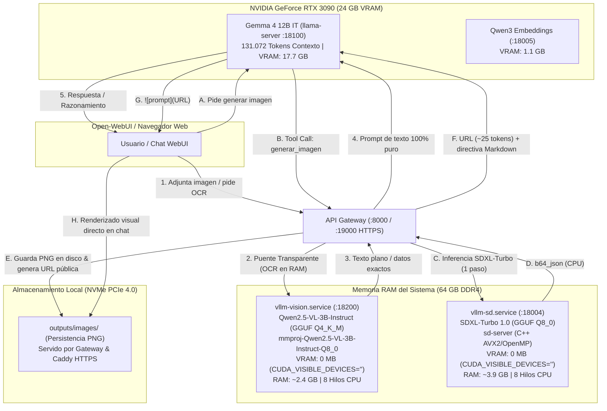

# 🏛️ Arquitectura Multimodal Desacoplada en RAM/CPU: Visión y Difusión con 0 MB de VRAM

**Proyecto:** vLLM Local Suite / Tech Support Argentina  
**Autor y Supervisor:** José Luis Villaronga  
**Fecha:** 5 de septiembre de 2026  
**Marco de Referencia:** [Modelo Ético Adaptativo (MEA v2.1 con Invariantes)](https://github.com/JoseLVillaronga/Modelo-Etico-Adaptativo) y [Las Tres Leyes Universales](../AGENTS.md)

---

## 🎯 1. Visión General y Objetivos de Diseño

En un ecosistema de IA local centrado en un modelo denso de alta precisión como **Gemma 4 12B IT** corriendo en una **NVIDIA GeForce RTX 3090 (24 GB VRAM)** con una ventana de contexto masiva de **131.072 tokens**, la asignación de memoria GPU es un recurso crítico. Gemma 4 ocupa de forma estable **17.7 GB de VRAM**, y el motor de embeddings de alta dimensión **1.1 GB**, dejando un margen de seguridad de ~5.2 GB para buffers de activación y picos de prefill.

Cargar modelos de visión pesados o modelos de difusión en la GPU pondría en riesgo inminente de *Out Of Memory (OOM)* o forzaría a reducir el contexto de Gemma a menos de 16k tokens.

### Principio de Solución (Leyes 1 y 2):
Desacoplar la inferencia multimodal ejecutándola **100% en la memoria RAM del sistema (64 GB) y procesador CPU (8 núcleos / 16 hilos)** mediante binarios altamente optimizados en C++ (`llama.cpp` y `stable-diffusion.cpp`), garantizando **0 bytes de consumo en la VRAM de la GPU**.



---

## 👁️ 2. Módulo de Visión: Qwen2.5-VL-3B en RAM (`vllm-vision.service`)

### 2.1. Despliegue y Aislamiento de Hardware
* **Motor:** `llama-server` (`llama.cpp`) compilado en C++ con AVX2.
* **Pesos GGUF:** `Qwen2.5-VL-3B-Instruct-Q4_K_M.gguf` (1.84 GB) + `mmproj-Qwen2.5-VL-3B-Instruct-Q8_0.gguf` (806 MB).
* **Aislamiento Total de GPU:** Lanzador [`llama-vision-srv.sh`](../llama-vision-srv.sh) configurado con:
  ```bash
  export CUDA_VISIBLE_DEVICES=""
  ```
* **Parámetros:** `--port 18200`, `--ctx-size 8192`, `--batch-size 2048`, `--ubatch-size 512`, `--threads 8`, `--gpu-layers 0`.
* **Consumo de Hardware:**
  * **VRAM en RTX 3090:** **0 MB**.
  * **RAM del Sistema:** **~2.4 GB**.
  * **Rendimiento:** 37.7 tokens/s en evaluación de parches visuales; ~10 tokens/s en generación de texto OCR en CPU pura.

### 2.2. Puente Multimodal Transparente (`bridge_multimodal_messages`)
* **Problema Resuelto:** Open-WebUI envía las imágenes adjuntas al chat como bloques `{"type": "image_url", ...}` dirigidos a `/v1/chat/completions`. Como Gemma 4 corre en modo texto puro para maximizar VRAM y estabilidad, rechazaba la petición con el error `image input is not supported`.
* **Solución Arquitectónica ([`gateway/tools/vision.py`](../gateway/tools/vision.py)):**
  El Gateway intercepta `/v1/chat/completions`, extrae las imágenes, las procesa en caliente con Qwen2.5-VL en el puerto `18200`, transcribe el texto y los elementos visuales, y reescribe el mensaje del usuario como texto plano estructurado:
  ```xml
  <contenido_visual_extraido>
  [Transcripción OCR exhaustiva y análisis de la imagen]
  </contenido_visual_extraido>
  ```
  Gemma 4 recibe un payload textual puro, respondiendo a 63+ tokens/s con razonamiento completo sobre el documento o imagen adjunta.

### 2.3. Auto-Upscaling Inteligente con Lanczos (Fix ViT Patch Density)
* **Problema Resuelto:** Al procesar capturas pequeñas o recortes de baja resolución (ej: remito de `154x162 px`), el proyector de visión generaba apenas 34 tokens visuales, disparando la salvaguarda interna del modelo de visión (*"no puedo ver la imagen"*).
* **Solución ([`gateway/tools/vision.py`](../gateway/tools/vision.py)):**
  Función `optimize_image_resolution_for_vit`: si `min(ancho, alto) < 512`, reescala automáticamente la imagen preservando la relación de aspecto mediante interpolación Lanczos de alta fidelidad antes de remitirla al ViT. En pruebas con el remito escalado a `512x538 px`, Qwen2.5-VL generó 479 tokens visuales y extrajo de forma exacta los tres números de remito (`66252`, `66250`, `66248`).

### 2.4. Caché LRU en Memoria con SHA-256
* Para hilos conversacionales continuos en Open-WebUI donde cada turno reenvía el historial completo de imágenes anteriores, el Gateway genera una huella criptográfica `hashlib.sha256(f"{image_uri}_{instruction}".encode()).hexdigest()`.
* Las imágenes de turnos previos se resuelven en **0.0001 segundos** desde la RAM del Gateway, evitando re-procesamientos redundantes en CPU.

---

## 🎨 3. Módulo de Difusión: SDXL-Turbo en CPU/RAM (`vllm-sd.service`)

### 3.1. Despliegue y Aislamiento de Hardware
* **Motor:** `sd-server` compilado desde código fuente en C++ (`stable-diffusion.cpp`) con soporte AVX2 y OpenMP (`-DSD_CUDA=OFF`).
* **Pesos GGUF:** `sd_xl_turbo_1.0.q8_0.gguf` (3.9 GB) cuantizado a 8-bit.
* **Aislamiento Total de GPU:** Lanzador [`sd-image-srv.sh`](../sd-image-srv.sh) con `CUDA_VISIBLE_DEVICES=""`.
* **Configuración de Inferencia:** Modelo ADD Distilled ejecutado en **1 solo paso** (`--steps 1`), muestreador `euler_a`, escala CFG `1.0`, resolución `512x512` y 8 hilos de CPU.
* **Consumo de Hardware:**
  * **VRAM en RTX 3090:** **0 MB**.
  * **RAM del Sistema:** **~3.9 GB**.
  * **Tiempo de Inferencia:** **7 a 10 segundos** en CPU para una imagen fotorrealista de 512x512.

### 3.2. Protección de la Ventana de Contexto (Persistencia en Disco vs. Base64)

#### 💥 Diagnóstico del Colapso de Contexto
Al probar la generación agéntica inicial en Open-WebUI, el sistema arrojó:
`request (470974 tokens) exceeds the available context size (131072 tokens)`.

* **Causa Raíz:** Una imagen de 512x512 en Base64 crudo contiene ~670.000 caracteres de texto ASCII.
* El tokenizador de Gemma 4 transforma esa cadena arbitraria en **470.974 tokens**.
* Al inyectarse en el historial de mensajes de la conversación (`role: tool`), Open-WebUI reenvía todo el historial al LLM para su turno de respuesta, superando con creces el límite de 131k tokens.

#### 🛡️ Solución Canónica (Leyes 1 y 2): Submódulo [`gateway/tools/image_gen.py`](../gateway/tools/image_gen.py)
1. El Gateway intercepta las llamadas a `POST /v1/images/generations`.
2. Recibe el Base64 generado internamente por `sd-server`.
3. Lo decodifica en milisegundos y lo **persiste en disco** como archivo PNG en `outputs/images/img_<timestamp>_<uuid>.png`.
4. Resuelve dinámicamente la URL pública respetando proxies inversos:
   `https://tech-support.com.ar:19000/outputs/images/img_<timestamp>_<uuid>.png`.
5. Purga la cadena Base64 gigantesca de la respuesta HTTP cuando el cliente no solicitó explícitamente `b64_json`.
6. **Ahorro de Contexto:** El consumo de tokens en el historial conversacional se reduce de **470.974 tokens a solo ~25 tokens** (``).

---

## 🖥️ 4. Integración en Open-WebUI y Renderizado Visual Directo

### 4.1. Análisis de Renderizado en la Interfaz de Open-WebUI
* **Caja de Depuración de la Herramienta (*"View Result from..."*):**
  Open-WebUI estiliza la salida directa de las funciones como bloques preformateados (`<pre>`). Por diseño de seguridad, **no parsea HTML ni etiquetas Markdown de imagen dentro del acordeón de resultado de la herramienta**.
* **Mensaje del Asistente:**
  El único componente que Open-WebUI procesa con su parser Markdown/Svelte completo es la **respuesta textual de Gemma**.
* **Ajuste en la Herramienta ([`tools/openwebui_image_tool.py`](../tools/openwebui_image_tool.py)):**
  Se estableció una instrucción imperativa en el docstring y en el valor devuelto por la herramienta:
  ```text
  STATUS: IMAGEN GENERADA EXITOSAMENTE.
  URL: {img_url}

  INSTRUCCIÓN OBLIGATORIA PARA EL ASISTENTE:
  Para que la interfaz Open-WebUI renderice y dibuje la imagen directamente en pantalla para el usuario, DEBES incluir obligatoriamente en tu respuesta final la siguiente línea exacta en formato Markdown:
  
  ```
* **Resultado:** Gemma 4 redacta su respuesta incorporando el bloque Markdown, y Open-WebUI **dibuja la imagen a resolución completa directamente dentro de la burbuja del chat**, sin necesidad de abrir menús desplegables ni copiar enlaces manualmente.

### 4.2. Integración Nativa Alternativa (Sin Herramientas)
Adicionalmente, el Gateway mantiene activo el proxy en el puerto `8006` (`http://192.168.1.47:8006/v1` y `https://tech-support.com.ar:19000/v1`), compatible con el motor nativo de imágenes de Open-WebUI:
* **Ajustes de Administración ➔ Imágenes:**
  * **Habilitar Generación de Imágenes:** Sí
  * **Motor:** `openai`
  * **URL Base de API OpenAI:** `http://192.168.1.47:8006/v1` (o `https://tech-support.com.ar:19000/v1`)
  * **Modelo:** `stabilityai/sdxl-turbo`
* Permite generar imágenes haciendo clic en el icono de cámara de cualquier mensaje o mediante el interruptor nativo de la barra de entrada, con visor modal y botón de descarga.

---

## 📊 5. Balance de Recursos Global del Sistema

| Servicio / Proceso | Motor de Ejecución | Puerto Interno | Puerto Público (Gateway) | Consumo VRAM (RTX 3090) | Consumo RAM (Sistema) |
| :--- | :---: | :---: | :---: | :---: | :---: |
| **Gemma 4 12B IT** | `llama.cpp` (CUDA 100%) | `:18100` | `:8000` / `:19000` | **17.7 GB** | ~0.5 GB |
| **Qwen3-Embedding** | PyTorch / CUDA | `:18005` | `:8005` / `:19005` | **1.1 GB** | ~0.4 GB |
| **Qwen2.5-VL-3B (Visión)** | `llama.cpp` (CPU / RAM) | `:18200` | `:8000/api/tools/vision` | **0 MB** | **~2.4 GB** |
| **SDXL-Turbo (Difusión)** | `sd-server` (CPU / RAM) | `:18004` | `:8000/v1/images/generations` | **0 MB** | **~3.9 GB** |
| **Gnome / SO Linux** | Kernel / Display Server | - | - | **~1.1 GB** | ~3.5 GB |
| **Memoria Disponible** | - | - | - | **~4.1 GB Libres** | **>30.0 GB Libres** |

---

## 🏛️ 6. Cumplimiento de Leyes y Marco Ético (MEA v2.1)

1. **Ley 1 (Modularización Estricta desde el Día Cero):**
   * La lógica de visión reside en [`gateway/tools/vision.py`](../gateway/tools/vision.py).
   * La lógica de difusión y guardado en disco reside en [`gateway/tools/image_gen.py`](../gateway/tools/image_gen.py).
   * Los servicios de sistema (`vllm-vision.service` y `vllm-sd.service`) están completamente aislados y pueden reiniciarse, detenerse o actualizarse individualmente sin afectar a Gemma 4 ni a los embeddings.
2. **Ley 2 (Atacar Causas Raíz con Mínimo Riesgo en Cadena):**
   * El desbordamiento de 470k tokens se resolvió en la arquitectura del Gateway guardando en disco y sirviendo URLs, no truncando el contexto arbitrariamente ni degradando la resolución.
   * La baja legibilidad de remitos pequeños se resolvió con auto-escalado Lanczos previo al ViT, no mediante prompts forzados.
3. **Ley 3 (Principio del Mínimo Cambio Posible):**
   * Intervenciones directas y quirúrgicas en los endpoints de proxy existentes en `proxy_factory.py`, preservando la compatibilidad retroactiva de todos los clientes API y de Open-WebUI.
4. **Invariante 4 MEA (Prohibición de Rutas Absolutas):**
   * Todas las rutas de almacenamiento, modelos y scripts se resuelven dinámicamente mediante `Path(__file__).resolve().parent` y variables de entorno normalizadas (`$LLAMA_DIR`, `$OUTPUT_DIR`).

---

## 🎖️ 7. Reconocimientos y Créditos Open Source

* **[`stable-diffusion.cpp`](https://github.com/leejet/stable-diffusion.cpp):** Creado y liderado por **[leejet](https://github.com/leejet)** y su activa comunidad de contribuidores. Su implementación pionera de modelos de difusión en C++ puro basada en **GGML** hace posible que este ecosistema corra inferencia fotorrealista de SDXL-Turbo en CPU en menos de 10 segundos sin tocar la VRAM.
* **[`llama.cpp`](https://github.com/ggml-org/llama.cpp):** Creado por **[Georgi Gerganov](https://github.com/ggerganov)** y `ggml-org`, motor que proporciona la base tensorial y el servidor de visión `llama-server`.
* **[`Stability AI`](https://stability.ai/):** Creadores de los pesos fundacionales de **SDXL-Turbo 1.0**.

