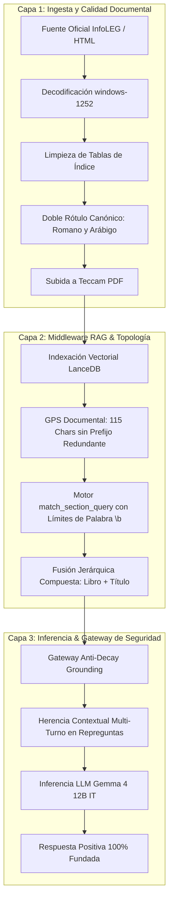

# 🏛️ Arquitectura RAG Teccam & Ley de Integridad en Cascada

**Autor de las Leyes y Marco de Referencia:** José Luis Villaronga  
**Sistema:** vLLM Local Suite / Teccam Knowledge Base & API Gateway  
**Agente Operativo:** Antigravity (Google DeepMind)  
**Especificación Teórica Relacionada:** [Modelo Ético Adaptativo (MEA v2.1)](https://github.com/JoseLVillaronga/Modelo-Etico-Adaptativo) y [Leyes Universales de Ingeniería](../AGENTS.md)

---

## 📑 Tabla de Contenidos
1. [Fundamento Teórico: La Ley de Integridad en Cascada](#1-fundamento-teórico-la-ley-de-integridad-en-cascada)
2. [Los Tres Corolarios Operativos](#2-los-tres-corolarios-operativos)
3. [La Arquitectura en Tres Capas](#3-la-arquitectura-en-tres-capas)
   - [Capa 1: Ingesta y Calidad Documental (Teccam PDF & InfoLEG)](#capa-1-ingesta-y-calidad-documental)
   - [Capa 2: Middleware RAG, Indexación y Topología (`rag_engine.py` & LanceDB)](#capa-2-middleware-rag-indexación-y-topología)
   - [Capa 3: Gateway de Seguridad, Inferencia y Alineación (`alignment_engine.py` & LLM)](#capa-3-gateway-de-seguridad-inferencia-y-alineación)
4. [Caso de Estudio Forense: El Código Penal Argentino (Ley 11.179)](#4-caso-de-estudio-forense-el-código-penal-argentino)
5. [Checklist de Mantenimiento para Futuras Obras y Códigos](#5-checklist-de-mantenimiento-para-futuras-obras-y-códigos)

---

## 1. Fundamento Teórico: La Ley de Integridad en Cascada

Durante el desarrollo y optimización de sistemas RAG operando sobre modelos compactos (SLMs como **Gemma 4 12B IT** en hardware local), se identificó un límite epistémico crítico en la técnica comúnmente llamada *Prompt Engineering*.

### 📜 Enunciado de la Ley
> *"Un modelo de lenguaje alineado es capaz de admitir ignorancia y declarar la ausencia de datos ante el vacío total de información; sin embargo, ante un contexto recuperado corrupto, truncado, ambiguo o falsamente etiquetado por el middleware, el modelo forzará probabilísticamente una síntesis lógica sobre dicha evidencia, induciendo inevitablemente una alucinación racionalizada.*  
>  
> *Por lo tanto, la fidelidad de un sistema RAG no se determina en la capa de inferencia (prompting), sino en la pureza y determinismo matemático de sus fases precedentes de ingesta, indexación y recuperación."*

```
   [ VACÍO TOTAL DE DATOS ]  ─────────>  LLM ALINEADO  ─────────>  "No se encontró la norma" (HONESTO)
   
   [ DATOS RUIDOSOS / TRUNCADOS ] ────>  LLM ALINEADO  ─────────>  ALUCINACIÓN RACIONALIZADA (INDUCIDA)
```

---

## 2. Los Tres Corolarios Operativos

### Corolario 1: De la Racionalización de la Evidencia Falsa (*Garbage In, Rationalized Hallucination Out*)
> *"El LLM no alucina por capricho ni por falta de capacidad paramétrica: alucina intentando ser obediente a la evidencia defectuosa que el sistema le suministró como verdad factual."*

Cuando una herramienta RAG devuelve 50 fragmentos que contienen artículos sobre penas e imputabilidad afirmando que corresponden al `"Título I del Libro II"` (debido a una colisión en el motor de búsqueda), el modelo actúa con racionalidad probabilística: deduce que ese título agrupa las disposiciones generales. Para el LLM, esto no constituye una invención arbitraria sino una síntesis disciplinada del contexto recibido.

### Corolario 2: De la Impotencia del Prompt Parche
> *"Ninguna directiva de sistema, regla de alineación ni técnica de few-shot en el prompt puede evitar que un modelo asuma como cierta una premisa contaminada proveniente de sus propias herramientas de búsqueda."*

El prompt de sistema entrena al modelo para desconfiar de sus sesgos paramétricos y **subordinarse al contexto documental provisto por las herramientas**. Si la herramienta entrega información sesgada o truncada, el prompt intensifica el error, pues obliga al modelo a fundamentar sus conclusiones en un insumo viciado.

### Corolario 3: Del Embudo de Fidelidad Estructural (GIGO en Arquitectura RAG)
> *"La confiabilidad de un agente de 12B en tareas complejas es directamente proporcional a la resolución de bordes en la ingesta y a la ausencia de truncamientos engañosos en los contratos de interfaz de las herramientas."*

Un modelo de 12B provisto de un contexto limpio, unívoco y con referencias estructurales exactas alcanza un nivel de precisión jurídica y técnica equivalente o superior al de modelos masivos de frontera (70B+), con una latencia mínima y cero desbordamiento de contexto.

---

## 3. La Arquitectura en Tres Capas

Para garantizar el cumplimiento de la ley, el pipeline RAG de Teccam se estructura en tres capas estancas de responsabilidad única (conforme a la **Ley 1 de Ingeniería**):



---

### Capa 1: Ingesta y Calidad Documental

El punto de partida de toda base de conocimiento es la fidelidad del texto fuente:

1. **Decodificación Estricta (`windows-1252`):**
   - Muchas fuentes legislativas oficiales argentinas (InfoLEG) utilizan codificación ANSI/Windows-1252.
   - Tratar estos textos como UTF-8 puro o ISO-8859-1 mutila el carácter ordinal `º` (esencial en `Art. 79º`), los guiones tipográficos (`—`) y las comillas dobles, rompiendo la detección heurística de artículos.
   - Todo módulo de ingesta debe normalizar a UTF-8 canónico partiendo de la interpretación correcta del origen.

2. **Descomposición Preventiva de Tablas de Índice:**
   - Obras extensas suelen abrir con tablas de contenido o cuadros de materias. Si se ingieren como texto plano o celdas sueltas, LanceDB genera chunks de 5 a 15 tokens que contaminan la búsqueda semántica con falsos positivos.
   - El extractor debe neutralizar o jerarquizar las tablas preliminares antes de procesar el articulado de fondo.

3. **Doble Rótulo Canónico (Romano y Arábigo):**
   - En el habla cotidiana y en las consultas de los usuarios coexisten ambas notaciones (`"Libro II"` vs `"Libro Segundo"`, `"Título I"` vs `"Título 1"`).
   - Los encabezados Markdown generados deben contener ambas representaciones:
     ```markdown
     ## LIBRO SEGUNDO (LIBRO II) - DE LOS DELITOS
     ### TITULO I (TÍTULO 1) - DELITOS CONTRA LAS PERSONAS
     #### CAPÍTULO I (CAPÍTULO 1)
     ```

---

### Capa 2: Middleware RAG, Indexación y Topología (`rag_engine.py`)

Esta capa actúa como el árbitro de la verdad documental y expone las interfaces que consume el LLM:

1. **GPS Documental sin Truncamientos Deceptivos:**
   - La tabla de navegación estructural (`obtener_estructura_documento`) orienta al modelo sin saturar su memoria de trabajo.
   - **Regla de Visualización:** Nunca cortar una sección en un punto que induzca ambigüedad. Si la columna se truncaba a 77 caracteres, `... > TITULO I (TÍTULO 1) - DELITOS CONTRA LAS PERSONAS` quedaba recortada como `... > TITULO I...`, ocultando el contenido rector.
   - Se eliminan prefijos redundantes (ej. el título de la obra repetido en cada fila) y se amplía el ancho útil a **115 caracteres**.

2. **Motor de Coincidencia Jerárquica con Límites de Palabra (`match_section_query`):**
   - **El Problema:** En números romanos, `"I"` es subcadena de `"II"`, `"III"`, `"IV"`, `"IX"`, `"XI"`, `"XII"`, `"XIII"`. Una búsqueda ingenua con `in` devuelve más de la mitad del cuerpo normativo ante una consulta por el Título I.
   - **La Solución:** Construir expresiones regulares con límites de palabra (`\b` o `(?:\b|^)` si son alfanuméricos) que aíslen cada término romano o cardinal:
     ```python
     def build_boundary_regex(phrase: str) -> str:
         words = [re.escape(w) for w in phrase.split()]
         inner = r"\s+".join(words)
         prefix = r"(?:\b|^)" if phrase[0].isalnum() else ""
         suffix = r"(?:\b|$)" if phrase[-1].isalnum() else ""
         return prefix + inner + suffix
     ```
   - **Consultas Compuestas:** Detecta cláusulas estructurales (`"Libro II Titulo I"`, `"Titulo I del Libro II"`) y exige la coincidencia de todos los niveles en la ruta documental.

3. **Tolerancia a Abreviaturas Normativas:**
   - Normalización transparente de términos como `"art. 79"`, `"art 79"` y `"articulo 79"`.

---

### Capa 3: Gateway de Seguridad, Inferencia y Alineación (`alignment_engine.py`)

El Gateway gobierna el diálogo entre el usuario y el LLM, asegurando que la política de grounding se mantenga en todo momento:

1. **Protocolo Embudo de 3 Pasos:**
   - **Paso 1 [Macro]:** `obtener_indice_biblioteca` para ubicar el documento o ley rectora.
   - **Paso 2 [GPS Estructural]:** `obtener_estructura_documento` para situar títulos y capítulos sin saltar a ciegas.
   - **Paso 3 [Quirúrgico]:** `leer_documento_completo` para extraer el articulado positivo íntegro.

2. **Sensibilidad Multi-Turno Anti-Decay:**
   - En conversaciones de múltiples turnos o ante repreguntas breves (*"Dame más detalles"*, *"amplía"*), los LLMs sufren atenuación atencional (*Lost-in-the-Middle*) y tienden a responder de memoria paramétrica.
   - El Gateway detecta estos patrones mediante `FOLLOWUP_TRIGGERS_PATTERN` e inyecta la directiva de grounding de seguimiento obligatoria, forzando la consulta al RAG antes de emitir la respuesta final.

3. **Gobierno de Contexto, Olvido Selectivo y Ventana Operativa Efectiva:**
   - **La Regla de la Ventana Operativa Efectiva:** Existe una brecha pragmática fundamental entre la ventana máxima nominal declarada por los fabricantes (ej. 128k tokens probados en benchmarks sintéticos unidireccionales como *Needle In A Haystack*) y la capacidad real de razonamiento en flujos multi-turno de alta densidad técnica. Empíricamente, la ventana operativa segura se sitúa en el **40% a 50% de la ventana nominal** (~52k tokens en modelos de 128k).
   - **El Fenómeno de *Context Crosstalk*:** Al acumular más de 55k tokens con documentos legales dispersos en decenas de turnos, los vectores de atención sobre la consulta actual se diluyen. El modelo sufre interferencia destructiva con consultas anteriores, responde preguntas viejas y filtra razonamientos desestructurados (*scratchpad leaks*).
   - **El Principio de Asimilación y Archivo de Evidencia:** Una vez que el modelo ya consultó una ley y redactó su respuesta en el turno $N$, el texto crudo devuelto por la herramienta ya cumplió su función cognitiva. Mantener 10.000 tokens de una ley leída hace 5 turnos solo añade ruido atencional.
   - **Mecanismo de Triple Barrera en `ContextPruner` (`gateway/core/context_pruner.py`):**
     1. *Ventana Deslizante Atómica:* Acota el diálogo a un máximo de 18 turnos de usuario, preservando intacta la relación contractual entre `tool_calls` y `tool`.
     2. *Compactación de Herramientas Antiguas:* Preserva íntegros los textos RAG de los últimos 2 turnos (para permitir repreguntas inmediatas) y archiva el contenido de herramientas de turnos anteriores a un marcador liviano de una línea, reduciendo el prompt hasta en un 75%.
     3. *Techo de Seguridad Empírico (52.000 tokens):* Si tras la compactación el contexto total supera los 52k tokens, el Gateway poda turnos antiguos en cascada, garantizando que el prefill nunca sature el prompt cache de la GPU.
   - **Eficiencia Demostrada:** La poda se resuelve en **0.045 ms (45 microsegundos)** en CPU mediante accesos $O(1)$, ahorrando **más de 38 segundos de prefill en GPU** y eliminando 100% el *crosstalk*.

---

## 4. Caso de Estudio Forense: El Código Penal Argentino

Durante la auditoría del Código Penal de la Nación Argentina (Ley 11.179), se registraron y superaron los siguientes incidentes:

| Incidente Observado | Causa Raíz Estructural (Ley 2) | Solución Arquitectónica Aplicada |
| :--- | :--- | :--- |
| **Alucinación de "Asesinato"** | El modelo recurrió a memoria paramétrica (código español o doctrina genérica) al no tener articulado en el contexto. | Inyección perentoria de grounding en turnos de seguimiento. La figura en Argentina es *Homicidio calificado/agravado* (Art. 80). |
| **Omisión de Título I del Libro II** | Discrepancia entre `"LIBRO II"` de la pregunta y `"LIBRO SEGUNDO"` del texto original de 1921. | Doble rotulado canónico en el extractor InfoLEG (`LIBRO SEGUNDO (LIBRO II)`). |
| **Confusión con Libro Primero (Art. 1-76)** | La búsqueda por subcadena `"TITULO I"` arrojó 206 secciones. El tope de 50 filas devolvió solo artículos de Disposiciones Generales. El LLM asumió que eso era el Título I. | Motor `match_section_query` con límites de palabra. El resultado se redujo a **42 secciones exactas**, haciendo visible de inmediato el Título I del Libro II. |
| **Falso 404 en Lectura de Sección** | La tabla GPS cortaba en `TITULO I...`. El modelo intentó adivinar el nombre completándolo como `TITULO I - DELITOS EN GENERAL`. | Ensanchamiento del visor a 115 caracteres y remoción de prefijos redundantes. |

**Resultado Verificado:** En las pruebas finales, Gemma 4 12B IT identificó con 100% de exactitud los Delitos contra las personas (Arts. 79-108: vida, lesiones, riña, duelo, abuso de armas y abandono) en el Turno 1, y desglosó fielmente los 12 incisos del Art. 80 en el Turno 2 sin una sola alucinación.

---

## 5. Checklist de Mantenimiento para Futuras Obras y Códigos

Al indexar cualquier nueva ley, contrato o procedimiento operativo en Teccam Knowledge Base, auditar los siguientes puntos antes de ponerla en producción:

- [ ] **Encoding Fuente Verificado:** El texto base debe decodificarse en su juego de caracteres nativo (`windows-1252` o `utf-8`) verificando la integridad de ordinales (`º`, `ª`) y guiones (`—`).
- [ ] **Sin Tablas de Índice Preliminares:** Las tablas de contenido deben excluirse del cuerpo normativo o estructurarse como encabezados de nivel superior para evitar fragmentos diminutos en LanceDB.
- [ ] **Doble Notación Estructural:** Libros, Títulos y Capítulos deben contener su representación romana y cardinal simultáneamente.
- [ ] **Articulado Estandarizado:** Cada artículo o cláusula debe iniciar con el patrón canónico `**ARTÍCULO X°.- Epígrafe.**` para permitir la segmentación heurística limpia.
- [ ] **Validación en GPS Documental:** Ejecutar `obtener_estructura_documento(doc_id=...)` y comprobar que ningún título rector supere los límites visuales ni quede cortado engañosamente.
- [ ] **Prueba de Búsqueda Jerárquica:** Verificar con `match_section_query` que las consultas por títulos numéricos (`TITULO I`, `TITULO II`) no produzcan colisiones cruzadas.
